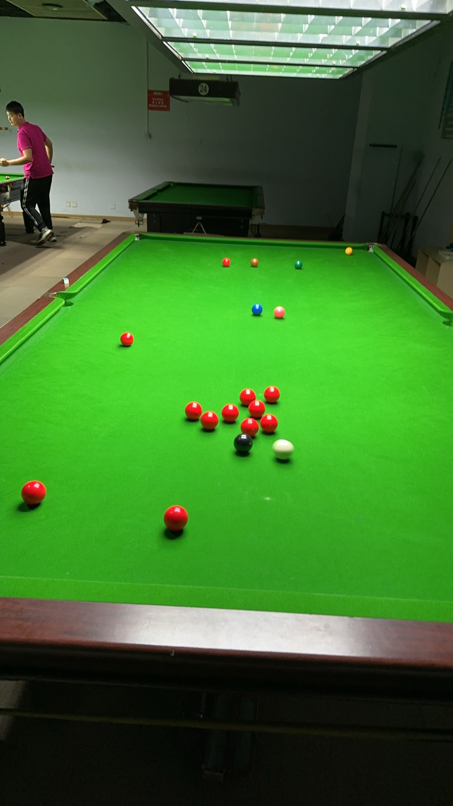

# MPRC台球俱乐部

丰富课余生活，共享台球乐趣！

## 赛事组织

**八球系列赛事**

| 赛事名称     | 规则       | 场地               | 积分         |
| ------------ | ---------- | ------------------ | ------------ |
| 邱德拔公开赛 | 中式八球   | 邱德拔体育馆台球厅 | 500/300/180  |
| 小铁公开赛   | 中式八球   | 海龙大厦小铁台球厅 | 1000/600/360 |
| 马池口公开赛 | 美式八球   | 马池口行政楼台球厅 | 250/150/90   |
| ???公开赛    | 英式八球？ | TBD                | 250/150/90   |

**斯诺克系列赛事**

| 赛事名称         | 规则              | 成绩积分     | 单杆奖励分               |
| ---------------- | ----------------- | ------------ | ------------------------ |
| 英式斯诺克锦标赛 | 英式斯诺克（147） | 1000/600/360 | 20/100, 50/500, 147/1000 |
| 中式斯诺克锦标赛 | 中式斯诺克（107） | 500/300/180  | 30/100, 60/200, 107/500  |

**远期筹划赛事**……

- 花式九球锦标赛
- 开伦台球锦标赛
- 俄式台球锦标赛

## 积分榜

| 排名 | 姓名   | 邱德拔 | 小铁 | 马池口 | 斯诺克147 | 斯诺克107 | 总计 | 变化 |
| ---- | ------ | ------ | ---- | ------ | --------- | --------- | ---- | ---- |
| 1    | 姜星宇 | 0      | 0    | 0      | 2200      | 0         | 2200 | -    |
| 2    | 王翰墨 | 0      | 0    | 0      | 1960      | 0         | 1960 | -    |
| 3    | 魏天昊 | 0      | 0    | 0      | 1600      | 0         | 1600 | -    |
| 4    | 郝明洋 | 0      | 0    | 0      | 0         | 0         | 0    | -    |

（实时排名，每个单项仅统计近3届的积分）

## 冠军榜

| 排名 | 姓名   | 邱德拔 | 小铁 | 马池口 | 斯诺克147 | 斯诺克107 | 总计 |
| ---- | ------ | ------ | ---- | ------ | --------- | --------- | ---- |
| 1    | 王翰墨 | 0      | 0    | 0      | 3         | 0         | 3    |
| 2    | 姜星宇 | 0      | 0    | 0      | 1         | 0         | 1    |
| 3    | 魏天昊 | 0      | 0    | 0      | 1         | 0         | 1    |
| 4    | 郝明洋 | 0      | 0    | 0      | 0         | 0         | 0    |

## 比赛记录

### 邱德拔公开赛/Qiudeba Open

### 小铁公开赛/Xiaotie Open

### 马池口公开赛/Machikou Open

### 英式斯诺克锦标赛/Snooker Championships 147

| 届次 | 日期       | 赛制     | 冠军   | 亚军                   | 季军   | 比分     |
| ---- | ---------- | -------- | ------ | ---------------------- | ------ | -------- |
| 1    | 2024.9.25  | 双人对战 | 王翰墨 | 魏天昊                 | /      | 64-51    |
| 2    | 2024.9.26  | 双人对战 | 王翰墨 | 姜星宇                 | /      | Unknown  |
| 3    | 2024.10.10 | 双人对战 | 王翰墨 | 姜星宇                 | /      | Unknown  |
| 4    | 2024.10.15 | 三人对战 | 姜星宇 | 魏天昊、王翰墨（并列） | /      | 30-30-33 |
| 5    | 2024.10.16 | 三人对战 | 魏天昊 | 姜星宇                 | 王翰墨 | 64-51-73 |

### 中式斯诺克锦标赛/Snooker Championships 107

Coming soon……

