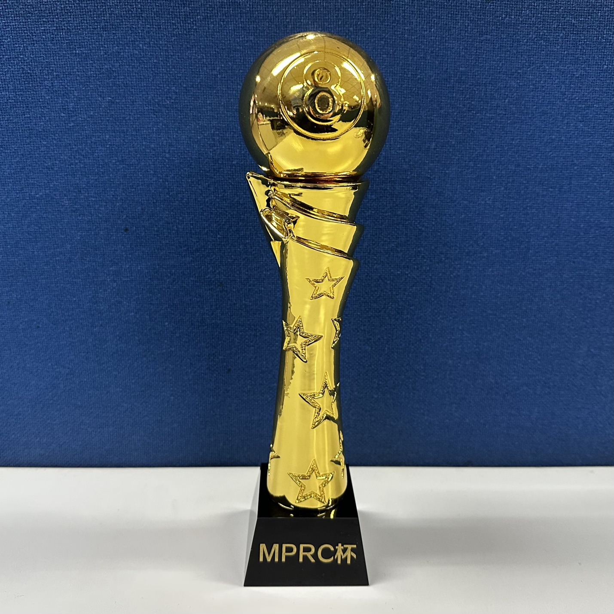

# 赛事组织

MPRC台球俱乐部利用课余生活组织台球比赛，主要分为积分赛事（例行赛、公开赛、锦标赛）、非积分赛事（友谊赛、挑战赛、团体赛、系列赛）和其他赛事（单项赛），囊括八球、斯诺克、九球等多种规则。

- **赛季：**每举办四届公开赛或一届锦标赛视为一个完整赛季，赛季内的所有例行赛、公开赛、锦标赛都会计入积分，其中任意一项例行赛都必须举办至少一次，赛季结束时积分排名第一的选手可获得“**赛季第一**”称号，随后所有选手积分清空并进入新赛季。
- **满贯：**每赛季会举行若干例行赛、公开赛、锦标赛，所有类型的比赛都会产生唯一一个冠军，获得过各种不同类型比赛的选手可获得“**满贯**”称号，其难度也随着赛事数目的拓展而增加。

<b>MPRC杯</b>

## 积分赛事

### 例行赛

例行赛是俱乐部平时的常规比赛，用于填补公开赛期间的空白。为满足平时比赛的需要，例行赛无固定赛制，每届比赛可以灵活安排，但参赛人数必须超过俱乐部人数的2/3。

| 赛事名称                | 规则        | 积分           |
| :--------------------: | :---------: | :------------: |
| 中式八球例行赛          | 中式八球     | 500/300/180/90 |
| 英式斯诺克例行赛        | 英式斯诺克   | 500/300/180/90 |
| 中式斯诺克例行赛        | 中式斯诺克   | 500/300/180/90 |
| 四球追分例行赛          | MPRC四球追分 | 500/300/180/90 |

### 公开赛

公开赛是俱乐部的高水平对抗赛，赛制固定为淘汰赛，由俱乐部全体常驻成员参加，且一周最多可以举办一次。

| 赛事名称                 | 规则       | 积分            |
| :---------------------: | :--------: | :-------------: |
| 中式八球公开赛\*          | 中式八球   | 1000/600/360/180 |

*\* 又称中式八球巡回赛（自S5赛季起，设小铁站、熊猫站、邱德拔站、蓝旗星站）*

### 锦标赛

锦标赛于每学期末举办，设置最高规格的积分和冠军奖励，冠军可整个假期保留MPRC杯。

|       赛事名称       |    规则      |        积分         |      冠军奖励     |
| :-----------------: | :----------: | :-----------------: | :--------------: |
|  MPRC台球锦标赛      |  八球+斯诺克  |  2000/1200/720/360  |  MPRC杯+小奖品   |

## 非积分赛事

### 友谊赛

友谊赛是随时可以发起约战的比赛，由且仅由2人参加，必须采用正规的对战规则，不能使用多人娱乐玩法。

|     赛事名称     |    规则               |
| :-------------: | :-------------------: |
| 中式八球友谊赛   | 中式八球               |
| 美式八球友谊赛   | 美式八球               |
| 英式斯诺克友谊赛 | 英式斯诺克             |
| 中式斯诺克友谊赛 | 中式斯诺克             |
| 花式九球友谊赛   | 花式九球               |
| 四球追分友谊赛   | MPRC四球追分           |
| 连续击球友谊赛   | 直球（14-1连续击球）    |
| 十五球旋转友谊赛 | 旋转台球（15球旋转/61） |
| 英式比利友谊赛   | 英式比利               |
| 花式台球友谊赛   | MPRC花式台球           |
| 反向八球友谊赛   | 反向八球               |
| 巴西斯诺克友谊赛 | 巴西斯诺克             |

### 挑战赛

挑战赛是不定期举行的小型比赛，赛制灵活多样，参赛人数无限制。因此，挑战赛既可以兼容不计入积分的临时比赛，也可以兼容各种多人娱乐玩法。

|     赛事名称       |    规则             |
| :---------------: | :-----------------: |
|  中式八球挑战赛\*  |  中式八球            |
|  残酷台球挑战赛    |  残酷台球            |
|  三人台球挑战赛    |  MPRC三人台球        |
|  英式比利挑战赛    |  英式比利            |
|  四球追分挑战赛    |  MPRC四球追分        |

*\* 又称中式八球邀请赛*

### 团体赛

团体赛是不定期进行的团体比赛，由俱乐部成员自行组队，以团体形式进行对抗的比赛。

|     赛事名称     |    规则             |
| :-------------: | :-----------------: |
|  美式八球团体赛  |  美式八球            |
|  中式八球团体赛  |  中式八球            |

### 系列赛

系列赛是由2人参加的一系列比赛，通常分多个比赛日完成，选手在多局比赛中对战，直到最终确定出一个获胜者。

|     赛事名称      |    规则             |
| :--------------: | :-----------------: |
|  普尔台球系列赛   |  普尔台球            |
|  英式台球系列赛   |  英式台球            |
|  斯诺克系列赛\*   |  斯诺克              |

*\* 又称斯诺克大师赛*

## 其他赛事

### 单项赛

单项赛是一种特殊的娱乐型比赛，进行某种单项技巧的比拼，并决出最佳选手。

|     赛事名称      |    规则                      |  称号   |
| :--------------: | :--------------------------: | :-----: |
|  准度单项赛       |  直线球、角度球、贴库球、翻袋球 | “准神”  |
|  杆法单项赛       |  高杆、低杆、加塞、扎杆        | “杆王”  |
|  模仿挑战单项赛   |  H-O-R-S-E游戏                | “HORSE” |