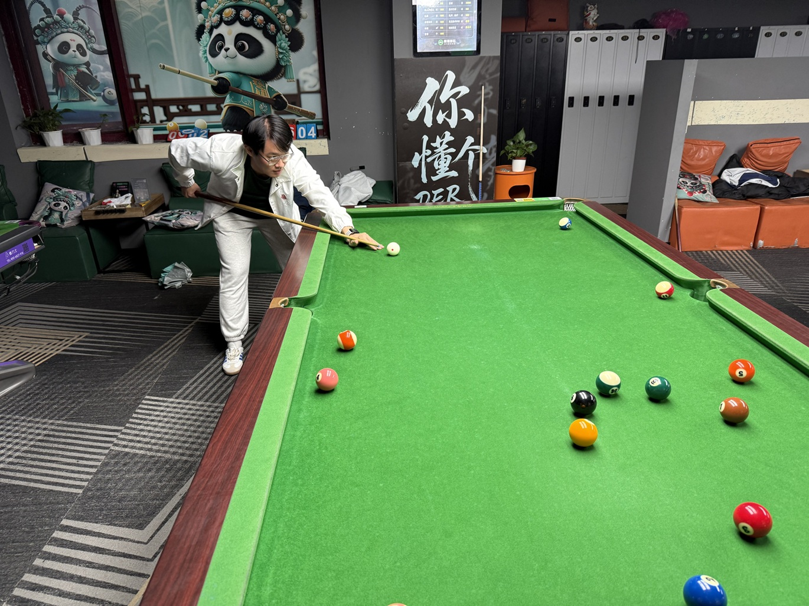
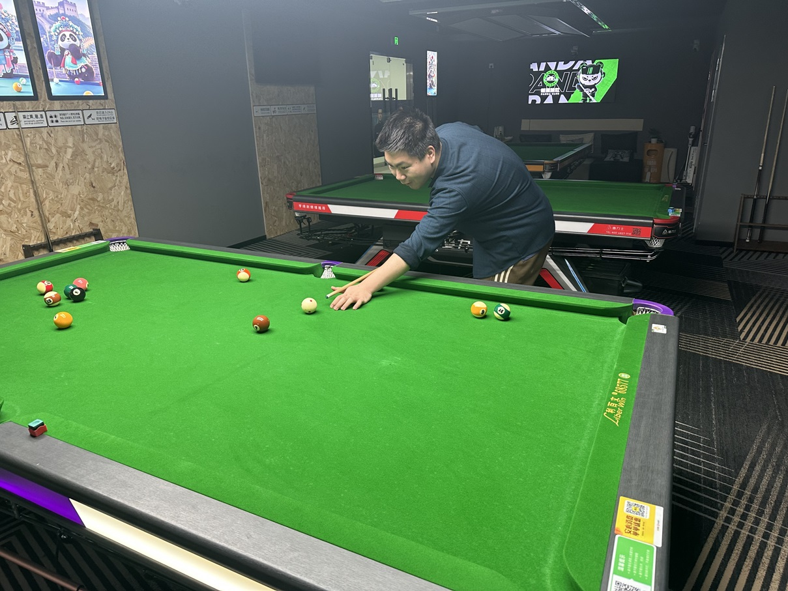
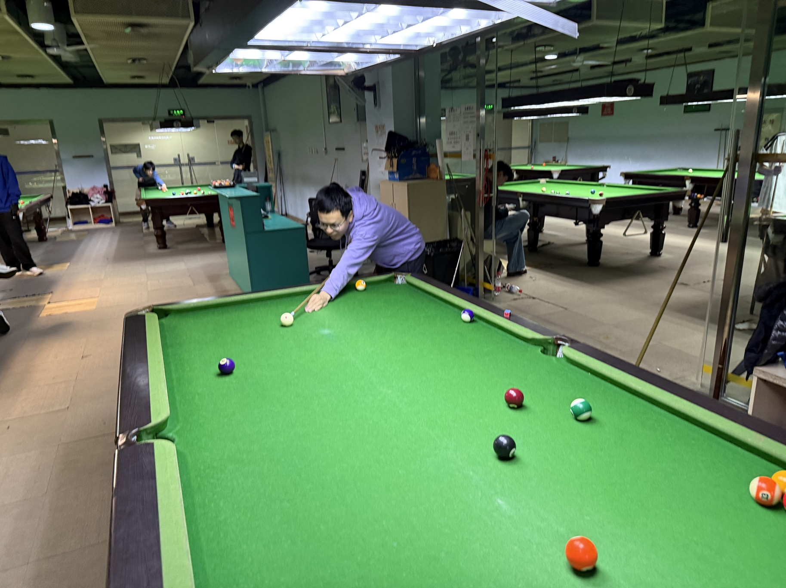
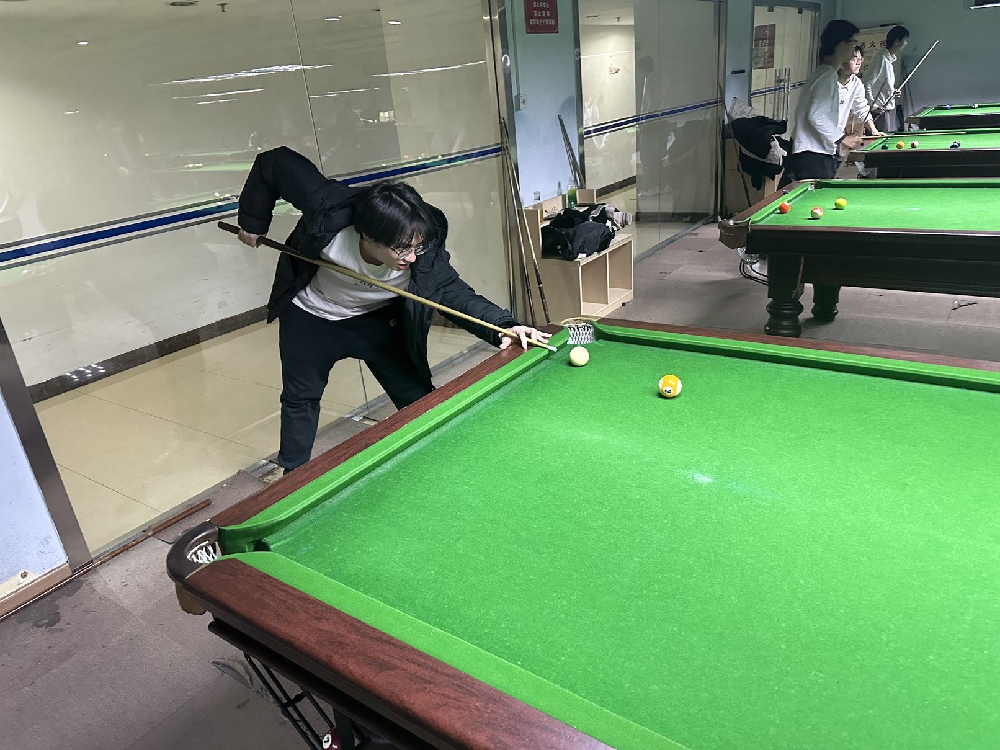

# 选手风采

俱乐部目前拥有10名成员，其中常驻成员4名、特邀成员6名。以下名单按姓名首字母排序。

## 常驻成员

### 郝明洋/Mingyang HAO

**离休赛季：**S5

**主要荣誉：**1次例行赛冠军

### 姜星宇/Xingyu JIANG

**主要荣誉：**生涯大满贯（双圈），1次赛季第一，5次公开赛冠军

### 王翰墨/Hanmo WANG

**主要荣誉：**生涯金满贯，3次赛季第一，5次公开赛冠军，1次锦标赛冠军

### 魏天昊/Tianhao WEI

**主要荣誉：**生涯大满贯，1次赛季第一，6次公开赛冠军，公开赛三连冠

## 特邀成员

### 陈昊千/Haoqian CHEN

### 和树繁/Shufan HE

### 井文淳/Wenchun JING

### 施耀民/Yaomin SHI

### 叶舟/Zhou YE

### 张政年/Zhengnian ZHANG

