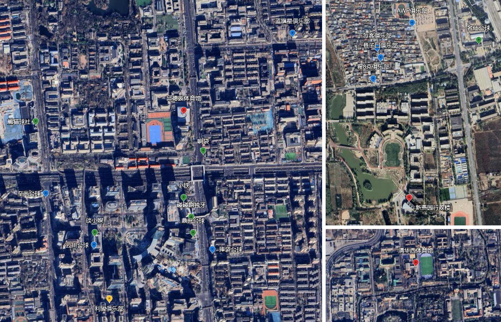
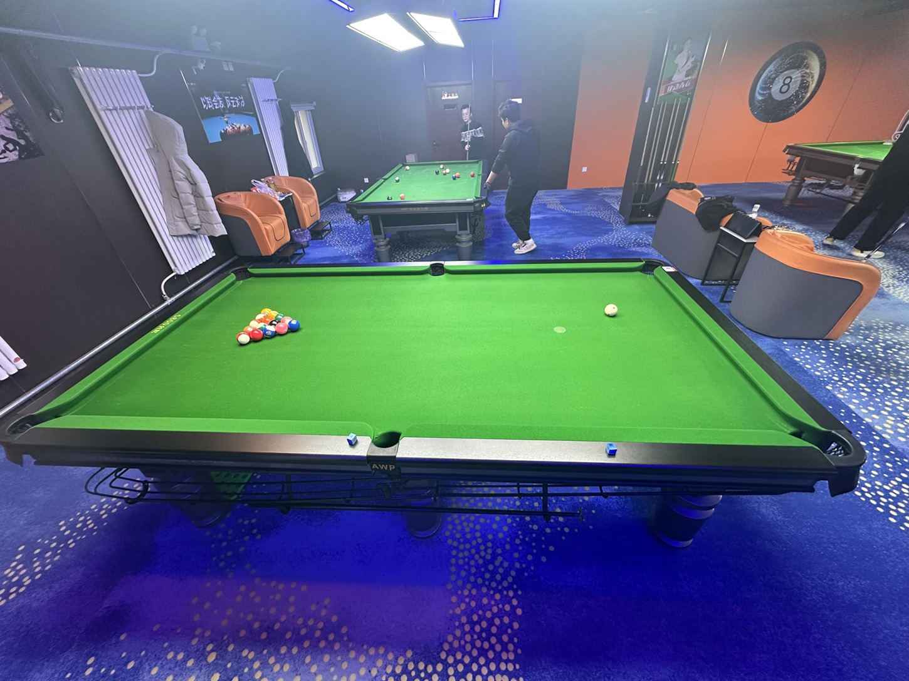

# 场馆设施

MPRC台球俱乐部的活动场馆分布地图如下：

场馆的星级划分如下：

- **五星级：** 利骏
- **四星级：** 小铁，蓝旗星，熊猫，云川
- **三星级：** 响袋，谈小娱，至尚，碰碰捌，忽客，AWP，鼎升
- **二星级：** 邱德拔，名仕，摔袋，清华
- **一星级：** 新燕园

台费价格更新时间：2025年02月14日

### 邱德拔体育馆

- 地址：北京市海淀区颐和园路5号北京大学邱德拔体育馆B1层
- 球桌：24张中式球桌（健英），1张斯诺克球桌
- 台费：15元/小时
- 评分：⭐⭐
- 标签：`校园场馆`，`健英台球桌`，`整点预约`，`无烟味`，`路程近`

### 新燕园行政楼

- 地址：北京市昌平区马池口镇北京大学（新燕园校区）行政楼1层
- 球桌：1张美式球桌
- 台费：免费
- 评分：⭐
- 标签：`校园场馆`，`马池口`，`美式球桌`，`无烟味`

### 小铁自助台球

- 地址：北京市海淀区中关村大街1号海龙大厦H座14层
- 球桌：8张中式球桌（达利欧巴：4张金腿，4张银腿）
- 台费：【金腿】34.9元/小时，【银腿】29.9元/小时
- 评分：⭐⭐⭐⭐
- 标签：`自助球房`，`达利欧巴台球桌`，`环境舒适`

### 蓝旗星台球俱乐部

- 地址：北京市海淀区成府路125号B1层
- 球桌：中式球桌（星牌、乔氏），斯诺克球桌
- 台费：【星牌金腿】53.8元/小时，【乔氏银腿】63.8元/小时，【斯诺克】149元/2小时
- 评分：⭐⭐⭐⭐
- 标签：`俱乐部`，`环境舒适`，`服务好`，`价格高`

### 响袋自助台球

- 地址：北京市海淀区中关村北大街178号3层
- 球桌：5张中式球桌（乔特斯）
- 台费：【1号台】15.9元/小时，【2-4号台】20元/小时，【5号台】26元/小时
- 评分：⭐⭐⭐
- 标签：`自助球房`，`乔特斯台球桌`，`路程近`，`人流多`

### 谈小娱自助台球

- 地址：北京市海淀区海淀大街天创科技大厦4层
- 球桌：5张中式球桌（1张星牌，4张腾勃）
- 台费：25.9元/小时，【特惠】9.9元/小时
- 评分：⭐⭐⭐
- 标签：`自助球房`，`腾勃台球桌`，`价格低`，`录像回放`

### 至尚台球俱乐部

- 地址：北京市海淀区苏州街1号育新大厦B1层
- 球桌：中式球桌（乔氏，惠士）
- 台费：【惠士普台】34.8元/小时，【乔氏银腿】50.8元/小时，【乔氏金腿】92元/小时
- 评分：⭐⭐⭐
- 标签：`俱乐部`，`惠士台球桌`，`路程远`，`价格高`

### 熊猫球社自助台球

- 地址：北京市海淀区颐和园路8号畅春园畅饷里2层
- 球桌：9张中式球桌（麦力士：6张玫瑰金，3张大黄蜂）
- 台费：【玫瑰金】39.9元/小时，【大黄蜂】89.9元/2小时
- 评分：⭐⭐⭐⭐
- 标签：`自助球房`，`麦力士台球桌`，`设施新`，`红包活动`

### 名仕自助台球

- 地址：北京市昌平区马池口镇北小营社区服务中心B段3门店2层
- 球桌：6张中式球桌
- 台费：18.8元/小时，【白天特惠】11.8元/小时
- 评分：⭐⭐
- 标签：`自助球房`，`马池口`，`价格低`，`人流少`

### 碰碰捌独牙自助台球

- 地址：北京市海淀区中关村大街1号海龙大厦H座8层
- 球桌：8张中式球桌（独牙）
- 台费：25.99元/小时
- 评分：⭐⭐⭐
- 标签：`自助球房`，`独牙台球桌`，`设施新`

### 云川台球俱乐部

- 地址：北京市海淀区彩和坊路8号天创科技大厦B1层
- 球桌：中式球桌（来力，乔氏），斯诺克球桌
- 台费：【来力K7】43.9元/小时，【乔氏银腿】63.9元/小时，【斯诺克】83.9元/小时
- 评分：⭐⭐⭐⭐
- 标签：`俱乐部`，`来力台球桌`，`赠送零食`，`服务好`，`人流多`

### 忽客台球俱乐部

- 地址：北京市昌平区北小营村55号2层
- 球桌：8张中式球桌（锐胜，乔氏）
- 台费：【锐胜】20元/小时，【乔氏银腿】25元/小时，【乔氏金腿】32元/小时
- 评分：⭐⭐⭐
- 标签：`俱乐部`，`马池口`，`锐胜台球桌`，`计时收费`，`路程近`

### AWP台球俱乐部

- 地址：北京市昌平区马池口镇北小营村临804号3层
- 球桌：8张中式球桌
- 台费：25.2元/小时，【新客】19.6元/小时
- 评分：⭐⭐⭐
- 标签：`俱乐部`，`马池口`，`灯光好`，`烟味大`

### 鼎升自助台球

- 地址：北京市海淀区中关村大街9号邮局南楼B1层
- 球桌：中式球桌（星牌）
- 台费：【星牌银腿】40元/小时，【星牌金腿】97元/2小时，【新客】29.99元/小时
- 评分：⭐⭐⭐
- 标签：`自助球房`，`星牌台球桌`，`门面隐蔽`

### 摔袋台球俱乐部

- 地址：北京市海淀区中科大厦B座底商B1层
- 球桌：中式球桌（乔氏）
- 台费：【乔氏银腿】20.9元/小时，【乔氏金腿】41元/小时
- 评分：⭐⭐
- 标签：`俱乐部`，`乔氏台球桌`，`无烟味`，`人流少`

### 利骏台球俱乐部

- 地址：北京市海淀区丹棱街海兴大厦下沉广场B1层
- 球桌：中式球桌，斯诺克球桌，美式球桌
- 台费：【中式大厅】78元/小时，【斯诺克大厅】88元/小时，【美式包厢】699元/3小时
- 评分：⭐⭐⭐⭐⭐
- 标签：`专业学院`，`国家队基地`，`价格高`，`无烟味`

### 清华西体育馆

- 地址：北京市海淀区双清路30号清华大学西区体育馆1层
- 球桌：8张中式球桌
- 台费：15元/小时
- 评分：⭐⭐
- 标签：`校园场馆`，`校外预约`，`袋口大`，`无烟味`