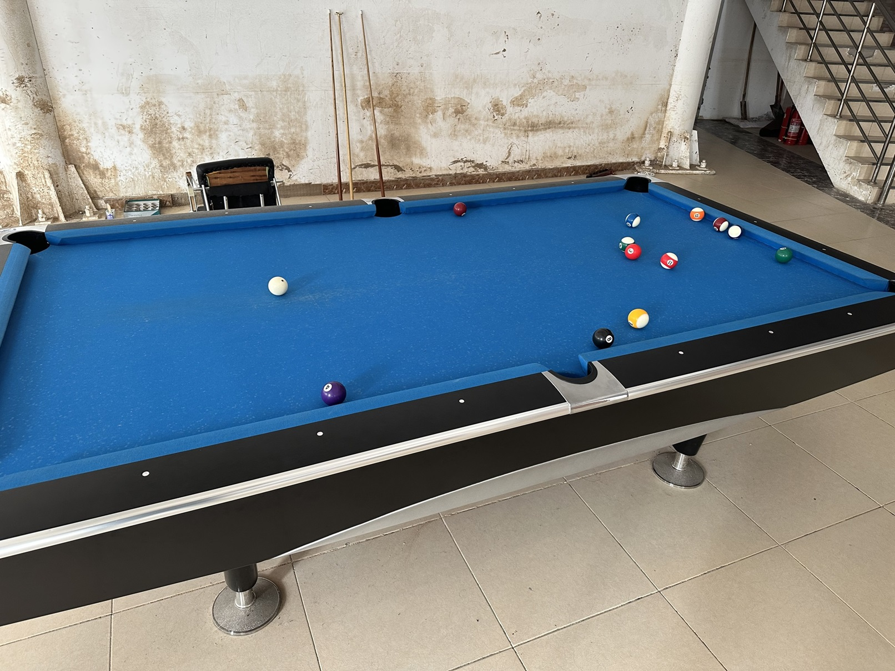
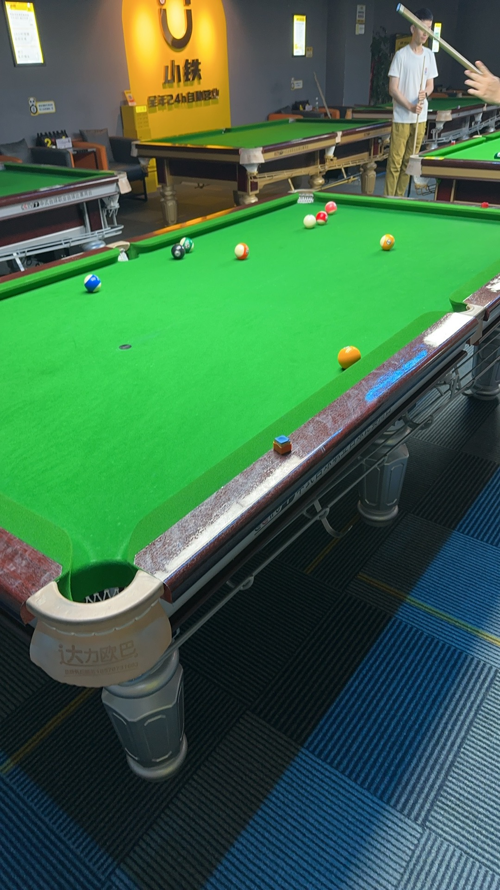

# 场馆设施

*TODO: The map is out-of-date, and will be revised after it is stable.*

## 校园内场馆

### 邱德拔体育馆

- 地址：北京市海淀区颐和园路5号北京大学邱德拔体育馆B1层
- 球桌：24张中式球桌（破旧），1张斯诺克球桌
- 台费：15元/小时
- 评分：⭐⭐⭐
- 特点：`整点预约`，`无集球器`，`路程近`

### 新燕园行政楼

- 地址：北京市昌平区马池口镇北京大学（新燕园校区）行政楼1层
- 球桌：1张美式球桌（破旧）
- 台费：免费
- 评分：⭐
- 特点：`无预约`，`美式球桌`，`球杆破损`

## 自助式球房

### 小铁自助台球

- 地址：北京市海淀区中关村大街1号海龙大厦H座14层
- 球桌：8张中式球桌（4张金腿，4张银腿）
- 台费：【金腿】31.9元/小时，【银腿】26.9元/小时
- 评分：⭐⭐⭐⭐
- 特点：`环境舒适`，`快速球台`

### 响袋自助台球

- 地址：北京市海淀区中关村北大街178号3层
- 球桌：5张中式球桌
- 台费：【1-2号台】15.9元/小时，【3-4号台】21元/小时，【5号台】26元/小时
- 评分：⭐⭐⭐
- 特点：`路程近`，`空台较少`，`有烟味`

### 谈小娱自助台球

- 地址：北京市海淀区海淀大街天创科技大厦4层
- 球桌：5张中式球桌（1张星牌，4张腾勃）
- 台费：25.9元/小时，【特惠】9.9元/小时
- 评分：⭐⭐⭐
- 特点：`价格低`，`空间狭小`，`有烟味`

### 熊猫球社自助台球

- 地址：北京市海淀区颐和园路8号畅春园畅饷里2层
- 球桌：9张中式球桌（6张麦力士玫瑰金，3张麦力士大黄蜂）
- 台费：35元/小时，【新客】25.7元/小时
- 评分：⭐⭐⭐⭐⭐
- 特点：`设施新`，`快速球台`

### 碰碰捌自助台球

- 地址：北京市海淀区中关村大街1号海龙大厦H座8层
- 球桌：8张中式球桌（独牙）
- 台费：55元/小时，【新客】9.9元/小时
- 评分：⭐⭐⭐⭐⭐
- 特点：`设施新`，`用球炫酷`

### 名仕自助台球

- 地址：北京市昌平区马池口镇北小营社区服务中心B段3门店2层
- 球桌：6张中式球桌
- 台费：15.8元/小时，【特惠】8.8元/小时
- 评分：⭐⭐
- 特点：`价格低`，`人流少`

## 周边俱乐部

### 蓝旗星台球俱乐部

- 地址：北京市海淀区成府路125号B1层
- 球桌：若干中式球桌（星牌、乔氏），斯诺克球桌
- 台费：【乔氏普台】46.8元/小时，【星牌金腿】53.8元/小时
- 评分：⭐⭐⭐⭐⭐
- 特点：`环境舒适`，`摆球服务`

### 至尚台球俱乐部

- 地址：北京市海淀区苏州街1号育新大厦B1层
- 球桌：若干中式球桌（乔氏）
- 台费：【普台】30.3元/小时，【乔氏银腿】59.8元/小时，【乔氏金腿】95元/小时
- 评分：⭐⭐
- 特点：`路程远`，`价格高`