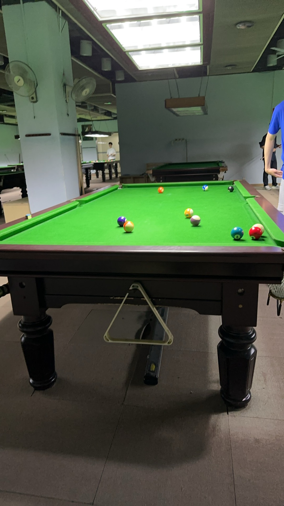
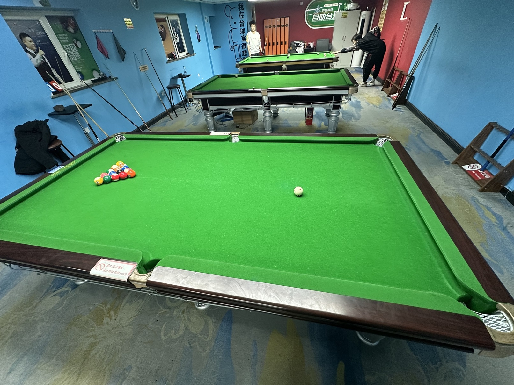

# 场馆设施

## 校园内场馆

### 邱德拔体育馆

- 地址：北京市海淀区颐和园路5号北京大学邱德拔体育馆B1层
- 球桌：24张中式球桌（破旧），1张斯诺克球桌
- 台费：15元/小时

### 新燕园行政楼

- 地址：北京市昌平区马池口镇北京大学（新燕园校区）行政楼1层
- 球桌：1张美式球桌（破旧）
- 台费：免费

## 自助式球房

### 小铁自助台球

- 地址：北京市海淀区中关村大街1号海龙大厦H座14层
- 球桌：8张中式球桌
- 台费：【金腿】31.9元/小时，【银腿】26.9元/小时

### 响袋自助台球

- 地址：北京市海淀区中关村北大街178号3层
- 球桌：5张中式球桌
- 台费：【1-2号台】15.9元/小时，【3-4号台】21元/小时，【5号台】26元/小时

### 谈小娱自助台球

- 地址：北京市海淀区海淀大街天创科技大厦4层
- 球桌：5张中式球桌（1张星牌）
- 台费：25.9元/小时，【特惠】9.9元/小时

## 周边俱乐部

### 蓝旗星俱乐部

- 地址：北京市海淀区成府路125号B1层
- 球桌：若干中式球桌（星牌、乔氏），斯诺克球桌
- 台费：【乔氏普台】46.8元/小时，【星牌金腿】53.8元/小时

### 至尚俱乐部

- 地址：北京市海淀区苏州街1号育新大厦

To be explored ...