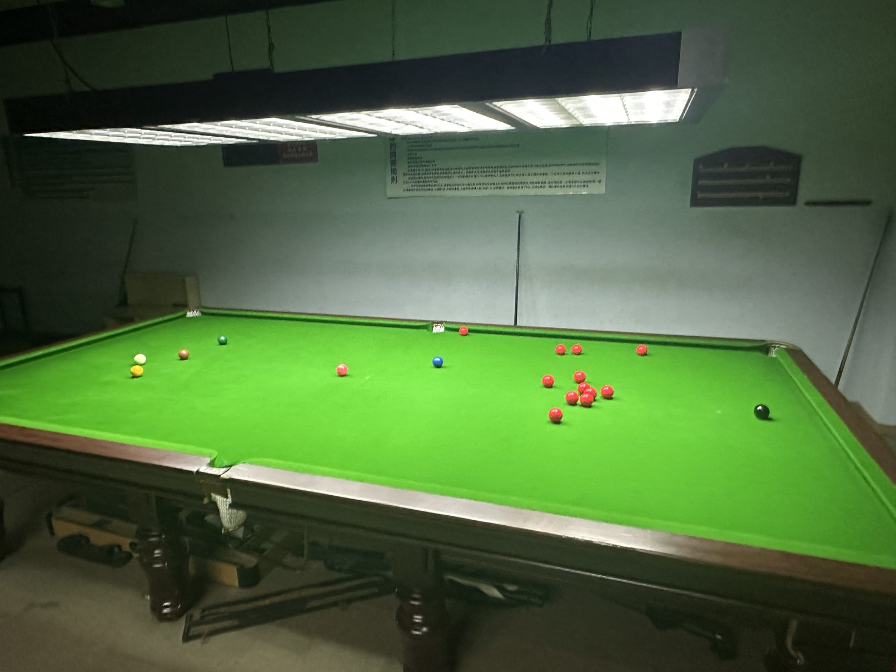

# 英式斯诺克例行赛/English Snooker Regular

| 届次 | 日期        | 地点   | 冠军   | 亚军   | 季军  | 殿军   |
| :--: | :--------: | :----: | :---: | :----: | :---: | :---: |
| 1    | 2024.10.15 | 邱德拔 | 姜星宇 | 魏天昊 | 王翰墨 | 郝明洋\* |
| 2    | 2024.10.16 | 邱德拔 | 魏天昊 | 姜星宇 | 王翰墨 | 郝明洋\* |
| 3    | 2024.11.21 | 邱德拔 | 魏天昊 | 王翰墨 | 姜星宇 | 郝明洋\* |
| 4    | 2024.11.25 | 邱德拔 | 王翰墨 | 魏天昊 | 姜星宇 | 郝明洋   |
| 5    | 2025.01.13 | 邱德拔 | 魏天昊 | 王翰墨 | 姜星宇 | 郝明洋\* |
| 6    | 2025.02.12 | 邱德拔 | 王翰墨 | 姜星宇 | 魏天昊 | 郝明洋\* |
| 7    | 2025.02.26 | 邱德拔 | 王翰墨 | 魏天昊 | 姜星宇 | 郝明洋\* |
| 8    | 2025.03.10 | 邱德拔 | 魏天昊 | 王翰墨 | 姜星宇 | 郝明洋\* |
| 9    | 2025.04.22 | 邱德拔 | 魏天昊 | 姜星宇 | 王翰墨 | 无      |
| 10   | 2025.05.13 | 邱德拔 | 姜星宇 | 王翰墨 | 魏天昊 | 无      |

*\* Did not play*

英式斯诺克例行赛，是MPRC台球俱乐部例行的英式斯诺克赛事。比赛采用单局制多人对战赛，参赛人数至少为3人，循环轮流击球，按得分排定名次。

## 历届赛历

### S1赛季

#### 第一届

| 选手A            | 选手B        | 选手C        | 选手D            |
| :--------------: | :----------: | :----------: | :--------------: |
| 魏天昊（30\*\*） | 王翰墨（30） | 姜星宇（33） | 郝明洋（NULL\*） |

*\* Did not play*

*\*\* Rank 2nd according to the draw*

#### 第二届

| 选手A        | 选手B        | 选手C        | 选手D            |
| :----------: | :----------: | :----------: | :--------------: |
| 姜星宇（64） | 王翰墨（51） | 魏天昊（73） | 郝明洋（NULL\*） |

*\* Did not play*

### S2赛季

#### 第三届

| 选手A        | 选手B        | 选手C        | 选手D            |
| :----------: | :----------: | :----------: | :--------------: |
| 魏天昊（55） | 姜星宇（33） | 王翰墨（42） | 郝明洋（NULL\*） |

*\* Did not play*

#### 第四届

| 选手A        | 选手B        | 选手C        | 选手D            |
| :----------: | :----------: | :----------: | :--------------: |
| 魏天昊（36） | 王翰墨（49） | 姜星宇（31） | 郝明洋（16） |

### S3赛季

#### 第五届

| 选手A        | 选手B        | 选手C        | 选手D            |
| :----------: | :----------: | :----------: | :--------------: |
| 姜星宇（27） | 王翰墨（31）  | 魏天昊（38） | 郝明洋（16\*） |

*\* Did not play*

### S4赛季

#### 第六届

| 选手A        | 选手B        | 选手C        | 选手D            |
| :----------: | :----------: | :----------: | :--------------: |
| 王翰墨（79） | 魏天昊（36）  | 姜星宇（45） | 郝明洋（38\*） |

*\* Did not play*

#### 第七届

| 选手A        | 选手B        | 选手C        | 选手D            |
| :----------: | :----------: | :----------: | :--------------: |
| 王翰墨（78） | 姜星宇（52）  | 魏天昊（63） | 郝明洋（58\*） |

*\* Did not play*

#### 第八届

| 选手A        | 选手B        | 选手C        | 选手D            |
| :----------: | :----------: | :----------: | :--------------: |
| 王翰墨（50） | 魏天昊（81）  | 姜星宇（48） | 郝明洋（49\*） |

*\* Did not play*

### S5赛季

#### 第九届

| 选手A        | 选手B        | 选手C        |
| :----------: | :----------: | :----------: |
| 魏天昊（67） | 王翰墨（17）  | 姜星宇（58） |

#### 第十届

| 选手A        | 选手B        | 选手C        |
| :----------: | :----------: | :----------: |
| 魏天昊（30） | 姜星宇（52）  | 王翰墨（42） |