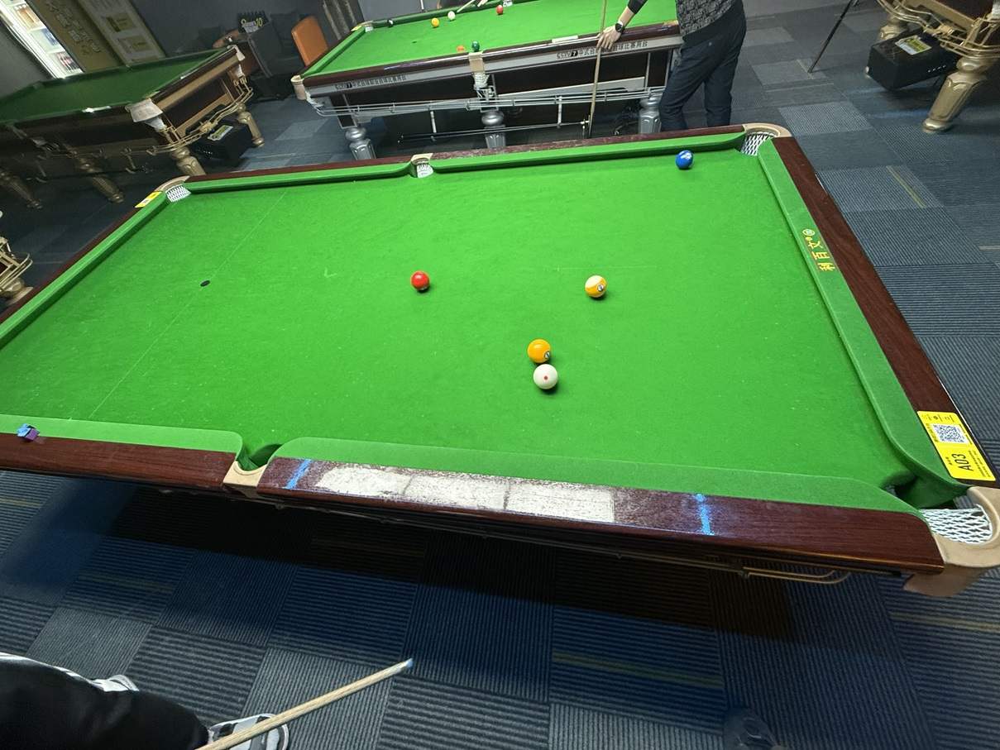

# 四球追分例行赛/4-Ball Regular

| 届次 | 日期       | 场地    | 冠军   | 亚军    | 季军  | 殿军 |
| :--: | :--------: | :----: | :---: | :----: |:----: | :---: |
| 1    | 2025.02.25 | 熊猫   | 魏天昊 | 王翰墨 | 郝明洋 | 姜星宇 |
| 2    | 2025.03.04 | 邱德拔 | 姜星宇 | 魏天昊 | 王翰墨 | 郝明洋\* |
| 3    | 2025.03.12 | 邱德拔 | 姜星宇 | 王翰墨 | 魏天昊 | 郝明洋\* |
| 4    | 2025.03.21 | 熊猫   | 姜星宇 | 魏天昊 | 王翰墨 | 郝明洋\* |

*\* Did not play*

四球追分例行赛至少由3人参加，采用由中式九球追分而演变的四球追分，按MPRC四球追分的计分规则计算，最终根据计分结果排定名次。

## 历届赛历

### 第一届

| 场序 |    选手A         |   选手B         |   选手C          |   选手D         |   备注     |
| :--: | :-------------: | :-------------: | :-------------: | :-------------: | :--------: |
|  1   | 姜星宇（-2）     | **王翰墨（+3）** | 魏天昊（-1）     | 郝明洋（0）      | 普通胜利   |
|  2   | **王翰墨（+3）** | 郝明洋（-1）     | 魏天昊（+1）     | 姜星宇（-3）     | 普通胜利   |
|  3   | 王翰墨（0）      | 姜星宇（0）      | 魏天昊（-1）     | **郝明洋（+1）** | 普通胜利   |
|  4   | 郝明洋（0）      | 姜星宇（-1）     | 魏天昊（-1）     | **王翰墨（+2）** | 普通胜利   |
|  5   | **王翰墨（+5）** | 魏天昊（0）      | 郝明洋（0）      | 姜星宇（-5）     | 小金一九金 |
|  6   | 王翰墨（0）      | 姜星宇（0）      | 郝明洋（-3）     | **魏天昊（+3）** | 普通胜利   |
|  7   | 魏天昊（0）      | 姜星宇（-2）     | **王翰墨（+2）** | 郝明洋（0）      | 普通胜利   |
|  8   | 王翰墨（-2）     | **魏天昊（+1）** | 郝明洋（+1）     | 姜星宇（0）      | 普通胜利   |
|  9   | **魏天昊（+2）** | 姜星宇（0）      | 郝明洋（+1）     | 王翰墨（-3）     | 普通胜利   |
|  10  | 魏天昊（-1）     | 郝明洋（0）      | **姜星宇（+1）** | 王翰墨（0）      | 普通胜利   |
|  11  | **姜星宇（+6）** | 魏天昊（-2）     | 王翰墨（-2）     | 郝明洋（-2）     | 大金黄金九 |
|  12  | 姜星宇（-2）     | **王翰墨（+2）** | 魏天昊（0）      | 郝明洋（0）      | 普通胜利   |
|  13  | 王翰墨（-3）     | **魏天昊（+2）** | 郝明洋（0）      | 姜星宇（+1）     | 普通胜利   |
|  14  | **魏天昊（+3）** | 姜星宇（-1）     | 郝明洋（+1）     | 王翰墨（-3）     | 普通胜利   |

| 排名 |  姓名  | 积分 | 
| :--: | :---: | :--: |
|  1   | 魏天昊 |  6   |
|  2   | 王翰墨 |  4   |
|  3   | 郝明洋 |  -2  |
|  4   | 姜星宇 |  -8  |

### 第二届

| 场序 |    选手A         |   选手B         |   选手C          |   备注     |
| :--: | :-------------: | :-------------: | :-------------: | :--------: |
|  1   | 魏天昊（-3）     | **王翰墨（+2）** | 姜星宇（+1）     | 普通胜利   |
|  2   | 王翰墨（-2）     | **魏天昊（+1）** | 姜星宇（+1）     | 普通胜利   |
|  3   | **魏天昊（+2）** | 王翰墨（0）      | 姜星宇（-2）     | 普通胜利   |
|  4   | **魏天昊（+1）** | 姜星宇（0）      | 王翰墨（-1）     | 普通胜利   |
|  5   | 魏天昊（0）      | 王翰墨（-3）     | **姜星宇（+3）** | 普通胜利   |
|  6   | 姜星宇（-3）     | **王翰墨（+2）** | 魏天昊（+1）     | 普通胜利   |
|  7   | **王翰墨（+2）** | 姜星宇（+1）     | 魏天昊（-3）     | 普通胜利   |
|  8   | 王翰墨（-3）     | **魏天昊（+2）** | 姜星宇（+1）     | 普通胜利   |
|  9   | 魏天昊（+2）     | 王翰墨（-4）     | **姜星宇（+2）** | 普通胜利   |
|  10  | **姜星宇（+3）** | 王翰墨（-1）     | 魏天昊（-2）     | 普通胜利   |
|  11  | 姜星宇（+1）     | 魏天昊（-2）     | **王翰墨（+1）** | 普通胜利   |

| 排名 |  姓名  | 积分 | 
| :--: | :---: | :--: |
|  1   | 姜星宇 |  8   |
|  2   | 魏天昊 |  -1  |
|  3   | 王翰墨 |  -7  |
|  4   | 郝明洋 |  0\* |

*\* Did not play*

### 第三届

| 场序 |    选手A         |   选手B         |   选手C          |   备注     |
| :--: | :-------------: | :-------------: | :-------------: | :--------: |
|  1   | **姜星宇（+3）** | 魏天昊（-1）     | 王翰墨（-2）     | 普通胜利   |
|  2   | **姜星宇（+2）** | 王翰墨（0）      | 魏天昊（-2）     | 普通胜利   |
|  3   | 姜星宇（-1）     | **魏天昊（+2）** | 王翰墨（-1）     | 普通胜利   |
|  4   | 魏天昊（0）      | 姜星宇（-2）     | **王翰墨（+2）** | 普通胜利   |
|  5   | 王翰墨（-2）     | **姜星宇（+2）** | 魏天昊（0）      | 普通胜利   |
|  6   | **姜星宇（+2）** | 王翰墨（0）      | 魏天昊（-2）     | 普通胜利   |
|  7   | **姜星宇（+2）** | 魏天昊（+1）     | 王翰墨（-3）     | 普通胜利   |
|  8   | **姜星宇（+6）** | 王翰墨（-3）     | 魏天昊（-3）     | 大金黄金九 |
|  9   | 姜星宇（0）      | 魏天昊（-2）     | **王翰墨（+2）** | 普通胜利   |
|  10  | 王翰墨（0）      | 魏天昊（-4）     | **姜星宇（+4）** | 普通胜利   |
|  11  | **姜星宇（+1）** | 魏天昊（0）      | 王翰墨（-1）     | 普通胜利   |
|  12  | 姜星宇（-4）     | **王翰墨（+4）** | 魏天昊（0）      | 普通胜利   |

| 排名 |  姓名  | 积分 | 
| :--: | :---: | :--: |
|  1   | 姜星宇 |  15  |
|  2   | 王翰墨 |  -4  |
|  3   | 魏天昊 |  -11 |
|  4   | 郝明洋 |  0\* |

*\* Did not play*

### 第四届

| 场序 |    选手A         |   选手B         |   选手C          |   备注     |
| :--: | :-------------: | :-------------: | :-------------: | :--------: |
|  1   | 姜星宇（0）      | 王翰墨（-2）     | **魏天昊（+2）** | 普通胜利   |
|  2   | 魏天昊（-1）     | 王翰墨（-2）     | **姜星宇（+3）** | 普通胜利   |
|  3   | 姜星宇（-6）     | **王翰墨（+6）** | 魏天昊（0）      | 小金一九金 |
|  4   | **王翰墨（+2）** | 姜星宇（0）      | 魏天昊（-2）     | 普通胜利   |
|  5   | **王翰墨（+1）** | 魏天昊（0）      | 姜星宇（-1）     | 普通胜利   |
|  6   | 王翰墨（-1）     | 姜星宇（-2）     | **魏天昊（+3）** | 普通胜利   |
|  7   | 魏天昊（-2）     | **姜星宇（+2）** | 王翰墨（0）      | 普通胜利   |
|  8   | **姜星宇（+2）** | 魏天昊（0）      | 王翰墨（-2）     | 普通胜利   |
|  9   | **姜星宇（+6）** | 王翰墨（-3）     | 魏天昊（-3）     | 大金黄金九 |
|  10  | 姜星宇（+1）     | 魏天昊（-3）     | **王翰墨（+2）** | 普通胜利   |
|  11  | 王翰墨（-4）     | **魏天昊（+3）** | 姜星宇（+1）     | 普通黄金九 |
|  12  | 魏天昊（0）      | **王翰墨（0）**  | 姜星宇（0）      | 普通胜利   |
|  13  | **王翰墨（+3）** | 魏天昊（+1）     | 姜星宇（-4）     | 普通胜利   |
|  14  | 王翰墨（+2）     | 姜星宇（-3）     | **魏天昊（+1）** | 普通胜利   |
|  15  | 魏天昊（0）      | **姜星宇（+3）** | 王翰墨（-3）     | 普通黄金九（让杆） |
|  16  | 姜星宇（0）      | 王翰墨（-2）     | **魏天昊（+2）** | 普通胜利   |

| 排名 |  姓名  | 积分 | 
| :--: | :---: | :--: |
|  1   | 姜星宇 |  2   |
|  2   | 魏天昊 |  1   |
|  3   | 王翰墨 |  -3  |
|  4   | 郝明洋 |  0\* |

*\* Did not play*