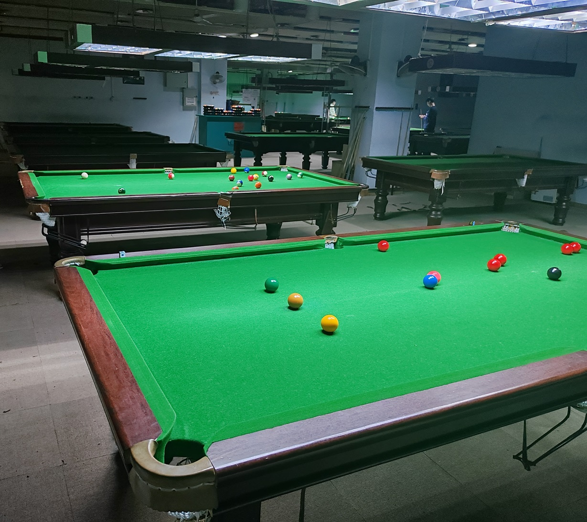

# MPRC台球锦标赛/MPRC Championships

| 届次 | 日期                   | 场地        | 冠军   | 决赛比分 | 亚军   | 季军    | 殿军   |
| :--: | :-------------------: | :---------: | :----: | :----:  | :----: | :----: | :----: |
| 1    | 2024.12.10-           | 邱德拔/熊猫  |        |         |        |        | 郝明洋 |

MPRC台球锦标赛是MPRC台球俱乐部积分最高、奖金最多的大型综合赛事，一般在节假日举办。锦标赛综合了八球和斯诺克两种玩法，使用双循环排名赛和双败淘汰赛的赛制，这使得锦标赛的场次繁多，冠军的含金量和综合水平也极高。

双循环排名赛由4名选手参加，进行6轮共12场比赛，每两个选手之间进行一次八球比赛和一次斯诺克比赛。排名赛结束后，根据积分排定1-4号种子。双败淘汰赛分为胜者组和败者组，其中1号、2号种子进入胜者组决赛，3号、4号种子进入败者组准决赛。胜者组决赛的胜者直接进入总决赛，败者则掉入败者组；败者组准决赛的胜者晋级；败者淘汰。败者组决赛在胜者组决赛败者和败者组准决赛胜者之间举行，争夺第二个总决赛席位。总决赛采用七局四胜制的系列赛，其余淘汰赛阶段的比赛采用五局三胜制的系列赛，所有系列赛的奇数局进行八球比赛，偶数局进行斯诺克比赛。



## 历届赛历

### 第一届

**排名赛阶段：**

排名赛阶段使用的斯诺克规则为六红球中式斯诺克，比赛分为两个比赛日：

- 第一个比赛日为2024.12.10，地点为邱德拔体育馆，进行了第一轮至第三轮比赛。
- 第二个比赛日为2024.12.11，地点为邱德拔体育馆，进行了第四轮至第六轮比赛。

| 场序 | 轮次   | 规则   | 选手A  | 比分   | 选手B  | 备注  |
| :--: | :---: | :----: | :----: | :---: | :---: | :---: |
| 1    | 第一轮 | 八球   | 魏天昊 | 7-8    | 姜星宇 | Final |
| 2    | 第一轮 | 斯诺克 | 王翰墨 | 34-27  | 郝明洋 | Final |
| 3    | 第二轮 | 八球   | 魏天昊 | 6-8    | 王翰墨 | Final |
| 4    | 第二轮 | 斯诺克 | 郝明洋 | 30-42  | 姜星宇 | Final |
| 5    | 第三轮 | 八球   | 郝明洋 | 4-8    | 魏天昊 | Final |
| 6    | 第三轮 | 斯诺克 | 姜星宇 | 1-56   | 王翰墨 | Final |
| 7    | 第四轮 | 八球   | 王翰墨 | 4-0    | 姜星宇 | Final |
| 8    | 第四轮 | 斯诺克 | 魏天昊 | 46-12  | 郝明洋 | Final |
| 9    | 第五轮 | 八球   | 郝明洋 | 5-8    | 王翰墨 | Final |
| 10   | 第五轮 | 斯诺克 | 姜星宇 | 39-22  | 魏天昊 | Final |
| 11   | 第六轮 | 八球   | 姜星宇 | 4-0    | 郝明洋 | Final |
| 12   | 第六轮 | 斯诺克 | 王翰墨 | 33-29  | 魏天昊 | Final |

| 排名 | 姓名   | 积分 | 胜/负  | 八球小分 | 斯诺克小分 |
| :--: | :---: | :--: | :---: | :------: | :-------: |
| 1    | 王翰墨 | 12   | 6-0   | 20-11   | 123-57    |
| 2    | 姜星宇 | 10   | 4-2   | 12-11   | 82-108    |
| 3    | 魏天昊 | 8    | 2-4   | 21-20   | 97-84     |
| 4    | 郝明洋 | 6    | 0-6   | 9-20    | 69-122    |

**淘汰赛阶段：**

```
	胜者组决赛																			  	  总决赛
----------------																		----------------
	  王翰墨			-----Winner---------------------------------------------------> 	   王翰墨
	  3-1																				  	  0-0
	  姜星宇			-----Loser----											   --->		  	W3
----------------				 	|			败者组决赛						|		----------------
								 	|		----------------					|
								  	---->	  	   姜星宇		-----Winner------
												   1-1
   败者组准决赛					  	---->		  魏天昊
----------------				 	|		----------------
	  魏天昊			-----Winner---
	  3-0
	  郝明洋
----------------
```

- 第三个比赛日为2024.12.30，地点为邱德拔体育馆，进行了败者组准决赛G1、G2和胜者组决赛G1、G3。
- 第四个比赛日为2025.01.02，地点为熊猫球社，进行了败者组准决赛G3和胜者组决赛G2、G4。

| 场序 | 阶段         | 规则   | 选手A  | 比分   | 选手B   | 备注           |
| :--: | :---------: | :----: | :----: | :---: | :-----: | :------------: |
| 13   | 败者组准决赛 | 八球   | 魏天昊  | 8-7   | 郝明洋  | Final          |
| 14   | 败者组准决赛 | 斯诺克 | 郝明洋  | 58-81 | 魏天昊  | Final          |
| 15   | 败者组准决赛 | 八球   | 郝明洋  | 4-8   | 魏天昊  | Final          |
| 16   | 败者组准决赛 | 斯诺克 | 魏天昊  | 0-0   | 郝明洋  | Cancelled      |
| 17   | 败者组准决赛 | 八球   | 魏天昊  | 0-0   | 郝明洋  | Cancelled      |

| 场序 | 阶段         | 规则   | 选手A  | 比分   | 选手B   | 备注           |
| :--: | :---------: | :----: | :----: | :--:  | :----: | :------------: |
| 18   | 胜者组决赛   | 八球   | 王翰墨  | 8-7   | 姜星宇  | Final          |
| 19   | 胜者组决赛   | 斯诺克 | 姜星宇  | 24-35 | 王翰墨  | Final          |
| 20   | 胜者组决赛   | 八球   | 姜星宇  | 8-7   | 王翰墨  | Final          |
| 21   | 胜者组决赛   | 斯诺克 | 王翰墨  | 68-29 | 姜星宇  | Final          |
| 22   | 胜者组决赛   | 八球   | 王翰墨  | 0-0   | 姜星宇  | Cancelled      |

- 第五个比赛日为2025.01.07，地点为熊猫球社，进行了败者组决赛G1、G3。

| 场序 | 阶段         | 规则   | 选手A  | 比分  | 选手B   | 备注           |
| :--: | :---------: | :----: | :----: | :--: | :----: | :------------: |
| 23   | 败者组决赛   | 八球   | 姜星宇 | 5-8   | 魏天昊 | Final          |
| 24   | 败者组决赛   | 斯诺克 | 魏天昊 | 0-0   | 姜星宇 | Due            |
| 25   | 败者组决赛   | 八球   | 魏天昊 | 5-8   | 姜星宇 | Final          |
| 26   | 败者组决赛   | 斯诺克 | 姜星宇 | 0-0   | 魏天昊 | Due            |
| 27   | 败者组决赛   | 八球   | 姜星宇 | 0-0   | 魏天昊 | If necessary   |

| 场序 | 阶段         | 规则   | 选手A  | 比分  | 选手B   | 备注           |
| :--: | :---------: | :----: | :----: | :--: | :----: | :------------: |
| 28   | 总决赛       | 八球   | 王翰墨 | 0-0   | W3     | Due            |
| 29   | 总决赛       | 斯诺克 | 王翰墨 | 0-0   | W3     | Due            |
| 30   | 总决赛       | 八球   | W3     | 0-0   | 王翰墨 | Due            |
| 31   | 总决赛       | 斯诺克 | W3     | 0-0   | 王翰墨 | Due            |
| 32   | 总决赛       | 八球   | W3     | 0-0   | 王翰墨 | If necessary   |
| 33   | 总决赛       | 斯诺克 | 王翰墨 | 0-0   | W3     | If necessary   |
| 34   | 总决赛       | 八球   | 王翰墨 | 0-0   | W3     | If necessary   |