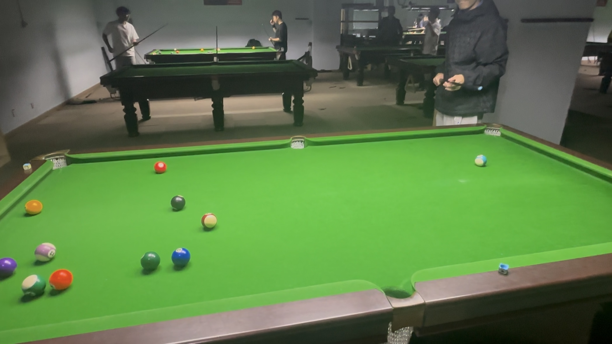

# 中式八球友谊赛/Chinese 8-Ball Friendly

| 届次 | 日期        | 场地  | 胜者   | 比分 | 负者   |
| ---- | ---------- | ----- | ------ | --- | ------ |
| 1    | 2024.10.31 | 邱德拔 | 王翰墨 | 3-2 | 姜星宇 |
| 2    | 2024.11.07 | 邱德拔 | 王翰墨 | 3-2 | 姜星宇 |
| 2    | 2024.11.07 | 邱德拔 | 姜星宇 | 4-1 | 王翰墨 |

中式八球友谊赛为友谊赛，不计入积分，部分比赛记录可能丢失。

## 历届赛历

### 第一届

| 场序 | 选手A  | 比分 | 选手B  | 用时   | 备注  |
| ---- | ------ | --- | ------ | ----- | ----- |
| 1    | 王翰墨 | 6-8 | 姜星宇 | 10min  | Final |
| 2    | 姜星宇 | 8-7 | 王翰墨 | 12min  | Final |
| 3    | 王翰墨 | 8-4 | 姜星宇 | 12min  | Final |
| 4    | 姜星宇 | 0-4 | 王翰墨 | 2.5min | Foul  |
| 5    | 王翰墨 | 8-5 | 姜星宇 | 7.5min | Final |

### 第二届

| 场序 | 选手A  | 比分 | 选手B  | 用时    | 备注  |
| ---- | ------ | --- | ------ | ------ | ----- |
| 1    | 王翰墨 | 0-4 | 姜星宇 | 1.5min  | Foul  |
| 2    | 姜星宇 | 8-7 | 王翰墨 | 19.5min | Final |
| 3    | 王翰墨 | 8-4 | 姜星宇 | 12min   | Final |
| 4    | 姜星宇 | 4-8 | 王翰墨 | 10min   | Final |
| 5    | 王翰墨 | 8-7 | 姜星宇 | 12.5min | Final |

### 第三届

| 场序 | 选手A  | 比分 | 选手B  | 用时    | 备注  |
| ---- | ------ | --- | ------ | ------ | ----- |
| 1    | 王翰墨 | 7-8 | 姜星宇 | 8min    | Final |
| 2    | 姜星宇 | 6-8 | 王翰墨 | 12min   | Final |
| 3    | 王翰墨 | 6-8 | 姜星宇 | 12.5min | Final |
| 4    | 姜星宇 | 4-0 | 王翰墨 | 2min    | Foul  |
| 5    | 王翰墨 | 7-8 | 姜星宇 | 13min   | Final |
