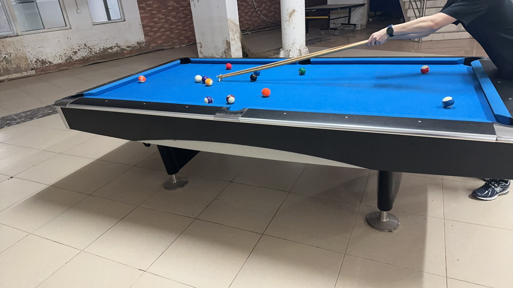

# 美式八球友谊赛/American 8-Ball Friendly

| 届次 | 日期        | 场地  | 选手A  | 比分 | 选手B  |
| :--: | :--------: | :---: | :----: | :-: | :----: |
| 1    | 2024.09.16 | 新燕园 | 魏天昊 | x-x\* | 姜星宇 |

*\* Unknown due to loss of results*

美式八球友谊赛使用美式球桌，该比赛为友谊赛，不计入积分，部分比赛记录可能丢失。

