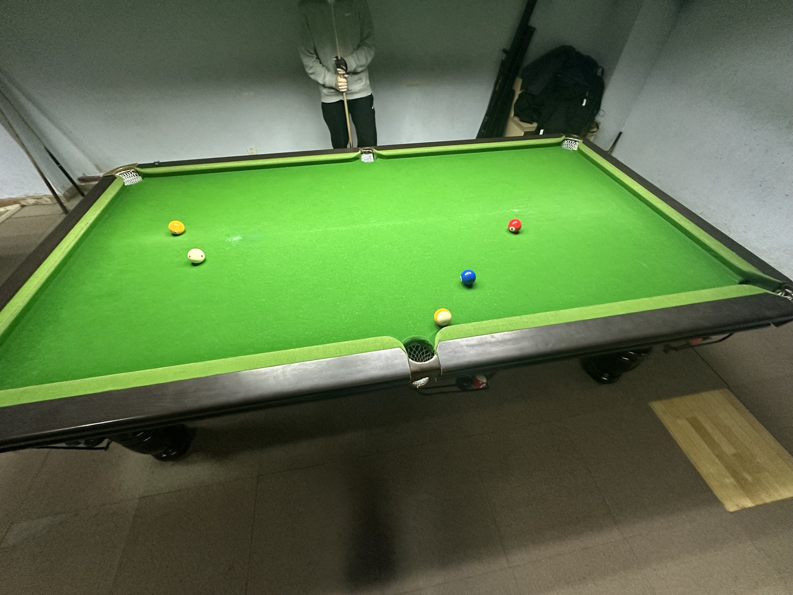

# 四球追分友谊赛/4-Ball Friendly

| 届次 | 日期        | 场地   | 选手A  | 比分 | 选手B |
| :--: | :--------: | :----: | :---: | :-: | :----: |
| 1    | 2025.02.17 | 邱德拔 | 魏天昊 | 3-3 | 王翰墨 |
| 2    | 2025.03.18 | 邱德拔 | 魏天昊 | 7-8 | 姜星宇 |
| 3    | 2025.05.20 | 邱德拔 | 姜星宇 | 6-9 | 王翰墨 |

四球追分友谊赛采用中式九球追分的变种规则，并将九球缩减为四球。该比赛为友谊赛，不计入积分，部分比赛记录可能丢失。四球追分友谊赛按MPRC四球追分的二分计分规则结算分数。

## 历届赛历

### 第一届

| 场序 | 选手A  | 比分 | 选手B  | 备注    |
| :--: | :----: | :-: | :----: | :----: |
| 1    | 魏天昊 | 0:1 | 王翰墨 | 普通胜利 |
| 2    | 王翰墨 | 0:1 | 魏天昊 | 普通胜利 |
| 3    | 魏天昊 | 0:1 | 王翰墨 | 普通胜利 |
| 4    | 王翰墨 | 1:0 | 魏天昊 | 普通胜利 |
| 5    | 魏天昊 | 1:0 | 王翰墨 | 普通胜利 |
| 6    | 王翰墨 | 0:1 | 魏天昊 | 普通胜利 |

### 第二届

| 场序 | 选手A  | 比分 | 选手B  | 备注      |
| :--: | :----: | :-: | :----: | :------: |
| 1    | 魏天昊 | 1:0 | 姜星宇 | 普通胜利   |
| 2    | 姜星宇 | 1:0 | 魏天昊 | 普通胜利   |
| 3    | 魏天昊 | 0:1 | 姜星宇 | 普通胜利   |
| 4    | 姜星宇 | 0:1 | 魏天昊 | 普通胜利   |
| 5    | 魏天昊 | 0:1 | 姜星宇 | 普通胜利   |
| 6    | 姜星宇 | 0:1 | 魏天昊 | 普通胜利   |
| 7    | 魏天昊 | 1:0 | 姜星宇 | 普通胜利   |
| 8    | 姜星宇 | 0:1 | 魏天昊 | 普通胜利   |
| 9    | 魏天昊 | 0:1 | 姜星宇 | 普通胜利   |
| 10   | 姜星宇 | 0:1 | 魏天昊 | 普通胜利   |
| 11   | 魏天昊 | 0:1 | 姜星宇 | 普通胜利   |
| 12   | 姜星宇 | 0:1 | 魏天昊 | 普通胜利   |
| 13   | 魏天昊 | 0:3 | 姜星宇 | 小金一九金 |

### 第三届

| 场序 | 选手A  | 比分 | 选手B  | 备注      |
| :--: | :----: | :-: | :----: | :------: |
| 1    | 姜星宇 | 1:0 | 王翰墨 | 普通胜利   |
| 2    | 王翰墨 | 1:0 | 姜星宇 | 普通胜利   |
| 3    | 姜星宇 | 1:0 | 王翰墨 | 普通胜利   |
| 4    | 王翰墨 | 4:0 | 姜星宇 | 小金全球金 |
| 5    | 姜星宇 | 0:1 | 王翰墨 | 普通胜利   |
| 6    | 王翰墨 | 1:0 | 姜星宇 | 普通胜利   |
| 7    | 姜星宇 | 0:2 | 王翰墨 | 大金黄金九 |
| 8    | 王翰墨 | 0:1 | 姜星宇 | 普通胜利   |
| 9    | 姜星宇 | 1:0 | 王翰墨 | 普通胜利   |
| 10   | 王翰墨 | 0:2 | 姜星宇 | 普通黄金九 |