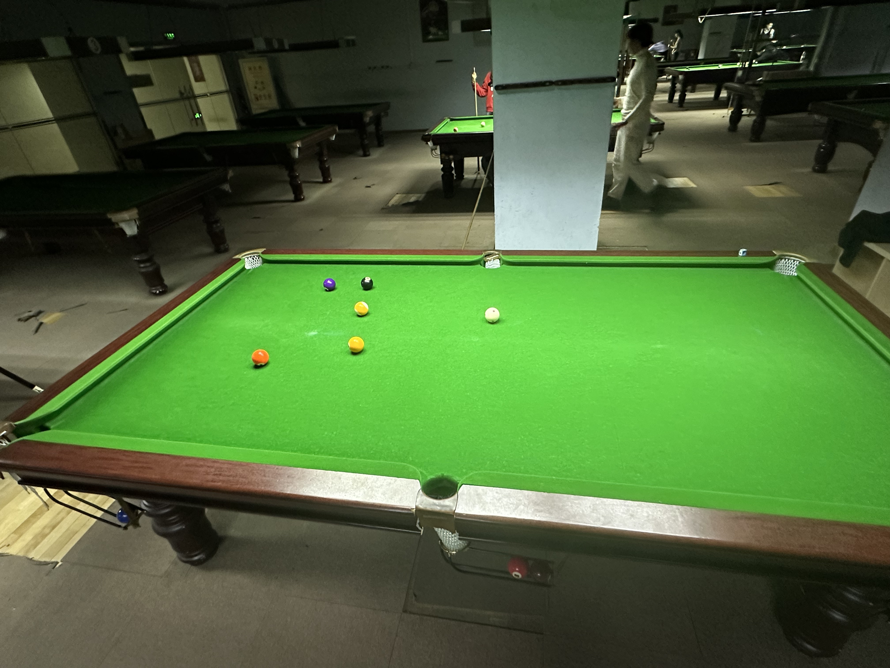

# 翻袋台球友谊赛/Bank Pool Friendly

| 届次 | 日期       | 地点    | 胜者   | 比分  | 负者   |
| ---- | ---------- | ----- | ------ | ----- | ------ |
| 1    | 2024.12.06 | 邱德拔 | 魏天昊 | 5-3   | 姜星宇 |

十五球旋转友谊赛采用翻袋台球规则，该比赛为友谊赛，不计入积分，部分比赛记录可能丢失。

