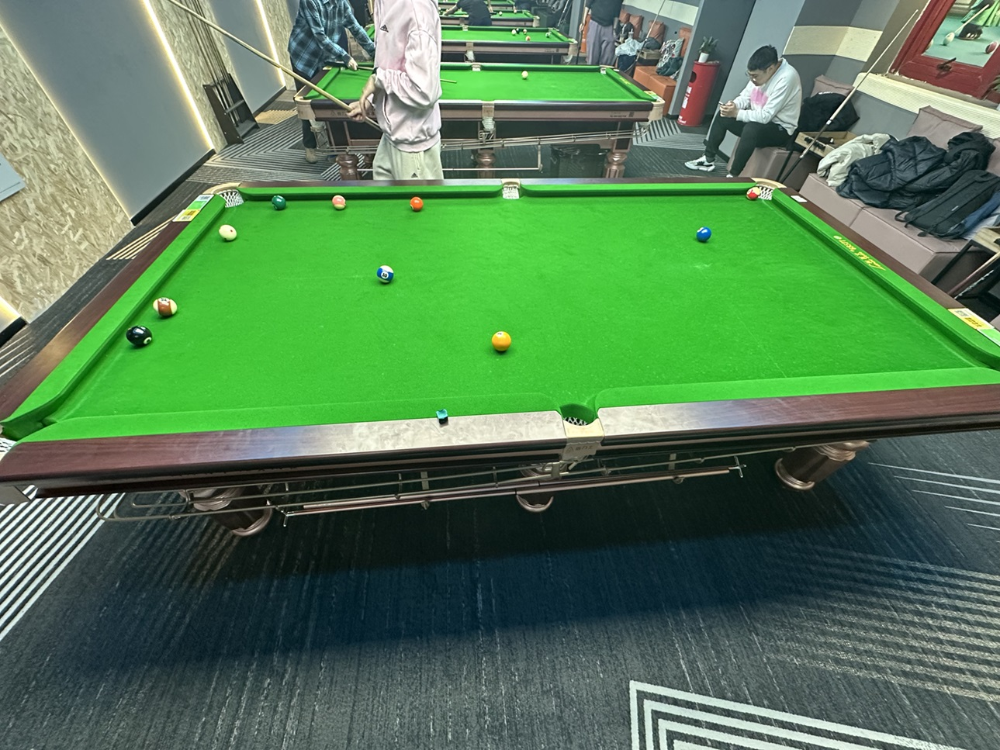

# 反向八球友谊赛/Backward 8-Ball Friendly

| 届次 | 日期       | 地点    | 选手A  | 比分  | 选手B  |
| :--: | :--------: | :----: | :---: | :---: | :----: |
| 1    | 2025.01.02 | 熊猫   | 王翰墨 | 6:5\* | 姜星宇 |

*\* Timeout*

反向八球友谊赛采用反向八球规则，该比赛为友谊赛，不计入积分，部分比赛记录可能丢失。

