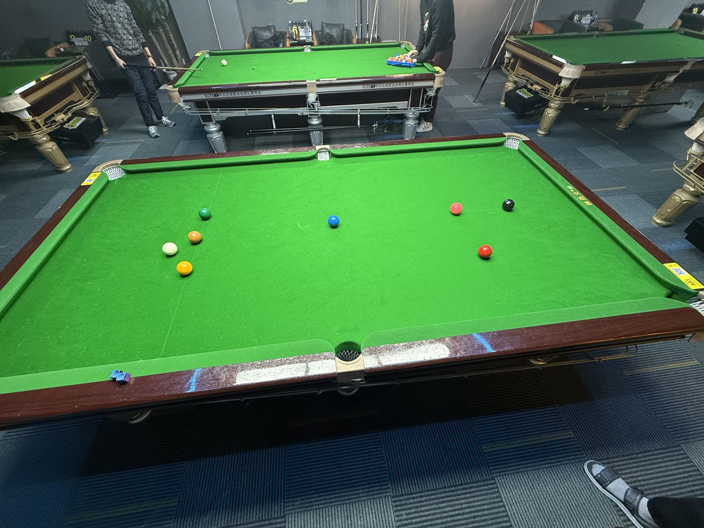

# 巴西斯诺克友谊赛/Brazil Snooker Friendly

| 届次 | 日期        | 场地  | 选手A  | 比分   | 选手B  |
| :--: | :--------: | :---:  | :---: | :---: | :---: |
| 1    | 2025.02.27 | 小铁  | 王翰墨 | 52:56 | 姜星宇 |

巴西斯诺克友谊赛采用巴西斯诺克规则，该比赛为友谊赛，不计入积分。

