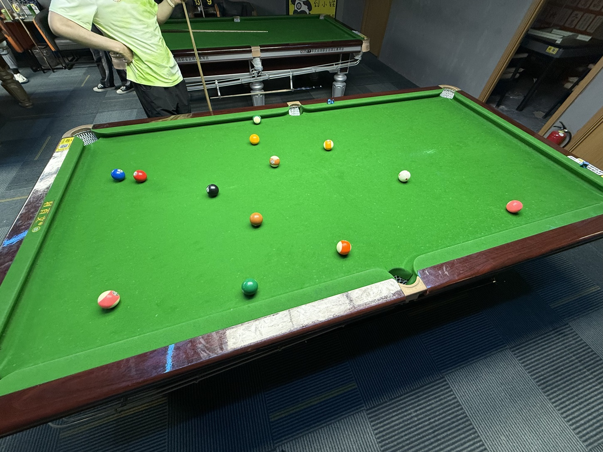

# 克里巴奇友谊赛/Cribbage Friendly

| 届次 | 日期        | 场地  | 选手A  | 比分   | 选手B  |
| :--: | :--------: | :---:  | :---: | :---: | :---: |
| 1    | 2025.05.08 | 小铁  | 王翰墨 |  7:0  | 姜星宇 |

克里巴奇友谊赛采用克里巴奇台球规则，双方选手进行多局比赛，在限定时间内得分高者或率先达到预定分值者获胜。

## 历届赛历

### 第一届

| 局数  | 王翰墨 | 姜星宇  |
| :---: | :---: | :----: |
|  1    |   5   |   0    |
|  2    |   2   |   0    |
| Total |   7   |   0    |