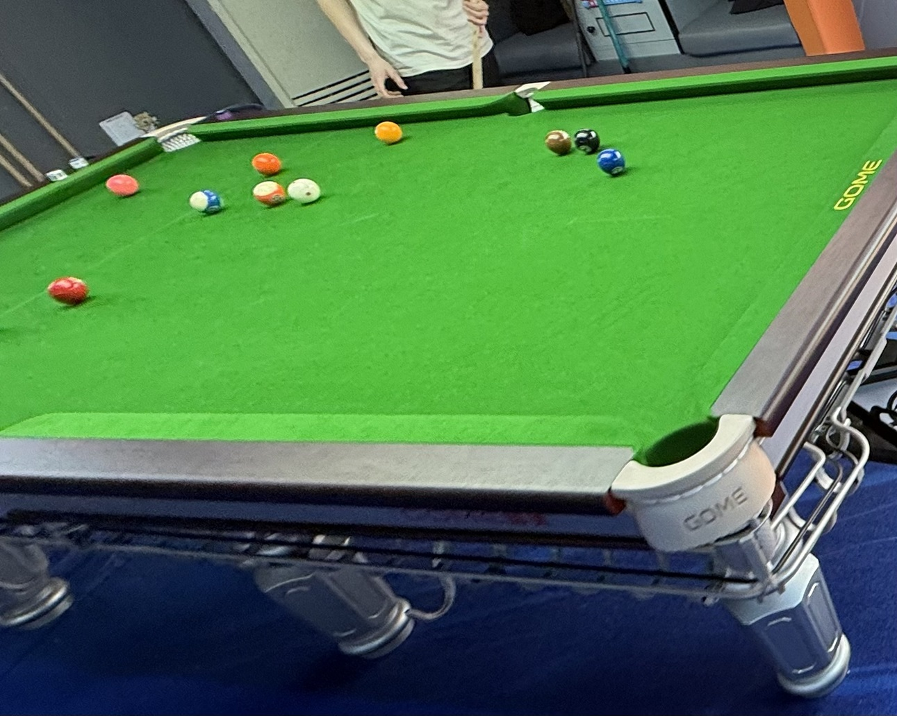

# 中式八球大师赛/Chinese 8-Ball Masters

| 届次 |          日期          |         场地          | 冠军   | 亚军  | 季军  |
| :--: | :-------------------: | :-------------------: | :---: | :---: | :---: |
| 1    | 2025.06.16-2025.07.04 | 邱德拔/熊猫/蓝旗星/小铁 | 王翰墨 | 魏天昊 | 姜星宇 |
| 2    | 2025.11.17-2025.12.08 | 邱德拔/熊猫            | 魏天昊 | 姜星宇 | 王翰墨 |
| 3    | 2025.12.08-2025.12.24 | 邱德拔                 | 魏天昊 | 王翰墨 | 姜星宇 |
| 4    | 2025.12.24-2026.01.08 | 邱德拔/熊猫/南山里      | 魏天昊 | 王翰墨 | 姜星宇 |
| 5    | 2026.01.09-           | 邱德拔                 |       |        |       |

中式八球大师赛由三人参加，每局比赛中一人为单打，其余二人为双打，以此展开对抗。单打方获胜可独享2积分，双打方获胜则平分2积分。一届比赛进行36局，最终按积分排定名次。

## 历届赛历

### 第一届

<b>积分榜</b>

| 排名 |  姓名  | 积分 | 单打战绩  | 双打战绩  |    小分     |
| :--: | :---: | :--: | :------: | :------: | :---------: |
|  1   | 王翰墨 |  28  |   7-5    |  14-10   | 164.5:152.5 |
|  2   | 魏天昊 |  25  |   6-6    |  13-11   | 154.0:161.5 |
|  3   | 姜星宇 |  19  |   4-8    |  11-13   | 156.5:161.0 |

| 局数 |  选手A |  比分  |    选手B     | 备注  |
| :--: | :---: | :----: | :---------: | :---: |
| 1    | 王翰墨 |  4:8  | 姜星宇/魏天昊 | Final |
| 2    | 魏天昊 |  5:8  | 姜星宇/王翰墨 | Final |
| 3    | 姜星宇 |  8:4  | 王翰墨/魏天昊 | Final |
| 4    | 王翰墨 |  8:7  | 姜星宇/魏天昊 | Final |
| 5    | 魏天昊 |  5:8  | 姜星宇/王翰墨 | Final |
| 6    | 姜星宇 |  4:8  | 王翰墨/魏天昊 | Final |
| 7    | 王翰墨 |  7:8  | 姜星宇/魏天昊 | Final |
| 8    | 魏天昊 |  8:3  | 姜星宇/王翰墨 | Final |
| 9    | 姜星宇 |  6:8  | 王翰墨/魏天昊 | Final |
| 10   | 王翰墨 |  8:5  | 姜星宇/魏天昊 | Final |
| 11   | 魏天昊 |  7:8  | 姜星宇/王翰墨 | Final |
| 12   | 姜星宇 |  6:8  | 王翰墨/魏天昊 | Final |
| 13   | 王翰墨 |  5:8  | 姜星宇/魏天昊 | Final |
| 14   | 魏天昊 |  7:8  | 姜星宇/王翰墨 | Final |
| 15   | 姜星宇 |  6:8  | 王翰墨/魏天昊 | Final |
| 16   | 王翰墨 |  8:5  | 姜星宇/魏天昊 | Final |
| 17   | 魏天昊 |  6:8  | 姜星宇/王翰墨 | Final |
| 18   | 姜星宇 |  8:7  | 王翰墨/魏天昊 | Final |
| 19   | 王翰墨 |  5:8  | 姜星宇/魏天昊 | Final |
| 20   | 魏天昊 |  8:6  | 姜星宇/王翰墨 | Final |
| 21   | 姜星宇 | X7:6  | 王翰墨/魏天昊 | Final |
| 22   | 王翰墨 |  8:6  | 姜星宇/魏天昊 | Final |
| 23   | 魏天昊 |  8:7  | 姜星宇/王翰墨 | Final |
| 24   | 姜星宇 |  7:8  | 王翰墨/魏天昊 | Final |
| 25   | 王翰墨 |  8:7  | 姜星宇/魏天昊 | Final |
| 26   | 魏天昊 |  5:6X | 姜星宇/王翰墨 | Final |
| 27   | 姜星宇 |  4:8  | 王翰墨/魏天昊 | Final |
| 28   | 王翰墨 |  8:3  | 姜星宇/魏天昊 | Final |
| 29   | 魏天昊 |  8:6  | 姜星宇/王翰墨 | Final |
| 30   | 姜星宇 |  8:1  | 王翰墨/魏天昊 | Final |
| 31   | 王翰墨 |  8:6  | 姜星宇/魏天昊 | Final |
| 32   | 魏天昊 |  3:4X | 姜星宇/王翰墨 | Final |
| 33   | 姜星宇 |  8:7  | 王翰墨/魏天昊 | Final |
| 34   | 王翰墨 | X7:4  | 姜星宇/魏天昊 | Final |
| 35   | 魏天昊 |  6:8  | 姜星宇/王翰墨 | Final |
| 36   | 姜星宇 |  7:8  | 王翰墨/魏天昊 | Final |

- 第一阶段：2025年6月16日于邱德拔体育馆，进行了第1-5局。
- 第二阶段：2025年6月17日于熊猫球社，进行了第6-10局。
- 第三阶段：2025年6月18日于邱德拔体育馆，进行了第11-15局。
- 第四阶段：2025年6月23日于邱德拔体育馆，进行了第16-18局。
- 第五阶段：2025年6月27日于蓝旗星俱乐部，进行了第19-22局。
- 第六阶段：2025年7月2日于熊猫球社，进行了第23-26局。
- 第七阶段：2025年7月3日于小铁自助台球，进行了第27-31局。
- 第八阶段：2025年7月4日于邱德拔体育馆，进行了第32-36局。

### 第二届

<b>积分榜</b>

| 排名 |  姓名  | 积分 | 单打战绩  | 双打战绩  |    小分     |
| :--: | :---: | :--: | :------: | :------: | :---------: |
|  1   | 魏天昊 |  29  |   8-4    |  13-11   |            |
|  2   | 姜星宇 |  26  |   7-5    |  12-12   |            |
|  3   | 王翰墨 |  17  |   4-8    |   9-15   |            |

| 局数 |  选手A |  比分  |    选手B     | 备注  |
| :--: | :---: | :----: | :---------: | :---: |
| 1    | 王翰墨 |  8:6  | 姜星宇/魏天昊 | Final |
| 2    | 魏天昊 |  8:5  | 姜星宇/王翰墨 | Final |
| 3    | 姜星宇 |  8:4  | 王翰墨/魏天昊 | Final |
| 4    | 王翰墨 |  6:8  | 姜星宇/魏天昊 | Final |
| 5    | 魏天昊 |  8:7  | 姜星宇/王翰墨 | Final |
| 6    | 姜星宇 |  8:3  | 王翰墨/魏天昊 | Final |
| 7    | 王翰墨 |  8:7  | 姜星宇/魏天昊 | Final |
| 8    | 魏天昊 |  5:8  | 姜星宇/王翰墨 | Final |
| 9    | 姜星宇 |  6:8  | 王翰墨/魏天昊 | Final |
| 10   | 王翰墨 |  4:8  | 姜星宇/魏天昊 | Final |
| 11   | 魏天昊 |  8:6  | 姜星宇/王翰墨 | Final |
| 12   | 姜星宇 |  7:8  | 王翰墨/魏天昊 | Final |
| 13   | 王翰墨 |  7:8  | 姜星宇/魏天昊 | Final |
| 14   | 魏天昊 |  6:8  | 姜星宇/王翰墨 | Final |
| 15   | 姜星宇 | X7:7  | 王翰墨/魏天昊 | Final |
| 16   | 王翰墨 |  4:8  | 姜星宇/魏天昊 | Final |
| 17   | 魏天昊 |  8:7  | 姜星宇/王翰墨 | Final |
| 18   | 姜星宇 |  8:3  | 王翰墨/魏天昊 | Final |
| 19   | 王翰墨 |  7:8  | 姜星宇/魏天昊 | Final |
| 20   | 魏天昊 |  5:8  | 姜星宇/王翰墨 | Final |
| 21   | 姜星宇 |  8:7  | 王翰墨/魏天昊 | Final |
| 22   | 王翰墨 |  8:5  | 姜星宇/魏天昊 | Final |
| 23   | 魏天昊 |  8:7  | 姜星宇/王翰墨 | Final |
| 24   | 姜星宇 |  5:8  | 王翰墨/魏天昊 | Final |
| 25   | 王翰墨 |  6:8  | 姜星宇/魏天昊 | Final |
| 26   | 魏天昊 |  8:7  | 姜星宇/王翰墨 | Final |
| 27   | 姜星宇 |  5:3X | 王翰墨/魏天昊 | Final |
| 28   | 王翰墨 |  8:5  | 姜星宇/魏天昊 | Final |
| 29   | 魏天昊 |  8:6  | 姜星宇/王翰墨 | Final |
| 30   | 姜星宇 |  8:7  | 王翰墨/魏天昊 | Final |
| 31   | 王翰墨 |  7:8  | 姜星宇/魏天昊 | Final |
| 32   | 魏天昊 |  8:6  | 姜星宇/王翰墨 | Final |
| 33   | 姜星宇 |  5:8  | 王翰墨/魏天昊 | Final |
| 34   | 王翰墨 |  4:8  | 姜星宇/魏天昊 | Final |
| 35   | 魏天昊 |  5:8  | 姜星宇/王翰墨 | Final |
| 36   | 姜星宇 |  8:5  | 王翰墨/魏天昊 | Final |

- 第一阶段：2025年11月17日于邱德拔体育馆，进行了第1-5局。
- 第二阶段：2025年11月18日于邱德拔体育馆，进行了第6-10局。
- 第三阶段：2025年11月20日于邱德拔体育馆，进行了第11-14局。
- 第四阶段：2025年11月21日于熊猫球社，进行了第15-19局。
- 第五阶段：2025年11月25日于邱德拔体育馆，进行了第20-24局。
- 第六阶段：2025年11月26日于邱德拔体育馆，进行了第25局。
- 第七阶段：2025年11月28日于熊猫球社，进行了第26-30局。
- 第八阶段：2025年12月2日于邱德拔体育馆，进行了第31局。
- 第九阶段：2025年12月8日于邱德拔体育馆，进行了第32-36局。

### 第三届

<b>积分榜</b>

| 排名 |  姓名  | 积分 | 单打战绩  | 双打战绩  |    小分     |
| :--: | :---: | :--: | :------: | :------: | :---------: |
|  1   | 魏天昊 |  29  |   7-5    |  15-9    |            |
|  2   | 王翰墨 |  29  |   7-5    |  15-9    |            |
|  3   | 姜星宇 |  14  |   2-10   |  10-14   |            |

| 局数 |  选手A |  比分  |    选手B     | 备注  |
| :--: | :---: | :----: | :---------: | :---: |
| 1    | 王翰墨 |  8:7  | 姜星宇/魏天昊 | Final |
| 2    | 魏天昊 |  5:8  | 姜星宇/王翰墨 | Final |
| 3    | 姜星宇 |  7:8  | 王翰墨/魏天昊 | Final |
| 4    | 王翰墨 |  8:7  | 姜星宇/魏天昊 | Final |
| 5    | 魏天昊 |  8:7  | 姜星宇/王翰墨 | Final |
| 6    | 姜星宇 |  6:8  | 王翰墨/魏天昊 | Final |
| 7    | 王翰墨 |  4:8  | 姜星宇/魏天昊 | Final |
| 8    | 魏天昊 |  8:5  | 姜星宇/王翰墨 | Final |
| 9    | 姜星宇 |  8:7  | 王翰墨/魏天昊 | Final |
| 10   | 王翰墨 |  6:8  | 姜星宇/魏天昊 | Final |
| 11   | 魏天昊 |  8:7  | 姜星宇/王翰墨 | Final |
| 12   | 姜星宇 |  6:8  | 王翰墨/魏天昊 | Final |
| 13   | 王翰墨 |  8:3  | 姜星宇/魏天昊 | Final |
| 14   | 魏天昊 |  6:8  | 姜星宇/王翰墨 | Final |
| 15   | 姜星宇 |  8:5  | 王翰墨/魏天昊 | Final |
| 16   | 王翰墨 |  5:8  | 姜星宇/魏天昊 | Final |
| 17   | 魏天昊 |  4:2X | 姜星宇/王翰墨 | Final |
| 18   | 姜星宇 |  6:8  | 王翰墨/魏天昊 | Final |
| 19   | 王翰墨 |  8:6  | 姜星宇/魏天昊 | Final |
| 20   | 魏天昊 |  8:7  | 姜星宇/王翰墨 | Final |
| 21   | 姜星宇 |  7:8  | 王翰墨/魏天昊 | Final |
| 22   | 王翰墨 |  7:7X | 姜星宇/魏天昊 | Final |
| 23   | 魏天昊 |  8:7  | 姜星宇/王翰墨 | Final |
| 24   | 姜星宇 |  7:8  | 王翰墨/魏天昊 | Final |
| 25   | 王翰墨 |  1:8  | 姜星宇/魏天昊 | Final |
| 26   | 魏天昊 |  6:8  | 姜星宇/王翰墨 | Final |
| 27   | 姜星宇 |  6:8  | 王翰墨/魏天昊 | Final |
| 28   | 王翰墨 |  8:5  | 姜星宇/魏天昊 | Final |
| 29   | 魏天昊 |  7:8  | 姜星宇/王翰墨 | Final |
| 30   | 姜星宇 |  7:8  | 王翰墨/魏天昊 | Final |
| 31   | 王翰墨 |  8:5  | 姜星宇/魏天昊 | Final |
| 32   | 魏天昊 |  7:8  | 姜星宇/王翰墨 | Final |
| 33   | 姜星宇 |  5:8  | 王翰墨/魏天昊 | Final |
| 34   | 王翰墨 |  6:8  | 姜星宇/魏天昊 | Final |
| 35   | 魏天昊 |  8:4  | 姜星宇/王翰墨 | Final |
| 36   | 姜星宇 |  6:8  | 王翰墨/魏天昊 | Final |

- 第一阶段：2025年12月8日于邱德拔体育馆，进行了第1局。
- 第二阶段：2025年12月11日于邱德拔体育馆，进行了第2-5局。
- 第三阶段：2025年12月15日于邱德拔体育馆，进行了第6-9局。
- 第四阶段：2025年12月16日于邱德拔体育馆，进行了第10-13局。
- 第五阶段：2025年12月18日于邱德拔体育馆，进行了第14-18局。
- 第六阶段：2026年12月19日于邱德拔体育馆，进行了第19-22局。
- 第七阶段：2025年12月22日于邱德拔体育馆，进行了第23-27局。
- 第八阶段：2025年12月23日于邱德拔体育馆，进行了第28-32局。
- 第九阶段：2025年12月24日于邱德拔体育馆，进行了第33-36局。

### 第四届

<b>积分榜</b>

| 排名 |  姓名  | 积分 | 单打战绩  | 双打战绩  |    小分     |
| :--: | :---: | :--: | :------: | :------: | :---------: |
|  1   | 魏天昊 |  32  |   9-3    |  14-10   |            |
|  2   | 王翰墨 |  20  |   5-7    |  10-14   |            |
|  3   | 姜星宇 |  20  |   5-7    |  10-14   |            |

| 局数 |  选手A |  比分  |    选手B     | 备注  |
| :--: | :---: | :----: | :---------: | :---: |
| 1    | 王翰墨 |  7:8  | 姜星宇/魏天昊 | Final |
| 2    | 魏天昊 |  8:7  | 姜星宇/王翰墨 | Final |
| 3    | 姜星宇 |  6:8  | 王翰墨/魏天昊 | Final |
| 4    | 王翰墨 |  7:8  | 姜星宇/魏天昊 | Final |
| 5    | 魏天昊 |  6:8  | 姜星宇/王翰墨 | Final |
| 6    | 姜星宇 |  6:8  | 王翰墨/魏天昊 | Final |
| 7    | 王翰墨 |  8:5  | 姜星宇/魏天昊 | Final |
| 8    | 魏天昊 |  6:8  | 姜星宇/王翰墨 | Final |
| 9    | 姜星宇 |  7:6X | 王翰墨/魏天昊 | Final |
| 10   | 王翰墨 |  6:8  | 姜星宇/魏天昊 | Final |
| 11   | 魏天昊 |  8:7  | 姜星宇/王翰墨 | Final |
| 12   | 姜星宇 |  8:7  | 王翰墨/魏天昊 | Final |
| 13   | 王翰墨 |  8:6  | 姜星宇/魏天昊 | Final |
| 14   | 魏天昊 |  8:7  | 姜星宇/王翰墨 | Final |
| 15   | 姜星宇 |  5:8  | 王翰墨/魏天昊 | Final |
| 16   | 王翰墨 |  8:7  | 姜星宇/魏天昊 | Final |
| 17   | 魏天昊 |  8:4  | 姜星宇/王翰墨 | Final |
| 18   | 姜星宇 |  8:7  | 王翰墨/魏天昊 | Final |
| 19   | 王翰墨 |  7:8  | 姜星宇/魏天昊 | Final |
| 20   | 魏天昊 |  6:8  | 姜星宇/王翰墨 | Final |
| 21   | 姜星宇 |  6:8  | 王翰墨/魏天昊 | Final |
| 22   | 王翰墨 |  8:6  | 姜星宇/魏天昊 | Final |
| 23   | 魏天昊 |  4:7X | 姜星宇/王翰墨 | Final |
| 24   | 姜星宇 |  3:6X | 王翰墨/魏天昊 | Final |
| 25   | 王翰墨 |  5:8  | 姜星宇/魏天昊 | Final |
| 26   | 魏天昊 |  8:5  | 姜星宇/王翰墨 | Final |
| 27   | 姜星宇 | X7:7  | 王翰墨/魏天昊 | Final |
| 28   | 王翰墨 |  6:8  | 姜星宇/魏天昊 | Final |
| 29   | 魏天昊 |  8:6  | 姜星宇/王翰墨 | Final |
| 30   | 姜星宇 |  8:6  | 王翰墨/魏天昊 | Final |
| 31   | 王翰墨 |  7:8  | 姜星宇/魏天昊 | Final |
| 32   | 魏天昊 |  8:5  | 姜星宇/王翰墨 | Final |
| 33   | 姜星宇 |  3:8  | 王翰墨/魏天昊 | Final |
| 34   | 王翰墨 |  8:2  | 姜星宇/魏天昊 | Final |
| 35   | 魏天昊 |  8:6  | 姜星宇/王翰墨 | Final |
| 36   | 姜星宇 |  4:8  | 王翰墨/魏天昊 | Final |

- 第一阶段：2025年12月24日于邱德拔体育馆，进行了第1局。
- 第二阶段：2025年12月25日于邱德拔体育馆，进行了第2-6局。
- 第三阶段：2025年12月26日于熊猫球社，进行了第7-9局。
- 第四阶段：2025年12月28日于南山里酒店，进行了第10-14局。
- 第五阶段：2025年12月29日于邱德拔体育馆，进行了第15-19局。
- 第六阶段：2025年12月30日于邱德拔体育馆，进行了第20-24局。
- 第七阶段：2026年1月6日于邱德拔体育馆，进行了第25-29局。
- 第八阶段：2026年1月7日于邱德拔体育馆，进行了第30-33局。
- 第九阶段：2026年1月8日于邱德拔体育馆，进行了第34-36局。

### 第四届

<b>实时积分榜</b>

| 排名 |  姓名  | 积分 | 单打战绩  | 双打战绩  |    小分     |
| :--: | :---: | :--: | :------: | :------: | :---------: |
|  1   | 王翰墨 |  17  |   4-2    |   9-3    |            |
|  2   | 魏天昊 |  14  |   3-3    |   8-4    |            |
|  3   | 姜星宇 |   5  |   0-6    |   5-7    |            |

| 局数 |  选手A |  比分  |    选手B     | 备注  |
| :--: | :---: | :----: | :---------: | :---: |
| 1    | 王翰墨 |  8:6  | 姜星宇/魏天昊 | Final |
| 2    | 魏天昊 |  7:8  | 姜星宇/王翰墨 | Final |
| 3    | 姜星宇 |  4:8  | 王翰墨/魏天昊 | Final |
| 4    | 王翰墨 |  8:7  | 姜星宇/魏天昊 | Final |
| 5    | 魏天昊 |  8:6  | 姜星宇/王翰墨 | Final |
| 6    | 姜星宇 |  4:8  | 王翰墨/魏天昊 | Final |
| 7    | 王翰墨 |  7:8  | 姜星宇/魏天昊 | Final |
| 8    | 魏天昊 |  6:8  | 姜星宇/王翰墨 | Final |
| 9    | 姜星宇 |  3:8  | 王翰墨/魏天昊 | Final |
| 10   | 王翰墨 |  8:5  | 姜星宇/魏天昊 | Final |
| 11   | 魏天昊 |  5:8  | 姜星宇/王翰墨 | Final |
| 12   | 姜星宇 |  5:8  | 王翰墨/魏天昊 | Final |
| 13   | 王翰墨 |  8:6  | 姜星宇/魏天昊 | Final |
| 14   | 魏天昊 |  8:7  | 姜星宇/王翰墨 | Final |
| 15   | 姜星宇 |  4:8  | 王翰墨/魏天昊 | Final |
| 16   | 王翰墨 |  4:8  | 姜星宇/魏天昊 | Final |
| 17   | 魏天昊 |  8:5  | 姜星宇/王翰墨 | Final |
| 18   | 姜星宇 |  6:8  | 王翰墨/魏天昊 | Final |
| 19   | 王翰墨 |  0:0  | 姜星宇/魏天昊 | Due   |
| 20   | 魏天昊 |  0:0  | 姜星宇/王翰墨 | Due   |
| 21   | 姜星宇 |  0:0  | 王翰墨/魏天昊 | Due   |
| 22   | 王翰墨 |  0:0  | 姜星宇/魏天昊 | Due   |
| 23   | 魏天昊 |  0:0  | 姜星宇/王翰墨 | Due   |
| 24   | 姜星宇 |  0:0  | 王翰墨/魏天昊 | Due   |
| 25   | 王翰墨 |  0:0  | 姜星宇/魏天昊 | Due   |
| 26   | 魏天昊 |  0:0  | 姜星宇/王翰墨 | Due   |
| 27   | 姜星宇 |  0:0  | 王翰墨/魏天昊 | Due   |
| 28   | 王翰墨 |  0:0  | 姜星宇/魏天昊 | Due   |
| 29   | 魏天昊 |  0:0  | 姜星宇/王翰墨 | Due   |
| 30   | 姜星宇 |  0:0  | 王翰墨/魏天昊 | Due   |
| 31   | 王翰墨 |  0:0  | 姜星宇/魏天昊 | Due   |
| 32   | 魏天昊 |  0:0  | 姜星宇/王翰墨 | Due   |
| 33   | 姜星宇 |  0:0  | 王翰墨/魏天昊 | Due   |
| 34   | 王翰墨 |  0:0  | 姜星宇/魏天昊 | Due   |
| 35   | 魏天昊 |  0:0  | 姜星宇/王翰墨 | Due   |
| 36   | 姜星宇 |  0:0  | 王翰墨/魏天昊 | Due   |

- 第一阶段：2026年1月9日于邱德拔体育馆，进行了第1-2局。
- 第二阶段：2026年1月12日于邱德拔体育馆，进行了第3-5局。
- 第三阶段：2026年1月16日于邱德拔体育馆，进行了第6-11局。
- 第四阶段：2026年1月19日于邱德拔体育馆，进行了第12-14局。
- 第五阶段：2026年1月21日于邱德拔体育馆，进行乐第15-18局。