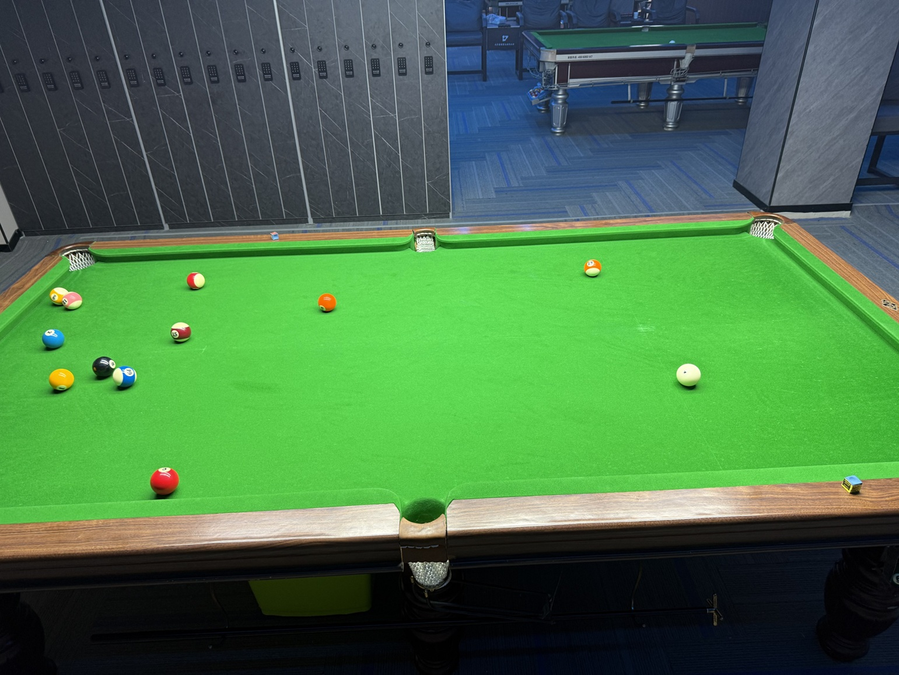

# 中式八球大师赛/Chinese 8-Ball Masters

| 届次 |          日期          |         场地          | 冠军   | 亚军  | 季军  |
| :--: | :-------------------: | :-------------------: | :---: | :---: | :---: |
| 1    | 2025.06.16-2025.07.04 | 邱德拔/熊猫/蓝旗星/小铁 | 王翰墨 | 魏天昊 | 姜星宇 |

中式八球大师赛由三人参加，每局比赛中一人为单打，其余二人为双打，以此展开对抗。单打方获胜可独享2积分，双打方获胜则平分2积分。一届比赛进行36局，最终按积分排定名次。

## 历届赛历

### 第一届

<b>实时积分榜</b>

| 排名 |  姓名  | 积分 | 单打战绩  | 双打战绩  |    小分     |
| :--: | :---: | :--: | :------: | :------: | :---------: |
|  1   | 王翰墨 |  28  |   7-5    |  14-10   | 164.5:152.5 |
|  2   | 魏天昊 |  25  |   6-6    |  13-11   | 154.0:161.5 |
|  3   | 姜星宇 |  19  |   4-8    |  11-13   | 156.5:161.0 |

| 局数 |  选手A |  比分  |    选手B     | 备注  |
| :--: | :---: | :----: | :---------: | :---: |
| 1    | 王翰墨 |  4:8  | 姜星宇/魏天昊 | Final |
| 2    | 魏天昊 |  5:8  | 姜星宇/王翰墨 | Final |
| 3    | 姜星宇 |  8:4  | 王翰墨/魏天昊 | Final |
| 4    | 王翰墨 |  8:7  | 姜星宇/魏天昊 | Final |
| 5    | 魏天昊 |  5:8  | 姜星宇/王翰墨 | Final |
| 6    | 姜星宇 |  4:8  | 王翰墨/魏天昊 | Final |
| 7    | 王翰墨 |  7:8  | 姜星宇/魏天昊 | Final |
| 8    | 魏天昊 |  8:3  | 姜星宇/王翰墨 | Final |
| 9    | 姜星宇 |  6:8  | 王翰墨/魏天昊 | Final |
| 10   | 王翰墨 |  8:5  | 姜星宇/魏天昊 | Final |
| 11   | 魏天昊 |  7:8  | 姜星宇/王翰墨 | Final |
| 12   | 姜星宇 |  6:8  | 王翰墨/魏天昊 | Final |
| 13   | 王翰墨 |  5:8  | 姜星宇/魏天昊 | Final |
| 14   | 魏天昊 |  7:8  | 姜星宇/王翰墨 | Final |
| 15   | 姜星宇 |  6:8  | 王翰墨/魏天昊 | Final |
| 16   | 王翰墨 |  8:5  | 姜星宇/魏天昊 | Final |
| 17   | 魏天昊 |  6:8  | 姜星宇/王翰墨 | Final |
| 18   | 姜星宇 |  8:7  | 王翰墨/魏天昊 | Final |
| 19   | 王翰墨 |  5:8  | 姜星宇/魏天昊 | Final |
| 20   | 魏天昊 |  8:6  | 姜星宇/王翰墨 | Final |
| 21   | 姜星宇 | X7:6  | 王翰墨/魏天昊 | Final |
| 22   | 王翰墨 |  8:6  | 姜星宇/魏天昊 | Final |
| 23   | 魏天昊 |  8:7  | 姜星宇/王翰墨 | Final |
| 24   | 姜星宇 |  7:8  | 王翰墨/魏天昊 | Final |
| 25   | 王翰墨 |  8:7  | 姜星宇/魏天昊 | Final |
| 26   | 魏天昊 |  5:6X | 姜星宇/王翰墨 | Final |
| 27   | 姜星宇 |  4:8  | 王翰墨/魏天昊 | Final |
| 28   | 王翰墨 |  8:3  | 姜星宇/魏天昊 | Final |
| 29   | 魏天昊 |  8:6  | 姜星宇/王翰墨 | Final |
| 30   | 姜星宇 |  8:1  | 王翰墨/魏天昊 | Final |
| 31   | 王翰墨 |  8:6  | 姜星宇/魏天昊 | Final |
| 32   | 魏天昊 |  3:4X | 姜星宇/王翰墨 | Final |
| 33   | 姜星宇 |  8:7  | 王翰墨/魏天昊 | Final |
| 34   | 王翰墨 | X7:4  | 姜星宇/魏天昊 | Final |
| 35   | 魏天昊 |  6:8  | 姜星宇/王翰墨 | Final |
| 36   | 姜星宇 |  7:8  | 王翰墨/魏天昊 | Final |

- 第一阶段：2025年6月16日于邱德拔体育馆，进行了第1-5局。
- 第二阶段：2025年6月17日于熊猫球社，进行了第6-10局。
- 第三阶段：2025年6月18日于邱德拔体育馆，进行了第11-15局。
- 第四阶段：2025年6月23日于邱德拔体育馆，进行了第16-18局。
- 第五阶段：2025年6月27日于蓝旗星俱乐部，进行了第19-22局。
- 第六阶段：2025年7月2日于熊猫球社，进行了第23-26局。
- 第七阶段：2025年7月3日于小铁自助台球，进行了第27-31局。
- 第八阶段：2025年7月4日于邱德拔体育馆，进行了第32-36局。