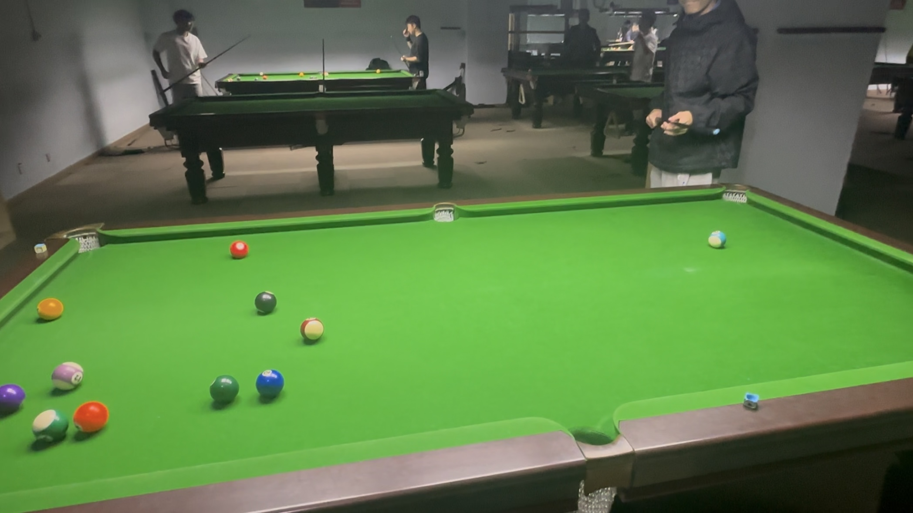

# 中式八球友谊赛/Chinese 8-Ball Friendly

| 届次 | 日期        | 场地  | 选手A  | 比分 | 选手B  |
| :--: | :--------: | :---: | :----: | :-: | :----: |
| 1    | 2024.10.31 | 邱德拔 | 王翰墨 | 3-2 | 姜星宇 |
| 2    | 2024.11.07 | 邱德拔 | 王翰墨 | 3-2 | 姜星宇 |
| 3    | 2024.11.28 | 邱德拔 | 王翰墨 | 1-4 | 姜星宇 |
| 4    | 2024.12.15 | 至尚   | 王翰墨 | 4-2 | 姜星宇 |
| 5    | 2025.01.04 | 名仕   | 王翰墨 | 2-3 | 姜星宇 |
| 6    | 2025.01.05 | 利骏   | 王翰墨 | 1-1 | 姜星宇 |
| 7    | 2025.01.07 | 熊猫   | 郝明洋 | 2-1 | 姜星宇 |
| 8    | 2025.02.28 | 熊猫   | 王翰墨 | 1-1 | 郝明洋 |
| 9    | 2025.03.02 | 邱德拔 | 姜星宇 | 2-0 | 王翰墨 |
| 10   | 2025.03.03 | 熊猫   | 王翰墨 | 3-2 | 郝明洋 |
| 11   | 2025.04.08 | 邱德拔 | 王翰墨 | 1-1 | 姜星宇 |
| 12   | 2025.04.18 | 邱德拔 | 魏天昊 | 1-3 | 姜星宇 |
| 13   | 2025.07.09 | 邱德拔 | 姜星宇 | 1-3 | 王翰墨 |
| 14   | 2025.07.10 | 碰碰捌 | 王翰墨 | 4-3 | 姜星宇 |
| 15   | 2025.07.09 | 熊猫   | 姜星宇 | 2-4 | 王翰墨 |
| 16   | 2025.08.27 | 邱德拔 | 王翰墨 | 2-4 | 姜星宇 |
| 17   | 2025.11.03 | 邱德拔 | 王翰墨 | 1-2 | 姜星宇 |

中式八球友谊赛为友谊赛，不计入积分，部分比赛记录可能丢失。

## 历届赛历

### 第一届

| 场序 | 选手A  | 比分 | 选手B  | 用时   | 备注  |
| :--: | :----: | :-: | :----: | :---: | :---: |
| 1    | 王翰墨 | 6:8 | 姜星宇 | 10min  | Final |
| 2    | 姜星宇 | 8:7 | 王翰墨 | 12min  | Final |
| 3    | 王翰墨 | 8:4 | 姜星宇 | 12min  | Final |
| 4    | 姜星宇 | X4:4\* | 王翰墨 | 2.5min | Foul  |
| 5    | 王翰墨 | 8:5 | 姜星宇 | 7.5min | Final |

*\* Did not record the score*

### 第二届

| 场序 | 选手A  | 比分 | 选手B  | 用时    | 备注  |
| :--: | :----: | :-: | :----: | :----: | :---: |
| 1    | 王翰墨 | X4:4\* | 姜星宇 | 1.5min  | Foul  |
| 2    | 姜星宇 | 8:7 | 王翰墨 | 19.5min | Final |
| 3    | 王翰墨 | 8:4 | 姜星宇 | 12min   | Final |
| 4    | 姜星宇 | 4:8 | 王翰墨 | 10min   | Final |
| 5    | 王翰墨 | 8:7 | 姜星宇 | 12.5min | Final |

*\* Did not record the score*

### 第三届

| 场序 | 选手A  | 比分 | 选手B  | 用时    | 备注  |
| :--: | :----: | :-: | :----: | :----: | :---: |
| 1    | 王翰墨 | 7:8 | 姜星宇 | 8min    | Final |
| 2    | 姜星宇 | 6:8 | 王翰墨 | 12min   | Final |
| 3    | 王翰墨 | 6:8 | 姜星宇 | 12.5min | Final |
| 4    | 姜星宇 | 4:4X\* | 王翰墨 | 2min    | Foul  |
| 5    | 王翰墨 | 7:8 | 姜星宇 | 13min   | Final |

*\* Did not record the score*

### 第四届

| 场序 | 选手A  | 比分 | 选手B  | 用时    | 备注  |
| :--: | :----: | :-: | :----: | :----: | :---: |
| 1    | 王翰墨 | 7:8 | 姜星宇 | 13min   | Final |
| 2    | 姜星宇 | 2:8 | 王翰墨 | 6.5min  | Final |
| 3    | 王翰墨 | 8:7 | 姜星宇 | 14min   | Final |
| 4    | 姜星宇 | X4:4\* | 王翰墨 | 2min    | Foul  |
| 5    | 王翰墨 | 7:8 | 姜星宇 | 12min   | Final |
| 6    | 姜星宇 | 7:8 | 王翰墨 | 12.5min | Final |

*\* Did not record the score*

### 第五届

| 场序 | 选手A  | 比分 | 选手B  | 用时    | 备注  |
| :--: | :----: | :-: | :----: | :----: | :---: |
| 1    | 王翰墨 | 5:8 | 姜星宇 | 8min    | Final |
| 2    | 姜星宇 | 7:8 | 王翰墨 | 12.5min | Final |
| 3    | 王翰墨 | 8:6 | 姜星宇 | 15min   | Final |
| 4    | 姜星宇 | 8:6 | 王翰墨 | 9.5min  | Final |
| 5    | 王翰墨 | X4:4\* | 姜星宇 | 15min   | Foul  |

*\* Did not record the score*

### 第六届

| 场序 | 选手A  | 比分 | 选手B  | 用时    | 备注  |
| :--: | :----: | :-: | :----: | :----: | :---: |
| 1    | 王翰墨 | 8:3 | 姜星宇 | 7min    | Final |
| 2    | 姜星宇 | 8:1 | 王翰墨 | 8min    | Final |

### 第七届

| 场序 | 选手A  | 比分 | 选手B  | 用时    | 备注  |
| :--: | :----: | :-: | :----: | :----: | :---: |
| 1    | 郝明洋 | 8:7 | 姜星宇 | x\*min  | Final |
| 2    | 姜星宇 | 8:7 | 郝明洋 | x\*min  | Final |
| 3    | 郝明洋 | 8:7 | 姜星宇 | x\*min  | Final |

*\* Did not record time*

### 第八届

| 场序 | 选手A  | 比分 | 选手B  | 用时    | 备注  |
| :--: | :----: | :-: | :----: | :----: | :---: |
| 1    | 王翰墨 | X5:4 | 郝明洋 | x\*min  | Foul |
| 2    | 郝明洋 | 5:8 | 王翰墨 | x\*min  | Final |

*\* Did not record time*

### 第九届

| 场序 | 选手A  | 比分 | 选手B  | 用时    | 备注  |
| :--: | :----: | :-: | :----: | :----: | :---: |
| 1    | 姜星宇 | 8:6 | 王翰墨 | x\*min  | Final |
| 2    | 王翰墨 | 5:6 | 姜星宇 | x\*min  | Timeout |

*\* Did not record time*

### 第十届

| 场序 | 选手A  | 比分 | 选手B  | 用时    | 备注  |
| :--: | :----: | :-: | :----: | :----: | :---: |
| 1    | 王翰墨 | 8:6 | 郝明洋 | x\*min  | Final |
| 2    | 郝明洋 | 7:8 | 王翰墨 | x\*min  | Final |
| 3    | 王翰墨 | 8:7 | 郝明洋 | x\*min  | Final |
| 4    | 郝明洋 | 8:6 | 王翰墨 | x\*min  | Final |
| 5    | 王翰墨 | 5:8 | 郝明洋 | x\*min  | Final |

*\* Did not record time*

### 第十一届

| 场序 | 选手A  | 比分 | 选手B  | 用时    | 备注  |
| :--: | :----: | :-: | :----: | :----: | :---: |
| 1    | 王翰墨 | 8:4 | 姜星宇 | x\*min  | Final |
| 2    | 姜星宇 | 8:6 | 王翰墨 | x\*min  | Final |

*\* Did not record time*

### 第十二届

| 场序 | 选手A  | 比分 | 选手B  | 用时    | 备注  |
| :--: | :----: | :-: | :----: | :----: | :---: |
| 1    | 魏天昊 | b:a\* | 姜星宇 | x\*\*min  | Final |
| 2    | 姜星宇 | b:a\* | 魏天昊 | x\*\*min  | Final |
| 3    | 魏天昊 | b:a\* | 姜星宇 | x\*\*min  | Final |
| 4    | 姜星宇 | a:b\* | 魏天昊 | x\*\*min  | Foul |

*\* Did not record the score (a>b)*

*\*\* Did not record time*

### 第十三届

| 场序 | 选手A  | 比分 | 选手B  | 用时    | 备注  |
| :--: | :----: | :-: | :----: | :----: | :---: |
| 1    | 姜星宇 | 5:8 | 王翰墨 | x\*min  | Final |
| 2    | 王翰墨 | 6:8 | 姜星宇 | x\*min  | Final |
| 3    | 姜星宇 | 6:8 | 王翰墨 | x\*min  | Final |
| 4    | 王翰墨 | 8:7 | 姜星宇 | x\*min  | Final |

*\* Did not record time*

### 第十四届

| 场序 | 选手A  | 比分 | 选手B  | 用时    | 备注  |
| :--: | :----: | :-: | :----: | :----: | :---: |
| 1    | 王翰墨 | 8:5 | 姜星宇 | x\*min  | Final |
| 2    | 姜星宇 | 8:5 | 王翰墨 | x\*min  | Final |
| 3    | 王翰墨 | 8:5 | 姜星宇 | x\*min  | Final |
| 4    | 姜星宇 | 8:6 | 王翰墨 | x\*min  | Final |
| 5    | 王翰墨 | 5:8 | 姜星宇 | x\*min  | Final |
| 6    | 姜星宇 | 6:8 | 王翰墨 | x\*min  | Final |
| 7    | 王翰墨 | 8:6 | 姜星宇 | x\*min  | Final |

*\* Did not record time*

### 第十五届

| 场序 | 选手A  | 比分 | 选手B  | 用时    | 备注  |
| :--: | :----: | :-: | :----: | :----: | :---: |
| 1    | 姜星宇 | 8:7 | 王翰墨 | x\*min  | Final |
| 2    | 王翰墨 | 3:5X | 姜星宇 | x\*min  | Foul |
| 3    | 姜星宇 | 6:8 | 王翰墨 | x\*min  | Final |
| 4    | 王翰墨 | 8:1 | 姜星宇 | x\*min  | Final |
| 5    | 姜星宇 | 7:8 | 王翰墨 | x\*min  | Final |
| 6    | 王翰墨 | 4:8 | 姜星宇 | x\*min  | Final |

*\* Did not record time*

### 第十六届

| 场序 | 选手A  | 比分 | 选手B  | 用时    | 备注  |
| :--: | :----: | :-: | :----: | :----: | :---: |
| 1    | 王翰墨 | 3:8 | 姜星宇 | x\*min  | Final |
| 2    | 姜星宇 | 6:8 | 王翰墨 | x\*min  | Final |
| 3    | 王翰墨 | 5:8 | 姜星宇 | x\*min  | Final |
| 4    | 姜星宇 | 0:0X | 王翰墨 | x\*min  | Foul |
| 5    | 王翰墨 | 8:4 | 姜星宇 | x\*min  | Final |
| 6    | 姜星宇 | 5:4X | 王翰墨 | x\*min  | Foul |

*\* Did not record time*

### 第十七届

| 场序 | 选手A  | 比分 | 选手B  | 用时    | 备注  |
| :--: | :----: | :-: | :----: | :----: | :---: |
| 1    | 王翰墨 | 7:8 | 姜星宇 | x\*min  | Final |
| 2    | 姜星宇 | 6:8 | 王翰墨 | x\*min  | Final |
| 3    | 王翰墨 | 6:8 | 姜星宇 | x\*min  | Final |

*\* Did not record time*