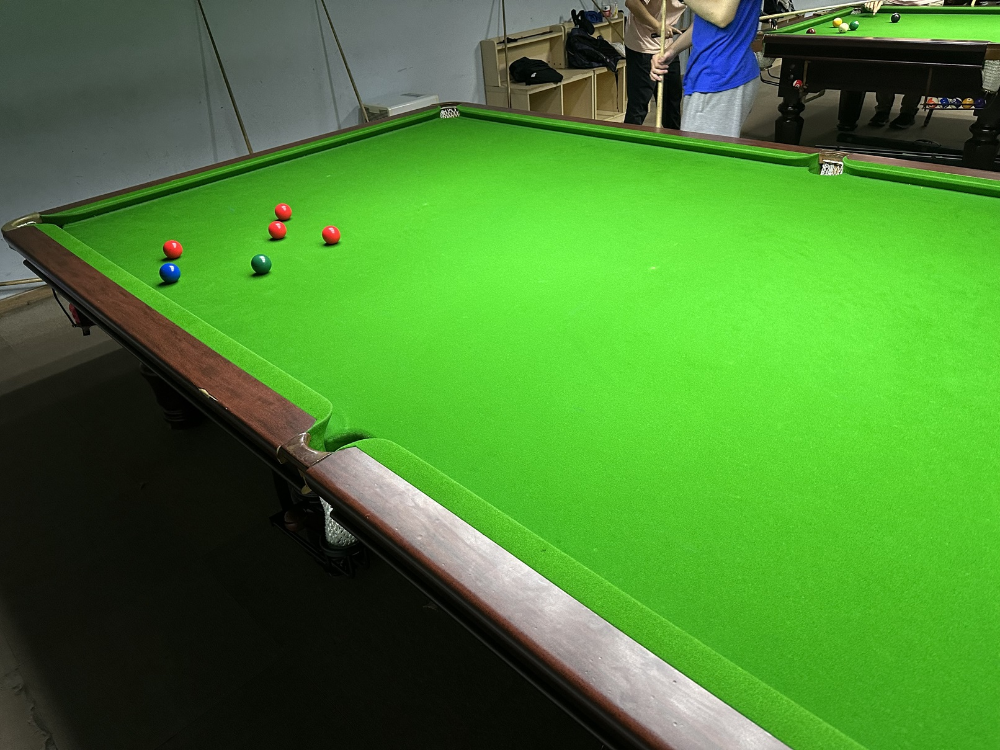

# 英式斯诺克友谊赛/English Snooker Friendly

| 届次 | 日期        | 场地  | 选手A  | 比分   | 选手B  |
| :--: | :--------: | :---:  | :---: | :---: | :---: |
| 1    | 2024.09.25 | 邱德拔 | 王翰墨 | 64:51 | 魏天昊 |
| 2    | 2024.09.26 | 邱德拔 | 姜星宇 | y:x\* | 王翰墨 |
| 3    | 2024.10.10 | 邱德拔 | 王翰墨 | x:y\* | 姜星宇 |
| 4    | 2024.11.20 | 邱德拔 | 姜星宇 | 67:52 | 郝明洋 |
| 5    | 2024.12.26 | 邱德拔 | 王翰墨 | 40:33 | 姜星宇 |
| 6    | 2025.01.06 | 邱德拔 | 姜星宇 | 80:70 | 郝明洋 |
| 7    | 2025.10.31 | 邱德拔 | 魏天昊 | 62:35 | 姜星宇 |
| 8    | 2026.01.04 | 邱德拔 | 姜星宇 | 51:62 | 魏天昊 |
| 9    | 2026.01.04 | 邱德拔 | 魏天昊 | 37:27 | 姜星宇 |

*\* Unknown due to loss of results (x>y)*

英式斯诺克友谊赛采用二人对决单局制，按得分排定名次。该比赛为友谊赛，不计入积分，部分比赛记录可能丢失。

