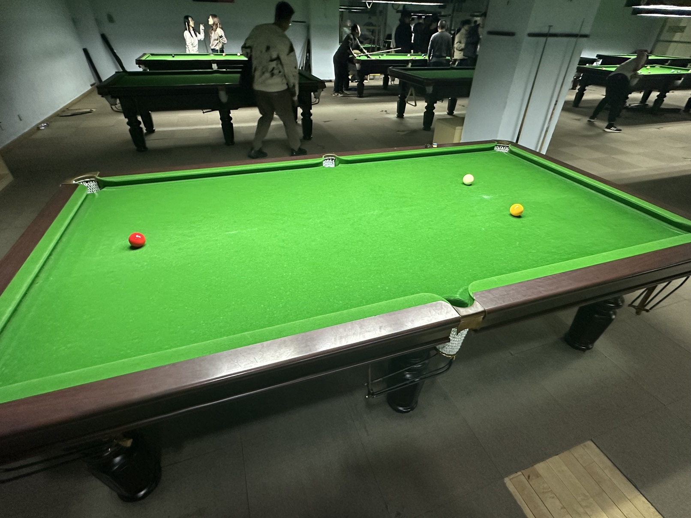

# 英式比利友谊赛/English Billiards Friendly

| 届次 | 日期       | 地点    | 选手A  | 比分     | 选手B  |
| :--: | :--------: | :----: | :----: | :-----: | :----: |
| 1    | 2024.12.03  | 邱德拔 | 姜星宇 | 15:14   | 王翰墨 |
| 2    | 2024.12.15  | 至尚   | 王翰墨 | 94:75   | 姜星宇 |

英式比利友谊赛使用英式比利台球规则，但为了可玩性可使用中式台球桌。该比赛为友谊赛，不计入积分，部分比赛记录可能丢失。

