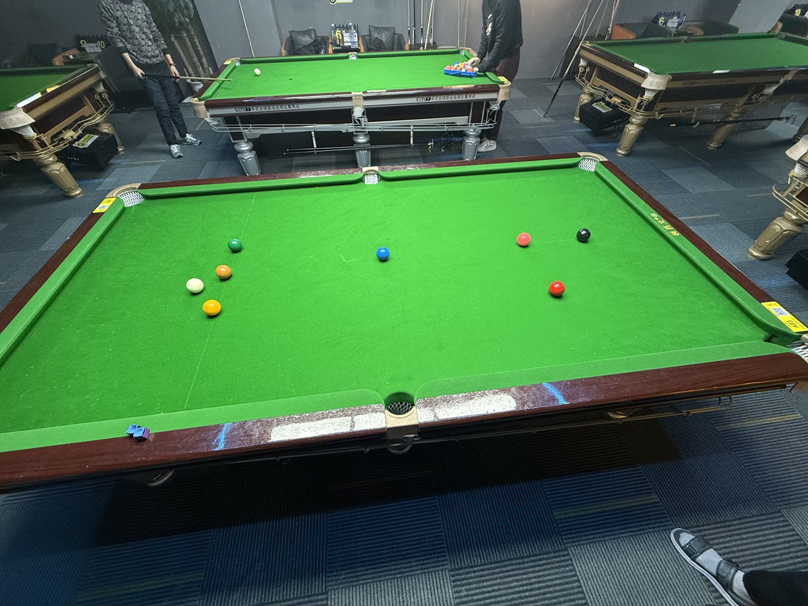

# 巴西斯诺克友谊赛/Brazil Snooker Friendly

| 届次 | 日期        | 场地  | 选手A  | 比分   | 选手B  |
| :--: | :--------: | :---:  | :---: | :---: | :---: |
| 1    | 2025.02.27 | 小铁   | 王翰墨 |  0-1  | 姜星宇 |
| 2    | 2025.05.16 | 邱德拔 | 姜星宇 |  2-3  | 魏天昊 |
| 3    | 2025.05.21 | 邱德拔 | 魏天昊 |  1-3  | 姜星宇 |
| 4    | 2025.05.22 | 邱德拔 | 姜星宇 |  2-2  | 王翰墨 |
| 5    | 2025.06.19 | 邱德拔 | 王翰墨 |  1-0  | 姜星宇 |

巴西斯诺克友谊赛采用巴西斯诺克规则，该比赛为友谊赛，不计入积分。

## 历届赛历

### 第一届

| 场序 | 选手A  |  比分  | 选手B  | 备注  |
| :--: | :----: | :---: | :---: | :---: |
| 1    | 王翰墨 | 52:56 | 姜星宇 | Final |

### 第二届

| 场序 | 选手A  | 比分 | 选手B  | 备注  |
| :--: | :----: | :-: | :---: | :---: |
| 1    | 姜星宇 | x:y | 魏天昊 | Final |
| 2    | 魏天昊 | x:y | 姜星宇 | Final |
| 3    | 姜星宇 | x:y | 魏天昊 | Final |
| 4    | 魏天昊 | x:y | 姜星宇 | Final |
| 5    | 姜星宇 | x:y | 魏天昊 | Final |

*\* x < y*

### 第三届

| 场序 | 选手A  | 比分 | 选手B  | 备注  |
| :--: | :----: | :-: | :---: | :---: |
| 1    | 魏天昊 | x:y | 姜星宇 | Final |
| 2    | 姜星宇 | x:y | 魏天昊 | Final |
| 3    | 魏天昊 | x:y | 姜星宇 | Final |
| 4    | 姜星宇 | y:x | 魏天昊 | Final |

*\* x < y*

### 第四届

| 场序 | 选手A  |  比分  | 选手B  | 备注  |
| :--: | :----: | :---: | :---: | :---: |
| 1    | 姜星宇 | 43:34 | 王翰墨 | Final |
| 2    | 王翰墨 | 53:86 | 姜星宇 | Final |
| 3    | 姜星宇 | 32:33 | 王翰墨 | Final |
| 4    | 王翰墨 | 70:63 | 姜星宇 | Final |

### 第五届

| 场序 | 选手A  |  比分  | 选手B  | 备注  |
| :--: | :----: | :---: | :---: | :---: |
| 1    | 王翰墨 | 80:66 | 姜星宇 | Final |