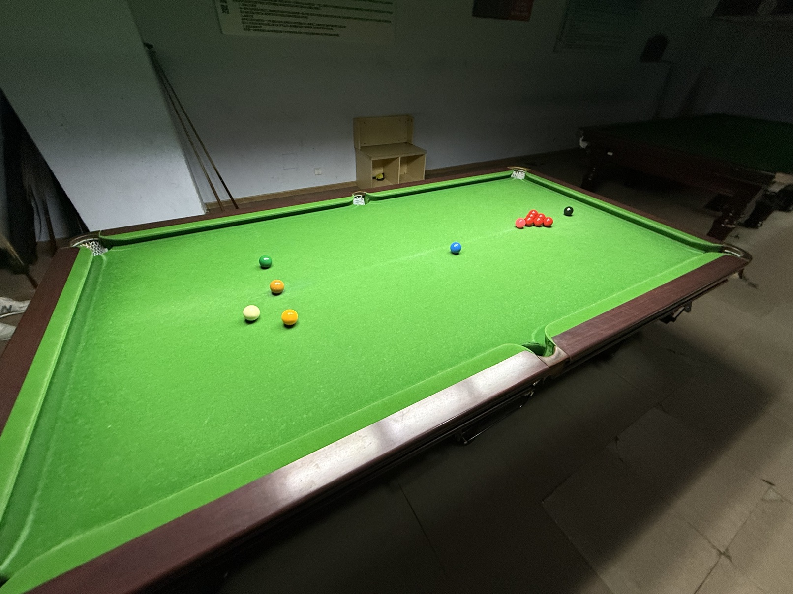

# 六红球小球中式斯诺克友谊赛/6-Red-Ball Small-Ball Chinese Snooker Friendly

| 届次 | 日期        | 场地  | 选手A  | 比分          | 选手B  |
| :--: | :--------: | :----: | :---: | :----------: | :----: |
| 1    | 2025.12.04 | 邱德拔 | 王翰墨 | 0-1          | 姜星宇 |

六红球小球中式斯诺克友谊赛，比赛采用中式球桌、英式小球，红球为六颗。该比赛为友谊赛，不计入积分，且规定连续解球次数不超过三次，部分比赛记录可能丢失。

## 历届赛历

### 第一届

| 场序 |    选手A     |    选手B     |
| :--: | :----------: | :----------: |
|  1   | 王翰墨（26） | 姜星宇（34） |