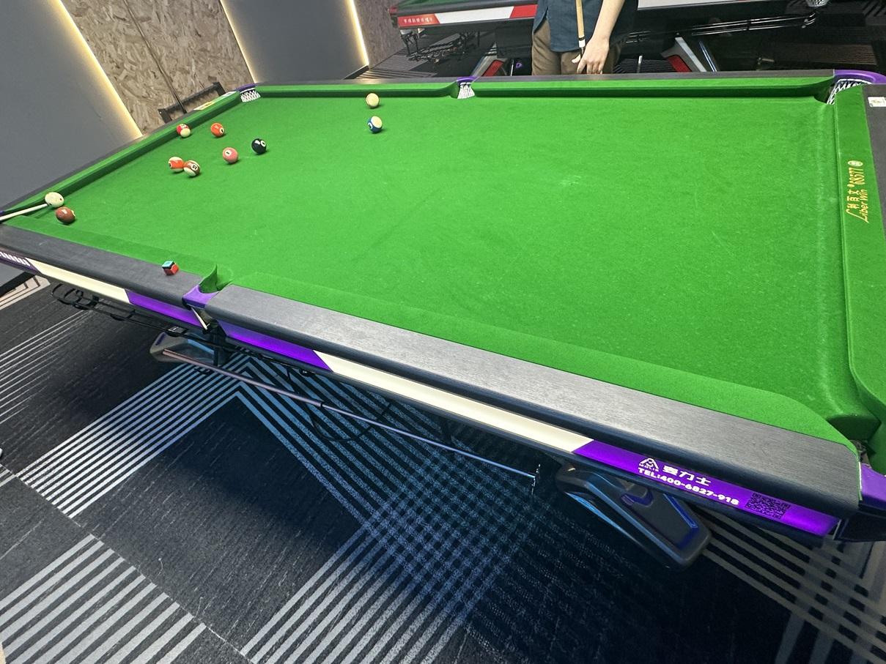

# 中式八球挑战赛/Chinese 8-Ball Challenge

| 届次 | 日期       | 场地    | 赢家   | 其他参赛者                 |
| :--: | :--------: | :----: | :---: | :------------------------: |
| 1    | 2024.12.20 | 熊猫   | 魏天昊 | 姜星宇，井文淳              |
| 2    | 2025.01.08 | 邱德拔 | 郝明洋 | 叶舟，王翰墨，魏天昊         |
| 3    | 2025.01.09 | 熊猫   | 魏天昊 | 王翰墨，郝明洋，叶舟，姜星宇 |
| 4    | 2025.01.15 | 熊猫   | 姜星宇 | 魏天昊，王翰墨              |

中式八球挑战赛邀请多人参加，赛制可以为基于中式八球的任意赛制。

## 历届赛历

### 第一届

| 场序 | 选手A  | 比分  | 选手B  | 备注  |
| :--: | :---: | :---: | :----: | :---: |
| 1    | 魏天昊 | 8:7   | 姜星宇 | Final |
| 2    | 井文淳 | 6:8   | 魏天昊 | Final |
| 3    | 姜星宇 | 8:7   | 井文淳 | Final |

### 第二届

| 场序 | 选手A  | 比分  | 选手B  | 备注  |
| :--: | :---: | :---: | :----: | :---: |
| 1    | 王翰墨 | 8:4   | 叶舟   | Final |
| 2    | 郝明洋 | 8:7   | 王翰墨 | Final |
| 3    | 叶舟   | 7:8   | 郝明洋 | Final |
| 4    | 魏天昊 | -4:4\* | 叶舟   | Foul  |

*\* Did not record the score*

### 第三届

| 场序 | 选手A  | 比分  | 选手B  | 备注  |
| :--: | :---: | :---: | :----: | :---: |
| 1    | 王翰墨 | 4:-4\* | 郝明洋 | Foul  |
| 2    | 叶舟   | 6:8   | 郝明洋 | Final |
| 3    | 王翰墨 | 8:4   | 叶舟   | Final |
| 4    | 叶舟   | 4:-4\* | 姜星宇 | Foul  |
| 5    | 魏天昊 | 8:6   | 王翰墨 | Relay |
| 6    | 郝明洋 | 4:-4\* | 姜星宇 | Foul  |
| 7    | 魏天昊 | 8:4   | 叶舟   | Final |

*\* Did not record the score*

### 第四届

| 场序 | 选手A  | 比分  | 选手B  | 备注  |
| :--: | :---: | :---: | :----: | :---: |
| 1    | 魏天昊 | 6:8   | 姜星宇 | Final |
| 2    | 王翰墨 | 6:8   | 姜星宇 | Final |
| 3    | 魏天昊 | 8:7   | 王翰墨 | Final |