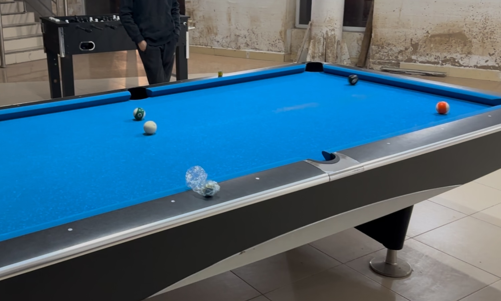

# 美式八球挑战赛/American 8-Ball Challenge

| 届次 | 日期        | 场地   | 胜者         | 比分 | 负者         |
| :--: | :--------: | :----: | :----------: | :-: | :----------: |
| 1    | 2024.12.01 | 新燕园 | 姜星宇/王翰墨 | 5-4 | 井文淳/魏天昊 |

美式八球挑战赛使用美式球桌，赛制为2v2团队对抗赛。

## 历届赛历

### 第一届

| 场序 | 选手A        | 比分   | 选手B        | 备注  |
| :--: | :----------: | :---: | :----------: | :---: |
| 1    | 井文淳/魏天昊 | 7-8   | 姜星宇/王翰墨 | Final |
| 2    | 姜星宇/王翰墨 | 6-8   | 井文淳/魏天昊 | Final |
| 3    | 井文淳/魏天昊 | 4-8   | 姜星宇/王翰墨 | Final |
| 4    | 姜星宇/王翰墨 | 8-6   | 井文淳/魏天昊 | Final |
| 5    | 姜星宇/王翰墨 | 4-8   | 井文淳/魏天昊 | Final |
| 6    | 井文淳/魏天昊 | 7-8   | 姜星宇/王翰墨 | Final |
| 7    | 姜星宇/王翰墨 | 6-8   | 井文淳/魏天昊 | Final |
| 8    | 井文淳/魏天昊 | 6-8\* | 姜星宇/王翰墨 | Final |
| 9    | 姜星宇/王翰墨 | 6-8\* | 井文淳/魏天昊 | Final |

*\* might be inaccurate because of the unclear records*