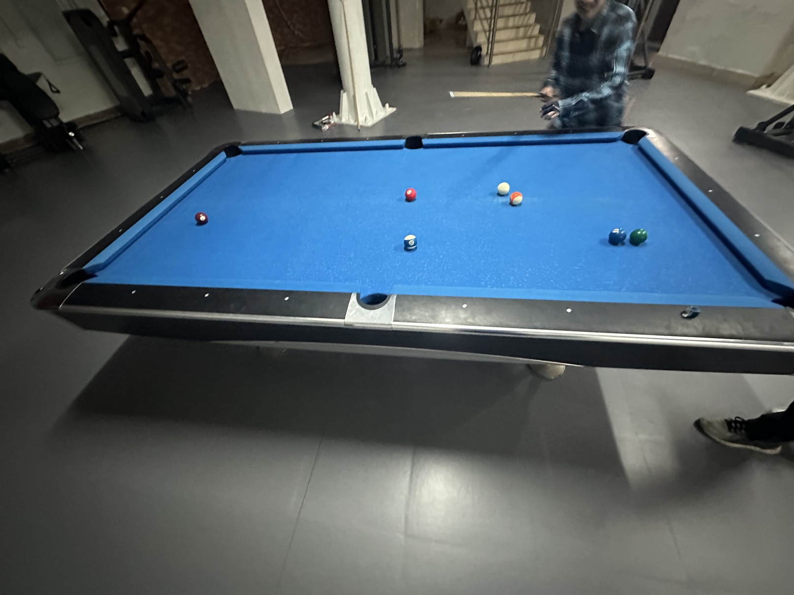

# 三人台球挑战赛/Trio Pool Challenge

| 届次 | 日期       | 场地    | 赢家   | 其他参赛者                 |
| :--: | :--------: | :----: | :---: | :------------------------: |
| 1    | 2025.01.01 | AWP    | 魏天昊 | 姜星宇，王翰墨              |
| 2    | 2025.01.16 | 新燕园 | 王翰墨 | 井文淳，魏天昊              |

三人台球挑战赛使用MPRC三人台球规则，赛制为三人对战。

### 第一届

| 场序 | 选手A        | 选手B       | 选手C       |
| :--: | :---------: | :---------: | :---------: |
| 1    | 王翰墨（2）  | 魏天昊（0）  | 姜星宇（1）  |
| 2    | 王翰墨（3）  | 姜星宇（0）  | 魏天昊（6）  |
| 3    | 魏天昊（2）  | 王翰墨（0）  | 姜星宇（1）  |
| 4    | 魏天昊（2）  | 姜星宇（5）  | 王翰墨（0）  |

### 第二届

| 场序 | 选手A         | 选手B        | 选手C        |
| :--: | :----------: | :----------: | :----------: |
| 1    | 王翰墨（3rd） | 魏天昊（2nd） | 井文淳（1st） |
| 2    | 井文淳（3rd） | 魏天昊（2nd） | 王翰墨（1st） |
| 3    | 王翰墨（1st） | 魏天昊（3rd） | 井文淳（2nd） |