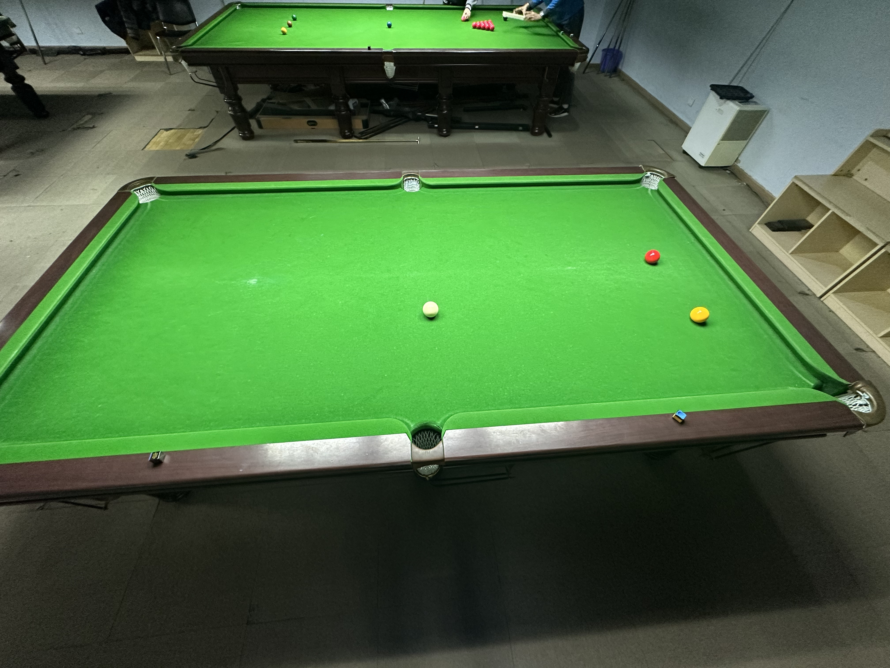

# 残酷台球挑战赛/Cutthroat Pool Challenge

| 届次 | 日期       | 场地    | 冠军   | 亚军  | 季军   |
| ---- | ---------- | ------ | ----- | ----- | ------ |
| 1    | 2024.12.16 | 响袋   | 魏天昊 | 王翰墨\* | 姜星宇 |

*\* Rank 2nd according to the draw*

残酷台球挑战赛使用残酷台球（Cutthroat）规则，赛制为三人对战。

## 历届赛历

### 第一届

| 场序 | 选手A        | 选手B       | 选手C       |
| ---- | ----------- | ----------- | ----------- |
| 1    | 王翰墨（3rd） | 魏天昊（1st） | 姜星宇（2nd） |
| 2    | 魏天昊（1st） | 姜星宇（3rd） | 王翰墨（2nd） |