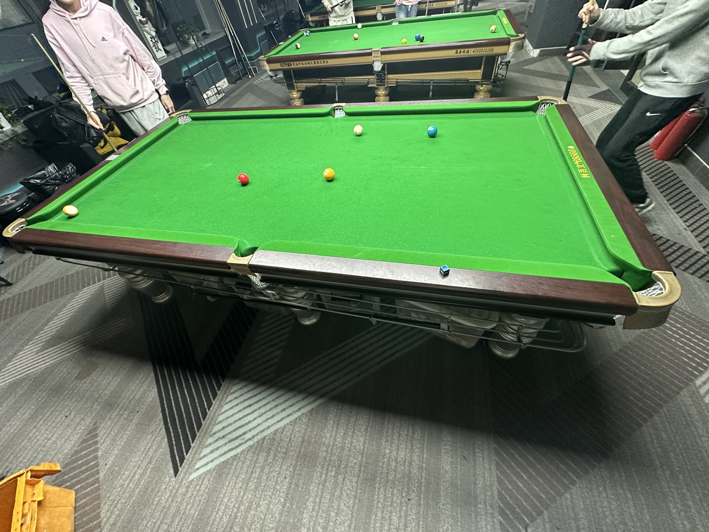

# 四球追分挑战赛/4-Ball Challenge

| 届次 | 日期       | 场地    | 赢家   | 其他参赛者    |
| :--: | :--------: | :----: | :---: | :-----------: |
| 1    | 2025.02.18 | 谈小娱 | 姜星宇 | 王翰墨，魏天昊 |

四球追分挑战赛由多人参加，采用四球追分规则，按照上下家结算分数，按MPRC四球追分的计分规则计算。

## 历届赛历

### 第一届

|           |  选手A     | 选手B     | 选手C      |
| :-------: | :-------: | :-------: | :--------: |
| **第1局** | **王翰墨** | **姜星宇** | **魏天昊** |
| 普通胜利  |   +2       |    0       |   -2      |
| **小结**  | **2**      | **0**      | **-2**    |
| **第2局** | **王翰墨** | **魏天昊** | **姜星宇** |
|   犯规    |   -1      |    0       |   +1      |
| 普通胜利  |   -2       |    +2      |   0       |
| **小结**  | **-1**    | **0**      | **+1**     |
| **第3局** | **魏天昊** | **王翰墨** | **姜星宇** |
| 普通胜利   |   +2      |    0       |   -2      |
| **小结**  | **2**     | **-1**     | **-1**     |
| **第4局** | **魏天昊** | **姜星宇** | **王翰墨** |
|   犯规    |   +1       |   -1       |   0       |
| 普通胜利  |   -2       |   +2       |   0       |
| **小结**  | **1**      | **0**     | **-1**     |
| **第5局** | **姜星宇** | **魏天昊** | **王翰墨** |
|   犯规    |   +1      |   -1        |   0       |
| 普通黄金九 |    0      |   -3        |   +3      |
| **小结**  | **1**     | **-3**       | **2**     |
| **第6局** | **王翰墨** | **魏天昊**  | **姜星宇** |
|   犯规    |   -1      |    0        |   +1       |
|   犯规    |   -1      |    0        |   +1       |
| 普通胜利  |   -2      |    +2       |   0        |
| **小结**  | **-2**    | **-1**      | **3**      |
| **第7局** | **魏天昊** | **王翰墨**  | **姜星宇** |
|   犯规    |   +1      |    -1       |   0        |
| 普通胜利  |   -2      |    +2       |   0        |
| **小结**  | **-2**    | **-1**      | **3**     |
| **第8局** | **王翰墨** | **魏天昊** | **姜星宇** |
|   犯规    |   -1      |    0        |   +1       |
| 普通胜利  |   -2      |   +2        |   0        |
| **小结**  | **-4**    | **0**       | **4**      |
| **第9局** | **魏天昊** | **王翰墨** | **姜星宇**  |
|   犯规    |   -1      |    0        |   +1       |
| 普通胜利  |   -2      |    +2       |   0        |
| **小结**  | **-3**    | **-2**      | **5**      |
| **第10局** | **王翰墨** | **魏天昊** | **姜星宇** |
|   犯规    |    0      |   +1        |   -1       |
| 普通胜利  |   +2      |    0        |   -2       |
| **小结**  | **0**     | **-2**      | **2**      |
| **第11局** | **王翰墨** | **姜星宇** | **魏天昊** |
|   犯规    |   +1      |   -1        |   0        |
|   犯规    |   +1      |   -1        |   0        |
|   犯规    |    0      |   +1        |   -1       |
| 普通胜利  |   -2      |   +2        |   0        |
| **小结**  | **0**     | **3**      | **-3**      |