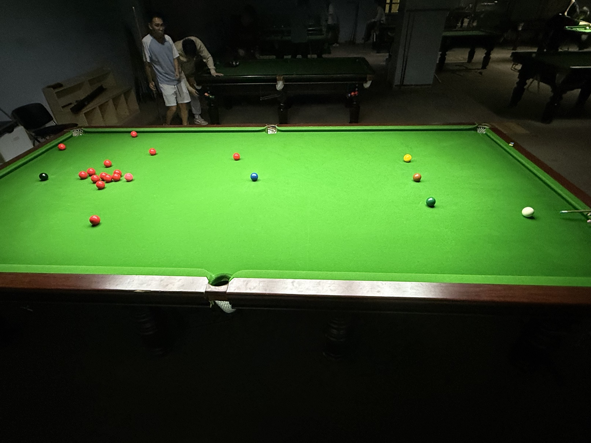

# 英式斯诺克挑战赛/English Snooker Challenge

| 届次 | 日期       | 场地    | 赢家   | 其他参赛者    |
| :--: | :--------: | :----: | :---: | :-----------: |
| 1    | 2025.04.29 | 邱德拔 | 姜星宇 | 王翰墨，井文淳 |
| 2    | 2025.06.13 | 邱德拔 | 王翰墨 | 姜星宇，魏天昊 |

英式斯诺克挑战赛由三人轮流击球进行。

## 历届赛历

### 第一届

| 选手A        | 选手B        | 选手C        |
| :----------: | :----------: | :----------: |
| 王翰墨（34） | 姜星宇（40）  | 井文淳（27） |

### 第二届

| 选手A        | 选手B        | 选手C        |
| :----------: | :----------: | :----------: |
| 王翰墨（38） | 姜星宇（34）  | 魏天昊（21） |