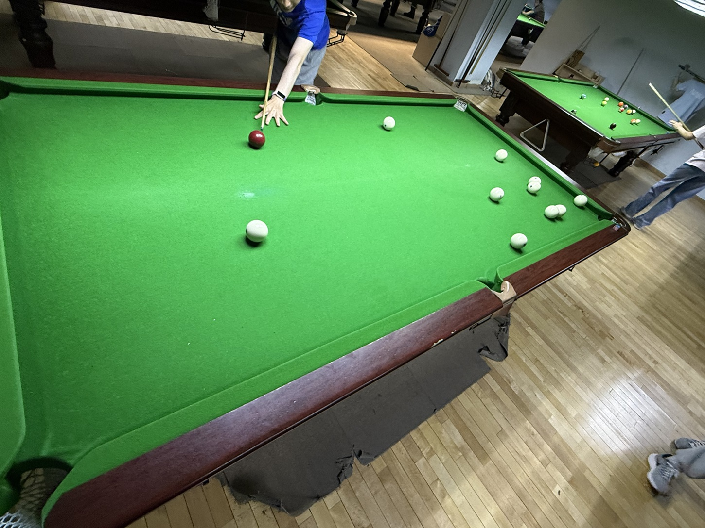

# 俄式台球挑战赛/Russian Pyramid Challenge

| 届次 | 日期       | 场地    | 赢家   | 其他参赛者    |
| :--: | :--------: | :----: | :---: | :-----------: |
| 1    | 2025.05.23 | 邱德拔 | 姜星宇 | 王翰墨，魏天昊 |

俄式台球挑战赛使用俄式台球规则，由三人轮流击球，犯规不罚分，得分最高者获胜。

## 历届赛历

### 第一届

- 球桌：中式八球桌
- 用球：俄式台球（68mm）
- 规则：自由派（1）、动态派（2）、混合派（3）

| 场序 | 选手A        | 选手B       | 选手C        |
| :--: | :---------: | :---------: | :---------: |
| 1    | 王翰墨（4）  | 魏天昊（5）  | 姜星宇（6）  |
| 2    | 姜星宇（7）  | 魏天昊（2）  | 王翰墨（6）  |
| 3    | 姜星宇（4）  | 王翰墨（6）  | 魏天昊（5）  |
