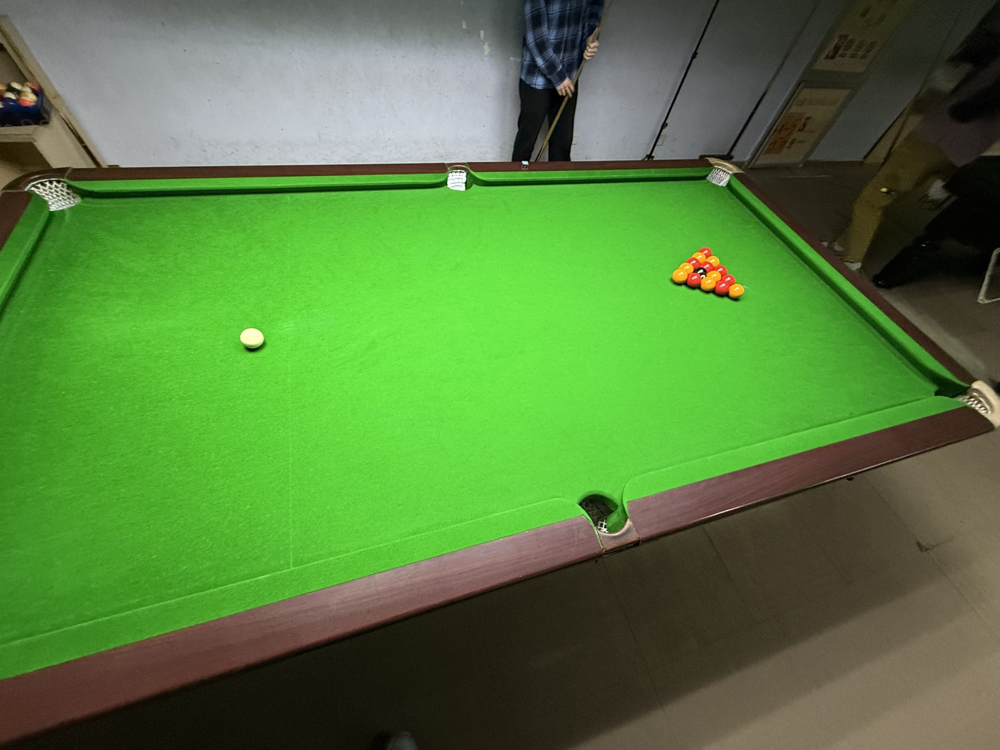

# 英式八球挑战赛/English 8-Ball Challenge

| 届次 | 日期       | 场地    | 赢家   | 其他参赛者                 |
| :--: | :--------: | :----: | :---: | :------------------------: |
| 1    | 2026.04.13 | 邱德拔 | 姜星宇 | 王翰墨，魏天昊              |

英式八球挑战赛，邀请多人参加，赛制可以为基于英式八球的任意赛制。

## 历届赛历

### 第一届

| 场序 | 选手A  | 比分  |     选手B     | 备注  |
| :--: | :---: | :---: | :----------: | :---: |
| 1    | 王翰墨 |  6:8  | 姜星宇/魏天昊 | Final |
| 2    | 魏天昊 |  3:8  | 姜星宇/王翰墨 | Final |
| 3    | 姜星宇 |  8:7  | 魏天昊/王翰墨 | Final |
| 4    | 王翰墨 |  7:7X | 姜星宇/魏天昊 | Foul  |