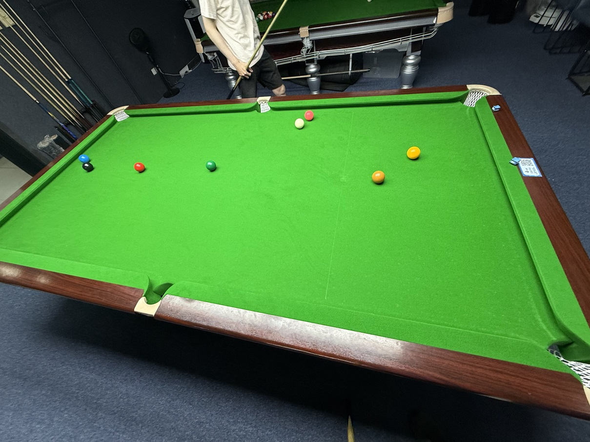

# 中式斯诺克挑战赛/Chinese Snooker Challenge

| 届次 | 日期       | 场地    | 赢家   | 其他参赛者    |
| :--: | :--------: | :----: | :---: | :-----------: |
| 1    | 2025.06.04 | 邱德拔 | 王翰墨 | 魏天昊，姜星宇 |
| 2    | 2026.04.27 | 邱德拔 | 姜星宇，王翰墨 | 魏天昊 |
| 3    | 2026.07.05 | 熊猫   | 王翰墨 | 姜星宇，魏天昊 |

中式斯诺克挑战赛由三人轮流击球进行。

## 历届赛历

### 第一届

| 场序 | 选手A        | 选手B       | 选手C        |
| :--: | :---------: | :---------: | :---------: |
| 1    | 姜星宇（24） | 王翰墨（33） | 魏天昊（47） |
| 2    | 魏天昊（25） | 王翰墨（49） | 姜星宇（44） |

### 第二届

| 局数 |  选手A |  比分  |    选手B     | 备注  |
| :--: | :---: | :----: | :---------: | :---: |
| 1    | 魏天昊 | 10:53 | 姜星宇/王翰墨 | Final |

### 第三届

| 局数 |  选手A |  比分  |    选手B     | 备注  |
| :--: | :---: | :----: | :---------: | :---: |
| 1    | 王翰墨 | 73:60 | 姜星宇/魏天昊 | Final |