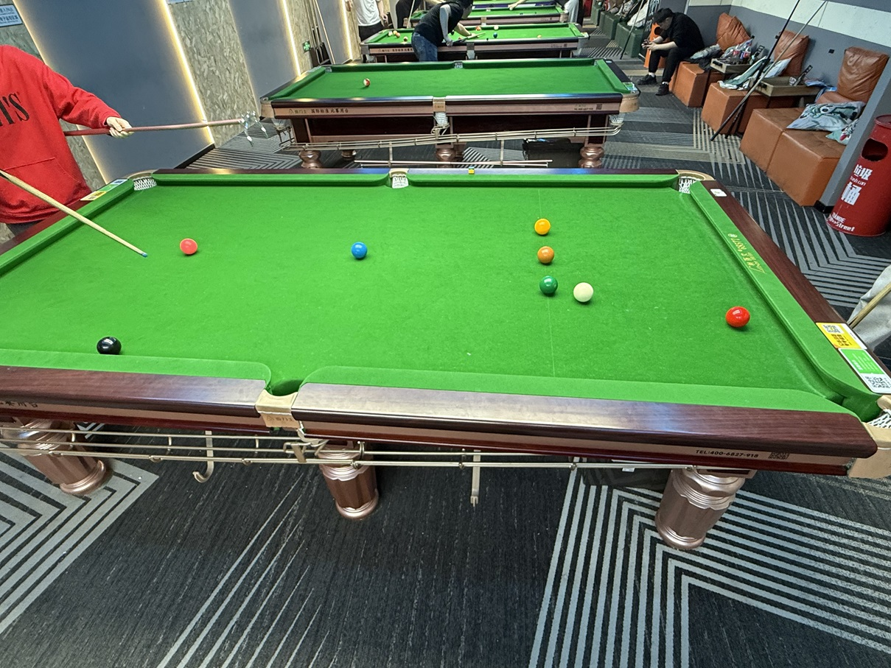

# 巴西斯诺克挑战赛/Brazil Snooker Challenge

| 届次 | 日期       | 场地    | 赢家   | 其他参赛者    |
| :--: | :--------: | :----: | :---: | :-----------: |
| 1    | 2025.04.25 | 熊猫   | 姜星宇 | 魏天昊，王翰墨 |
| 2    | 2025.11.24 | 邱德拔 | 姜星宇 | 魏天昊，王翰墨 |
| 3    | 2025.12.04 | 邱德拔 | 姜星宇 | 魏天昊，王翰墨 |

巴西斯诺克挑战赛采用巴西斯诺克规则，三人轮流击球进行。当一人犯规时，须罚给另外两人各四分。

## 历届赛历

### 第一届

| 场序 | 选手A        | 选手B        | 选手C        |
| :--: | :---------: | :---------: | :---------: |
| 1    | 姜星宇（67） | 王翰墨（34） | 魏天昊（21） |
| 2    | 姜星宇（32） | 魏天昊（49） | 王翰墨（21） |
| 3    | 魏天昊（83） | 姜星宇（50） | 王翰墨（31） |
| 4    | 魏天昊（54） | 王翰墨（57） | 姜星宇（65） |

| 排名 | 姓名   | 积分 | 战绩    | 局内总得分   |
| :--: | :---: | :--: | :-----: | :--------: |
| 1    | 姜星宇 | 10   | 2-2-0   | 214        |
| 2    | 魏天昊 | 8    | 2-0-2   | 207        |
| 3    | 王翰墨 | 6    | 0-2-2   | 143        |

### 第二届

| 场序 | 选手A        | 选手B        | 选手C        |
| :--: | :---------: | :---------: | :---------: |
| 1    | 王翰墨（37） | 魏天昊（46） | 姜星宇（54） |

### 第三届

| 场序 | 选手A        | 选手B        | 选手C        |
| :--: | :---------: | :---------: | :---------: |
| 1    | 姜星宇（53） | 魏天昊（35） | 王翰墨（26） |