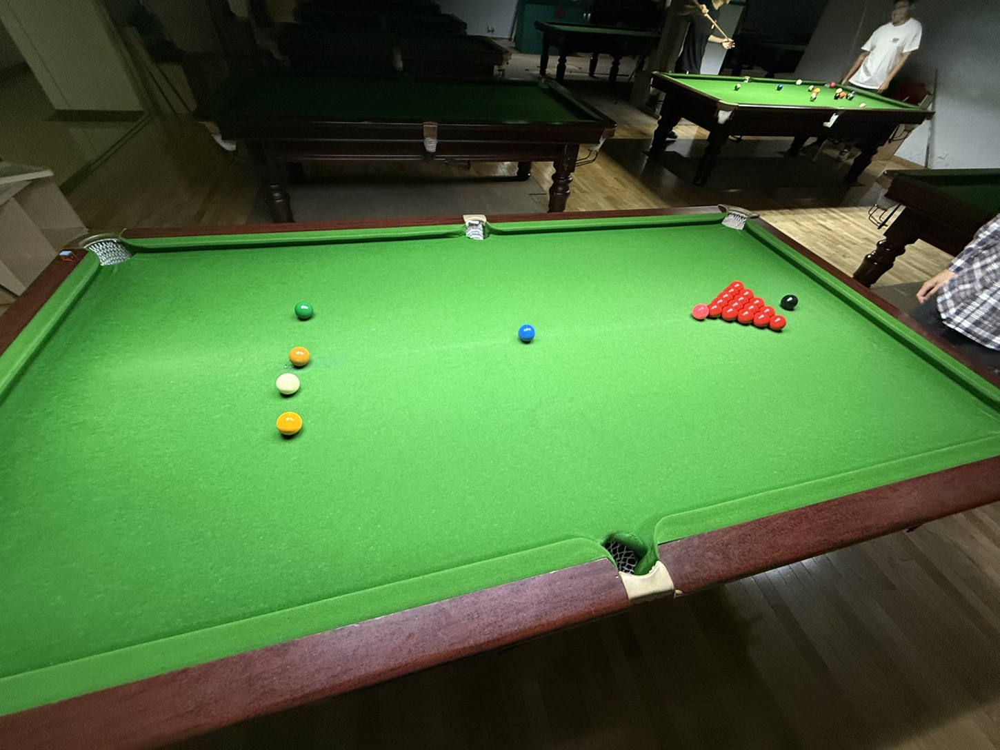

# 中桌英球斯诺克挑战赛/Chinese-Table English-Ball Snooker Challeng

| 届次 | 日期       | 场地    | 赢家   | 其他参赛者    |
| :--: | :--------: | :----: | :---: | :-----------: |
| 1    | 2025.09.10 | 邱德拔 | 魏天昊 | 姜星宇，王翰墨 |

中桌英球斯诺克挑战赛由三人轮流击球进行。

## 历届赛历

### 第一届

| 场序 | 选手A        | 选手B       | 选手C        |
| :--: | :---------: | :---------: | :---------: |
| 1    | 王翰墨（37） | 姜星宇（49） | 魏天昊（40） |
| 2    | 姜星宇（43） | 王翰墨（43） | 魏天昊（53） |
