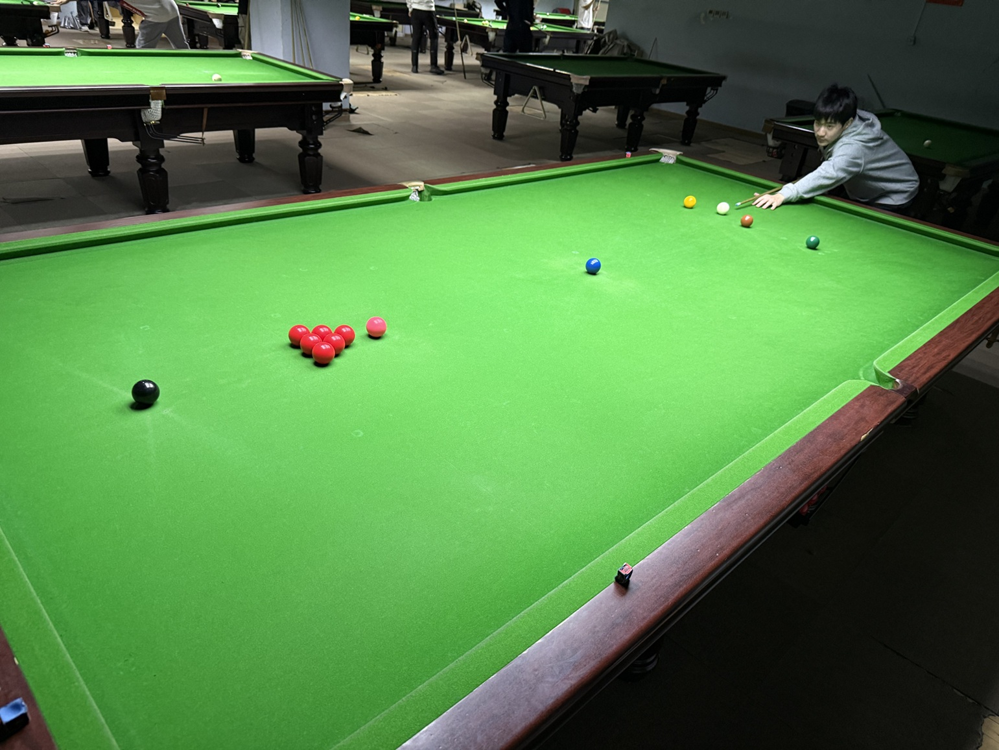

# 六红球英式斯诺克挑战赛/6-Red-Ball English Snooker Challenge

| 届次 | 日期       | 场地    | 赢家   | 其他参赛者    |
| :--: | :--------: | :----: | :---: | :-----------: |
| 1    | 2025.10.10 | 邱德拔 | 王翰墨 | 魏天昊，姜星宇 |

六红球英式斯诺克挑战赛由三人轮流击球进行。

## 历届赛历

### 第一届

| 场序 | 选手A        | 选手B       | 选手C        |
| :--: | :---------: | :---------: | :---------: |
| 1    | 魏天昊（21） | 王翰墨（31） | 姜星宇（16） |