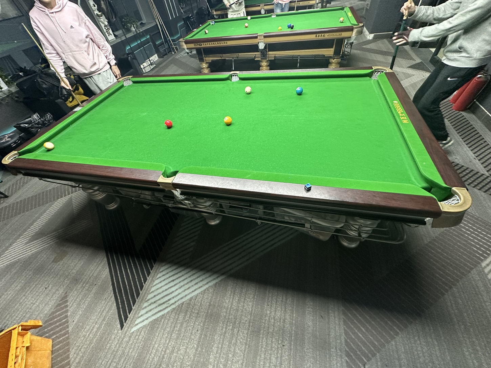

# 四球追分挑战赛/4-Ball Zhuifen Challenge

| 届次 | 日期       | 场地    | 赢家   | 其他参赛者    |
| :--: | :--------: | :----: | :---: | :-----------: |
| 1    | 2025.02.18 | 谈小娱 | 姜星宇 | 王翰墨，魏天昊 |
| 2    | 2025.03.17 | 蓝旗星 | 王翰墨 | 姜星宇，魏天昊 |
| 3    | 2025.04.02 | 邱德拔 | 魏天昊 | 王翰墨，姜星宇 |
| 4    | 2025.05.28 | 邱德拔 | 魏天昊 | 姜星宇，王翰墨 |
| 5    | 2026.01.08 | 邱德拔 | 王翰墨 | 魏天昊，姜星宇 |

四球追分挑战赛由多人参加，采用四球追分规则，按照上下家结算分数，按MPRC四球追分的计分规则计算。

## 历届赛历

### 第一届

| 场序 |    选手A         |   选手B         |   选手C          |   备注     |
| :--: | :-------------: | :-------------: | :-------------: | :--------: |
|  1   | **王翰墨（+2）** | 姜星宇（0）      | 魏天昊（-2）     | 普通胜利   |
|  2   | 王翰墨（-3）     | **魏天昊（+2）** | 姜星宇（+1）     | 普通胜利   |
|  3   | **魏天昊（+2）** | 王翰墨（0）      | 姜星宇（-2）     | 普通胜利   |
|  4   | 魏天昊（-1）     | **姜星宇（+1）** | 王翰墨（0）      | 普通胜利   |
|  5   | 姜星宇（+1）     | 魏天昊（-4）     | **王翰墨（+3）** | 普通黄金九 |
|  6   | 王翰墨（-4）     | **魏天昊（+2）** | 姜星宇（+2）     | 普通胜利   |
|  7   | 魏天昊（-1）     | **王翰墨（+1）** | 姜星宇（0）      | 普通胜利   |
|  8   | 王翰墨（-3）     | **魏天昊（+2）** | 姜星宇（+1）     | 普通胜利   |
|  9   | 魏天昊（-3）     | **王翰墨（+2）** | 姜星宇（+1）     | 普通胜利   |
|  10  | **王翰墨（+2）** | 魏天昊（+1）     | 姜星宇（-3）     | 普通胜利   |
|  11  | 王翰墨（0）      | **姜星宇（+1）** | 魏天昊（-1）     | 普通胜利   |

| 排名 |  姓名  | 积分 | 
| :--: | :---: | :--: |
|  1   | 姜星宇 |  3   |
|  2   | 王翰墨 |  0   |
|  3   | 魏天昊 |  -3  |

### 第二届

| 场序 |    选手A         |   选手B         |   选手C          |   备注     |
| :--: | :-------------: | :-------------: | :-------------: | :--------: |
|  1   | **王翰墨（+8）** | 姜星宇（-4）     | 魏天昊（-4）     | 大金       |
|  2   | 王翰墨（0）      | 魏天昊（-3）     | **姜星宇（+3）** | 普通胜利   |
|  3   | **姜星宇（+1）** | 魏天昊（0）      | 王翰墨（-1）     | 普通胜利   |
|  4   | 姜星宇（-2）     | **王翰墨（+3）** | 魏天昊（-1）     | 普通胜利   |
|  5   | **王翰墨（+2）** | 姜星宇（-1）     | 魏天昊（-1）     | 普通胜利   |
|  6   | 王翰墨（0）      | 魏天昊（-3）     | **姜星宇（+3）** | 普通胜利   |
|  7   | 姜星宇（0）      | 魏天昊（-2）     | **王翰墨（+2）** | 普通胜利   |
|  8   | **王翰墨（+6）** | 魏天昊（-3）     | 姜星宇（-3）     | 开球黄金九 |
|  9   | **王翰墨（+1）** | 姜星宇（0）      | 魏天昊（-1）     | 普通胜利   |
|  10  | 王翰墨（0）      | 魏天昊（-3）     | **姜星宇（+3）** | 普通胜利   |
|  11  | 姜星宇（-3）     | **魏天昊（+2）** | 王翰墨（+1）     | 普通胜利   |

| 排名 |  姓名  | 积分 | 
| :--: | :---: | :--: |
|  1   | 王翰墨 |  22  |
|  2   | 姜星宇 |  -3  |
|  3   | 魏天昊 | -19  |

### 第三届

| 场序 |    选手A         |   选手B         |   选手C          |   备注     |
| :--: | :-------------: | :-------------: | :-------------: | :--------: |
|  1   | 王翰墨（-3）     | **魏天昊（+3）** | 姜星宇（0）      | 普通黄金九 |
|  2   | 魏天昊（-3）     | **王翰墨（+3）** | 姜星宇（0）      | 普通胜利   |

| 排名 |  姓名  | 积分 | 
| :--: | :---: | :--: |
|  1\* | 魏天昊 |  0  |
|  2   | 王翰墨 |  0  |
|  3   | 姜星宇 |  0  |

*\* Rank 1st for the golden-9*

# 第四届

| 场序 |    选手A         |   选手B         |   选手C          |   备注     |
| :--: | :-------------: | :-------------: | :-------------: | :--------: |
|  1   | **王翰墨（+5）** | 姜星宇（0）      | 魏天昊（-5）     | 小金一九金 |
|  2   | 王翰墨（-2）     | **魏天昊（+2）** | 姜星宇（0）      | 普通胜利   |
|  3   | 魏天昊（0）      | 王翰墨（-3）     | **姜星宇（+3）** | 普通胜利   |
|  4   | **姜星宇（+1）** | 王翰墨（+1）     | 魏天昊（-2）     | 普通胜利   |
|  5   | **姜星宇（+2）** | 魏天昊（0）      | 王翰墨（-2）     | 普通胜利   |
|  6   | 姜星宇（+1）     | **王翰墨（0）**  | 魏天昊（-1）     | 普通胜利   |
|  7   | 王翰墨（-1）     | 姜星宇（-2）     | **魏天昊（+3）** | 普通胜利   |
|  8   | 魏天昊（-1）     | 姜星宇（-2）     | **王翰墨（+3）** | 普通胜利   |
|  9   | 王翰墨（+1）     | 姜星宇（-3）     | **魏天昊（+2）** | 普通胜利   |
|  10  | **魏天昊（+1）** | 姜星宇（+1）     | 王翰墨（-2）     | 普通胜利   |
|  11  | 魏天昊（+2）     | 王翰墨（-4）     | **姜星宇（+2）** | 普通胜利   |
|  12  | 姜星宇（-2）     | 王翰墨（0）      | **魏天昊（+2）** | 普通胜利   |
|  13  | **魏天昊（+2）** | 王翰墨（0）      | 姜星宇（-2）     | 普通胜利   |
|  14  | **魏天昊（+2）** | 姜星宇（+1）     | 王翰墨（-3）     | 普通胜利   |
|  15  | 魏天昊（0）      | 王翰墨（-3）     | **姜星宇（+3）** | 普通胜利   |
|  16  | **姜星宇（+2）** | 王翰墨（0）      | 魏天昊（-2）     | 普通胜利   |
|  17  | **姜星宇（+2）** | 魏天昊（0）      | 王翰墨（-2）     | 普通胜利   |
|  18  | 姜星宇（0）      | 王翰墨（-3）     | **魏天昊（+3）** | 普通黄金九 |
|  19  | **魏天昊（+3）** | 王翰墨（+1）     | 姜星宇（-4）     | 普通胜利   |

| 排名 |  姓名  | 积分 | 
| :--: | :---: | :--: |
|  1   | 魏天昊 |  11 |
|  2   | 姜星宇 |  3  |
|  3   | 王翰墨 | -14 |

# 第五届

#### 第八届

| 排名 |  姓名  | 积分 | 
| :--: | :---: | :--: |
|  1   | 王翰墨 |   6  |
|  2   | 魏天昊 |  -2  |
|  3   | 姜星宇 |  -4  |