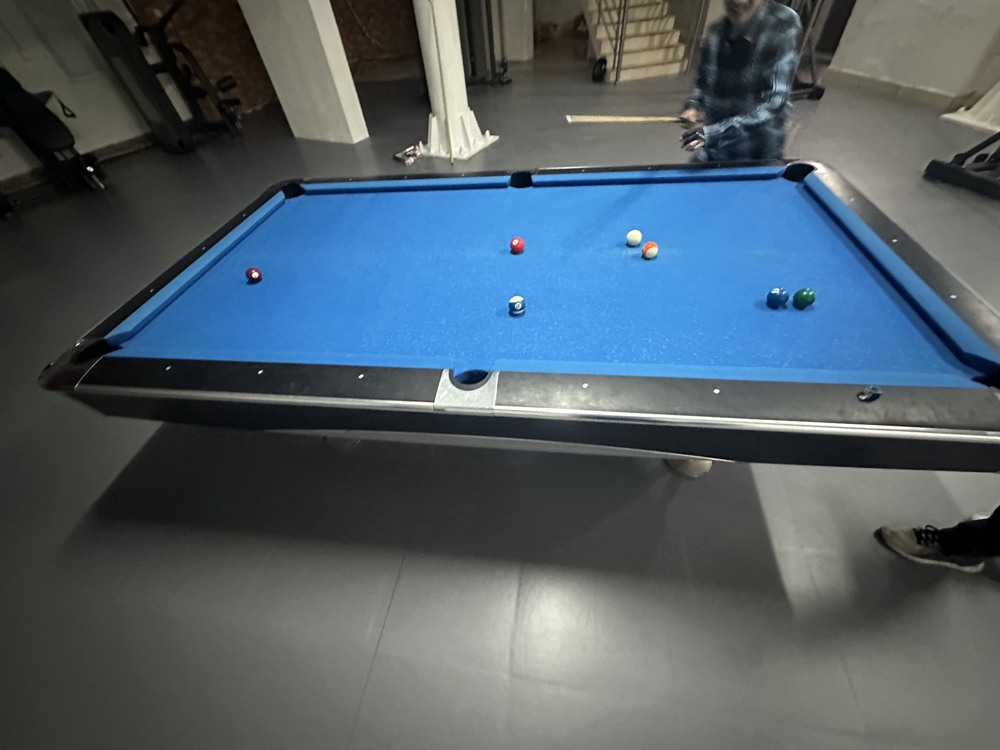

# 美式八球挑战赛/American 8-Ball Challenge

| 届次 | 日期       | 场地    | 赢家   | 其他参赛者                 |
| :--: | :--------: | :----: | :---: | :------------------------: |
| 1    | 2025.01.16 | 新燕园 | 王翰墨 | 井文淳，魏天昊              |

美式八球挑战赛在美式球桌上进行，赛制可以为基于美式八球的任意赛制。

### 第一届

赛制：MPRC三人台球

| 场序 | 选手A         | 选手B        | 选手C        |
| :--: | :----------: | :----------: | :----------: |
| 1    | 王翰墨（3rd） | 魏天昊（2nd） | 井文淳（1st） |
| 2    | 井文淳（3rd） | 魏天昊（2nd） | 王翰墨（1st） |
| 3    | 王翰墨（1st） | 魏天昊（3rd） | 井文淳（2nd） |