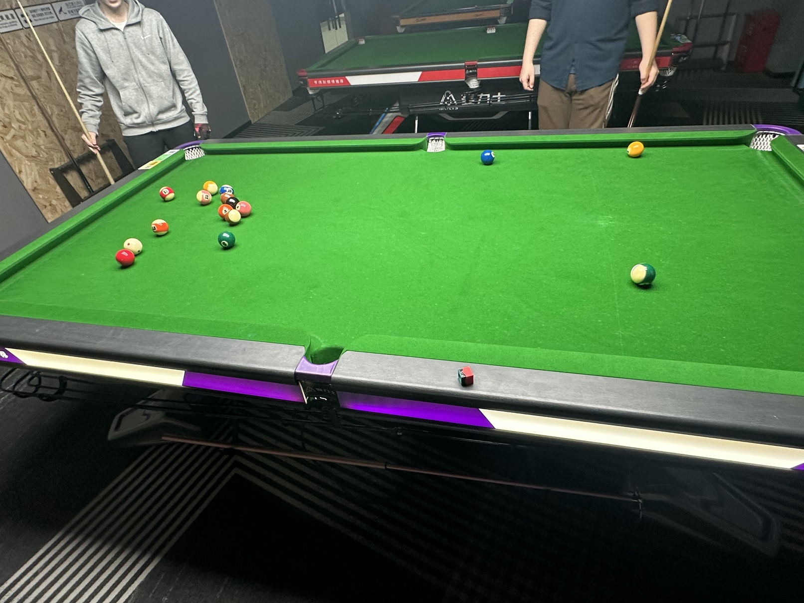

# 中式八球团体赛/Chinese 8-Ball Teams

| 届次 | 日期        | 场地   | 胜者         | 比分 | 负者         |
| :--: | :--------: | :----: | :----------: | :-: | :----------: |
| 1    | 2025.02.20 | 熊猫   | 姜星宇/魏天昊 | 3-2 | 和树繁/王翰墨 |
| 2    | 2025.03.27 | 熊猫   | 郝明洋/姜星宇 | 3-0 | 王翰墨/魏天昊 |
| 3    | 2025.09.01 | 邱德拔 | 王翰墨/魏天昊 | 3-1 | 姜星宇/张政年 |
| 4    | 2025.09.02 | 熊猫   | 郝明洋/魏天昊 | 1-2 | 姜星宇/王翰墨 |

中式八球团体赛采用组队制，赛制为2v2团队对抗赛。

## 历届赛历

### 第一届

| 场序 | 选手A        | 比分   | 选手B        | 备注  |
| :--: | :----------: | :---: | :----------: | :---: |
| 1    | 和树繁/王翰墨 | X6:4  | 姜星宇/魏天昊 | Foul  |
| 2    | 姜星宇/魏天昊 |  7:7X | 和树繁/王翰墨 | Foul  |
| 3    | 和树繁/王翰墨 |  8:4  | 姜星宇/魏天昊 | Final |
| 4    | 姜星宇/魏天昊 |  5:8  | 和树繁/王翰墨 | Final |
| 5    | 和树繁/王翰墨 |  7:8  | 姜星宇/魏天昊 | Final |

### 第二届

| 场序 | 选手A        | 比分   | 选手B        | 备注  |
| :--: | :----------: | :---: | :----------: | :---: |
| 1    | 王翰墨/魏天昊 |  6:8  | 郝明洋/姜星宇 | Final |
| 2    | 郝明洋/姜星宇 |  8:7  | 王翰墨/魏天昊 | Final |
| 3    | 王翰墨/魏天昊 |  7:8  | 郝明洋/姜星宇 | Final |

### 第三届

| 场序 | 选手A        | 比分   | 选手B        | 备注  |
| :--: | :----------: | :---: | :----------: | :---: |
| 1    | 王翰墨/魏天昊 |  6:8  | 姜星宇/张政年 | Final |
| 2    | 姜星宇/张政年 |  2:8  | 王翰墨/魏天昊 | Final |
| 3    | 王翰墨/魏天昊 |  8:6  | 姜星宇/张政年 | Final |
| 4    | 姜星宇/张政年 |  6:8  | 王翰墨/魏天昊 | Final |

### 第四届

| 场序 | 选手A        | 比分   | 选手B        | 备注  |
| :--: | :----------: | :---: | :----------: | :---: |
| 1    | 郝明洋/魏天昊 |  5:8  | 姜星宇/王翰墨 | Final |
| 2    | 姜星宇/王翰墨 |  6:8  | 郝明洋/魏天昊 | Final |
| 3    | 郝明洋/魏天昊 |  7:8  | 姜星宇/王翰墨 | Final |