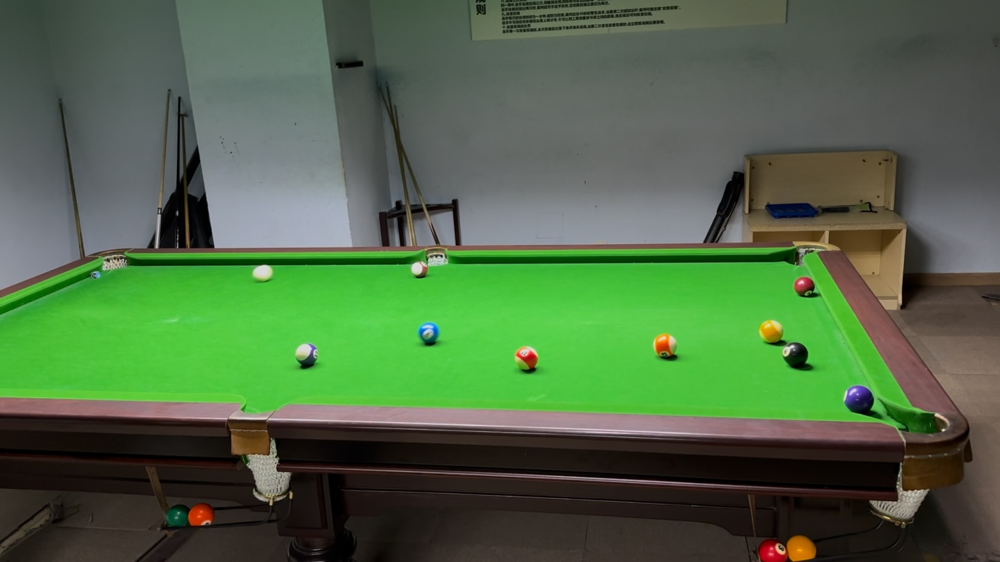

# 普尔台球系列赛/Pool Series

| 届次 | 日期                   | 场地              | 胜者   | 比分 | 负者  |
| :--: | :-------------------: | :---------------: | :---: | :--: | :---: |
| 1    | 2024.12.05-2024.12.12 | 邱德拔/谈小娱      | 王翰墨 | 4-3 | 姜星宇 |
| 2    | 2024.12.24-2024.12.30 | 熊猫/碰碰捌/邱德拔 | 王翰墨 | 5-2 | 姜星宇 |
| 3    | 2025.01.10            | 蓝旗星            | 王翰墨 | 3-1 | 姜星宇 |

普尔台球系列赛是各种普尔台球的混合系列赛，2名选手进行若干局比赛决出胜负，可以从以下8种规则中任选：

1. 单袋台球（One-Pocket Pool）
2. 翻袋台球（Bank Pool）
3. 残酷台球（Cutthroat Pool）
4. 直球（Straight Pool）
5. 旋转台球（Rotation Pool）
6. 八球（8-Ball Pool）
7. 九球（9-Ball Pool）
8. 反向八球（Backwards 8-Ball Pool）

## 历届赛历

### 第一届

| 场序 | 选手A  | 比分  | 选手B   | 规则       | 备注  |
| :--: | :---: | :---: | :----: | :--------: | :---: |
| 1    | 姜星宇 | 8-3   | 王翰墨 | One-Pocket | Final |
| 2    | 王翰墨 | 5-4   | 姜星宇 | Bank       | Final |
| 3    | 姜星宇 | 6-7   | 王翰墨 | Cutthroat  | Final |
| 4    | 王翰墨 | 20-14 | 姜星宇 | Straight   | Final |
| 5    | 姜星宇 | 69-23 | 王翰墨 | Rotation   | Final |
| 6    | 王翰墨 | 2-8   | 姜星宇 | 8-Ball     | Final |
| 7    | 姜星宇 | 0-9\* | 王翰墨 | 9-Ball     | Final |

*\* Did not record the score*

### 第二届

| 场序 | 选手A  | 比分  | 选手B   | 规则       | 备注  |
| :--: | :---: | :---: | :----: | :--------: | :---: |
| 1    | 王翰墨 | 8-3   | 姜星宇 | 8-Ball     | Final |
| 2    | 姜星宇 | 66-54 | 王翰墨 | Rotation   | Final |
| 3    | 王翰墨 | 6-8   | 姜星宇 | One-Pocket | Final |
| 4    | 姜星宇 | 19-30 | 王翰墨 | Straight   | Final |
| 5    | 王翰墨 | 7-4   | 姜星宇 | Cutthroat  | Final |
| 6    | 姜星宇 | 4-5   | 王翰墨 | Bank       | Final |
| 7    | 王翰墨 | 9-0   | 姜星宇 | 9-Ball     | Final |

### 第三届

| 场序 | 选手A  | 比分  | 选手B   | 规则       | 备注  |
| :--: | :---: | :---: | :----: | :--------: | :---: |
| 1    | 姜星宇 | 1-8   | 王翰墨 | 8-Ball     | Final |
| 2    | 王翰墨 | 88-6  | 姜星宇 | Backwards  | Final |
| 3    | 姜星宇 | 5-8   | 王翰墨 | One-Pocket | Final |
| 4    | 王翰墨 | 24-70 | 姜星宇 | Rotation   | Final |