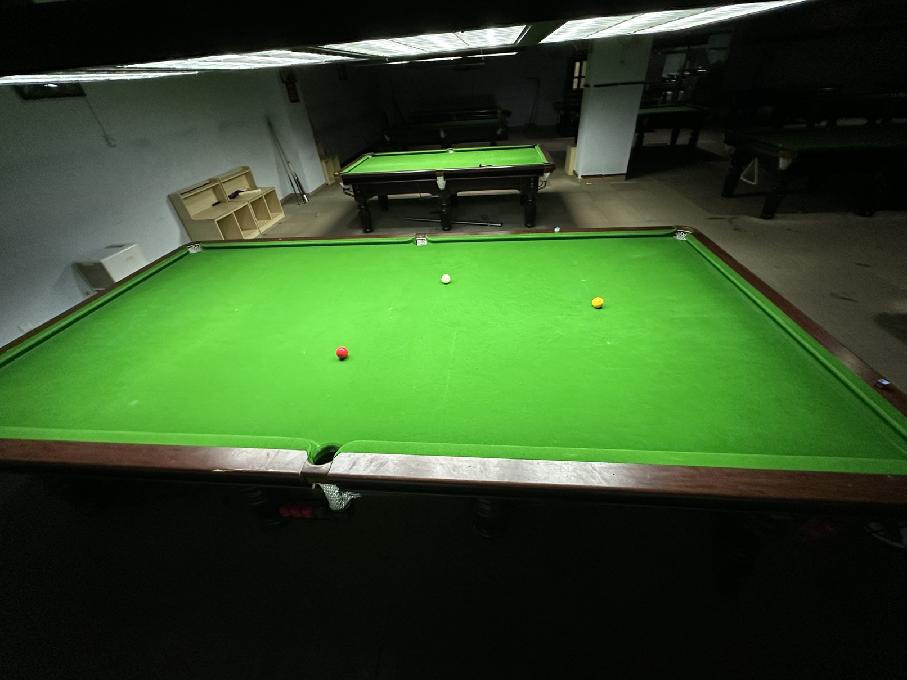

# 英式台球系列赛/English Series

| 届次 | 日期        | 场地   | 胜者   | 比分 | 负者  |
| :--: | :--------: | :----: | :---: | :--: | :---: |
| 1    | 2024.12.19 | 邱德拔 | 王翰墨 | 2-0 | 姜星宇 |

英式台球系列赛是使用12ft英式球桌的混合系列赛，2名选手进行若干局比赛决出胜负，可以从以下3种规则中任选：

1. 英式斯诺克
2. 英式比利
3. 巴西斯诺克

## 历届赛历

### 第一届

| 场序 | 选手A  | 比分  | 选手B   | 规则       | 备注  |
| :--: | :---: | :---: | :----: | :--------: | :---: |
| 1    | 姜星宇 | 33:60 | 王翰墨 | 斯诺克     | Final |
| 2    | 王翰墨 | 13:3  | 姜星宇 | 英式比利   | Final |

