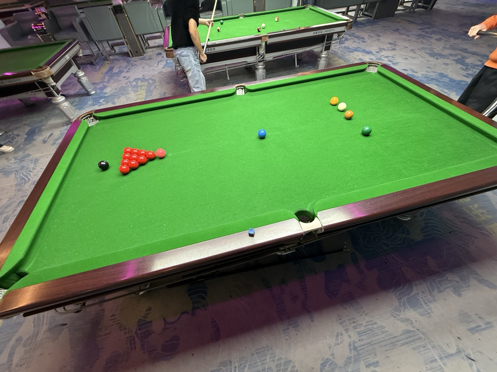

# 中式斯诺克系列赛/Chinese Snooker Series

| 届次 | 日期                 | 场地     | 胜者   | 比分 | 负者  |
| :--: | :-----------------: | :------: | :---: | :--: | :---: |
| 1    | 2025.03.07-         | 至尚/熊猫 |       |      |       |

中式斯诺克系列赛采用十红球中式斯诺克规则，比赛规模为比肩世锦赛决赛的35局18胜制。

## 历届赛历

### 第一届

- 第一阶段：2025年3月7日于至尚，进行了第1-6局，比分为姜星宇4-2王翰墨。
- 第二阶段：2025年3月9日于熊猫球社，进行了第7-9局，比分为姜星宇6-3王翰墨。

| 场序 | 选手A  | 比分   | 选手B  | 备注  |
| :--: | :----: | :----: | :---: | :---: |
| 1    | 姜星宇 | 11:46  | 王翰墨 | Final |
| 2    | 王翰墨 | 34:43  | 姜星宇 | Final |
| 3    | 姜星宇 | 55:26  | 王翰墨 | Final |
| 4    | 王翰墨 | 31:9   | 姜星宇 | Final |
| 5    | 姜星宇 | 54:20  | 王翰墨 | Final |
| 6    | 王翰墨 | 31:44  | 姜星宇 | Final |
| 7    | 姜星宇 | 23:51  | 王翰墨 | Final |
| 8    | 王翰墨 | 29:73  | 姜星宇 | Final |
| 9    | 姜星宇 | 57:44  | 王翰墨 | Final |
| 10   | 王翰墨 |  0:0   | 姜星宇 | Due   |
| 11   | 姜星宇 |  0:0   | 王翰墨 | Due   |
| 12   | 王翰墨 |  0:0   | 姜星宇 | Due   |
| 13   | 姜星宇 |  0:0   | 王翰墨 | Due   |
| 14   | 王翰墨 |  0:0   | 姜星宇 | Due   |
| 15   | 姜星宇 |  0:0   | 王翰墨 | Due   |
| 16   | 王翰墨 |  0:0   | 姜星宇 | Due   |
| 17   | 姜星宇 |  0:0   | 王翰墨 | Due   |
| 18   | 王翰墨 |  0:0   | 姜星宇 | Due   |
| 19   | 姜星宇 |  0:0   | 王翰墨 | Due   |
| 20   | 王翰墨 |  0:0   | 姜星宇 | Due   |
| 21   | 姜星宇 |  0:0   | 王翰墨 | Due   |
| 22   | 王翰墨 |  0:0   | 姜星宇 | If Necessary |
| 23   | 姜星宇 |  0:0   | 王翰墨 | If Necessary |
| 24   | 王翰墨 |  0:0   | 姜星宇 | If Necessary |
| 25   | 姜星宇 |  0:0   | 王翰墨 | If Necessary |
| 26   | 王翰墨 |  0:0   | 姜星宇 | If Necessary |
| 27   | 姜星宇 |  0:0   | 王翰墨 | If Necessary |
| 28   | 王翰墨 |  0:0   | 姜星宇 | If Necessary |
| 29   | 姜星宇 |  0:0   | 王翰墨 | If Necessary |
| 30   | 王翰墨 |  0:0   | 姜星宇 | If Necessary |
| 31   | 姜星宇 |  0:0   | 王翰墨 | If Necessary |
| 32   | 王翰墨 |  0:0   | 姜星宇 | If Necessary |
| 33   | 姜星宇 |  0:0   | 王翰墨 | If Necessary |
| 34   | 王翰墨 |  0:0   | 姜星宇 | If Necessary |
| 35   | 姜星宇 |  0:0   | 王翰墨 | If Necessary |

