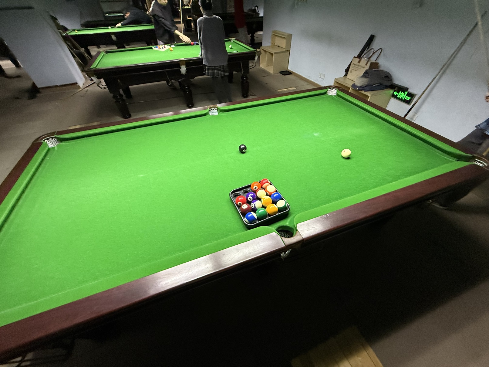

# 准度单项赛/Accuracy Contest

| 届次 | 日期        | 场地   | 准神  | 副准神 | 助理准神 |
| :--: | :--------: | :----: | :---: | :---: | :-----: |
| 1    | 2025.03.26 | 邱德拔 | 魏天昊 | 姜星宇 | 王翰墨  |
| 2    | 2025.03.31 | 邱德拔 | 魏天昊 | 王翰墨 | 姜星宇  |

准度单项赛是MPRC台球俱乐部成员之间的准度比拼游戏，包含以下比赛项目：

|  大项  |   小项    |                          点位                      |    计分     |          组数           |
| :----: | :------: | :------------------------------------------------: | :-------- : | :--------------------: |
| 直线球 |  五分点   |   固定点位：子球位于中心点，母球位于开球线，形成直线   | 连进分值累加 |     10球，左右各1组      |
| 直线球 |  六分点   |   固定点位：子球位于摆球点，母球位于开球线，形成直线   | 连进分值累加 |     10球，左右各1组      |
| 角度球 | 纵向长台  |     不同点位：子球纵向一字排开，母球位于开球线中点     | 点位分值对应 | 5球（12345），左右各1组  |
| 角度球 | 横向半台  |       不同点位：子球横向一字排开，母球位于中心点       | 点位分值对应 |   5球（12321），共1组   |
| 角度球 | 横向长台  |     不同点位：子球横向一字排开，母球位于开球线中点     | 点位分值对应 |   5球（12321），共1组    |
| 贴库球 | 半台45°角 |      固定点位：子球位于长库边1/4处，母球位于中心       | 连进分值累加 |    10球，左右各1组      |
| 翻袋球 |   贴库    |  不同点位：子球半台贴库一字排开，母球离库1/2任意位置   | 连进分值累加 |     5球，左右各1组       |
| 翻袋球 |  离库1/4  | 不同点位：子球半台离库1/4一字排开，母球离库1/2任意位置 | 连进分值累加 |     5球，左右各1组       |

计分采用连进分值累加制，各项分数相加得到总分，总分最高者获得“准神”称号。排名优先级如下：

1. 总分更高者，排名靠前；
2. 在连进分值累加的项目中，最大连进数更高者，排名靠前；
3. 在点位分值对应的项目中，打进单球分值更高者，排名靠前；
4. 总进球数更高者，排名靠前；
5. 加赛一颗球，打进者排名靠前。

## 历届赛历

### 第一届

| 直线球 |          第一轮：左侧五分点        |           第二轮：右侧五分点        |
| :----: | :------------------------------: | :-------------------------------: |
| 王翰墨 |     ✅✅❌✅❌❌✅❌❌❌     |     ❌❌❌✅✅❌✅✅❌❌     |
| 魏天昊 |     ❌❌✅✅❌❌❌❌❌❌     |     ❌✅✅❌❌❌✅❌✅❌     |
| 姜星宇 |     ❌❌❌❌❌❌✅❌❌❌     |     ❌❌✅❌✅✅❌❌❌❌     |

| 贴库球 |          第一轮：左侧半台45°角          |     第二轮：右侧半台45°角         |
| :----: | :------------------------------: | :-------------------------------: |
| 王翰墨 |     ❌❌❌❌❌❌✅❌✅✅     |     ❌❌❌❌❌❌❌❌❌❌     |
| 魏天昊 |     ❌✅❌❌✅❌❌❌❌❌     |     ✅✅✅✅✅❌✅✅✅✅     |
| 姜星宇 |     ❌✅❌❌❌✅❌✅❌❌     |     ❌✅✅✅❌❌❌✅❌❌     |

| 排名 |  姓名  | 总分 | 直线球  | 贴库球  |
| :--: | :---: | :---: | :----: | :----: |
|  1   | 魏天昊 |  35  |   8    |   27   |
|  2   | 姜星宇 |  15  |   5    |   10   |
|  3   | 王翰墨 |  15  |   11   |   4    |

### 第二届

| 角度球 | 第一轮：左侧纵向长台 | 第二轮：右侧纵向长台 | 第三轮：横向半台  | 第四轮：横向长台   |
| :----: | :----------------: | :----------------: | :--------------: | :--------------: |
| 魏天昊 |   ❌❌✅❌❌     |    ❌❌❌❌❌    |  ❌✅❌❌❌   |  ✅❌❌❌❌    |
| 姜星宇 |   ❌❌❌❌❌     |    ❌❌❌❌❌    |  ✅❌❌❌❌   |  ❌❌❌❌✅    |
| 王翰墨 |   ❌❌❌❌❌     |    ✅❌❌❌❌    |  ❌✅❌✅❌   |  ❌❌✅❌❌    |

| 翻袋球 | 第一轮：左侧贴库     | 第二轮：右侧贴库   | 第三轮：左侧离库1/4  | 第四轮：右侧离库1/4 |
| :----: | :----------------: | :---------------: | :----------------: | :----------------: |
| 魏天昊 |   ❌❌✅❌❌     |   ❌❌❌❌❌   |   ❌✅❌❌❌     |  ✅❌✅❌❌     |
| 姜星宇 |   ❌✅❌❌❌     |   ❌❌❌❌❌   |   ✅❌❌❌❌     |  ❌❌❌❌❌     |
| 王翰墨 |   ❌❌❌❌❌     |   ❌❌❌❌❌   |   ✅❌❌❌❌     |  ❌❌❌❌❌     |

| 排名 |  姓名  | 总分 | 角度球  | 翻袋球  |
| :--: | :----: | :--: | :----: | :----: |
|  1   | 魏天昊 |  10  |   6    |   4    |
|  2   | 王翰墨 |  9   |   8    |   1    |
|  3   | 姜星宇 |  3   |   2    |   1    |

