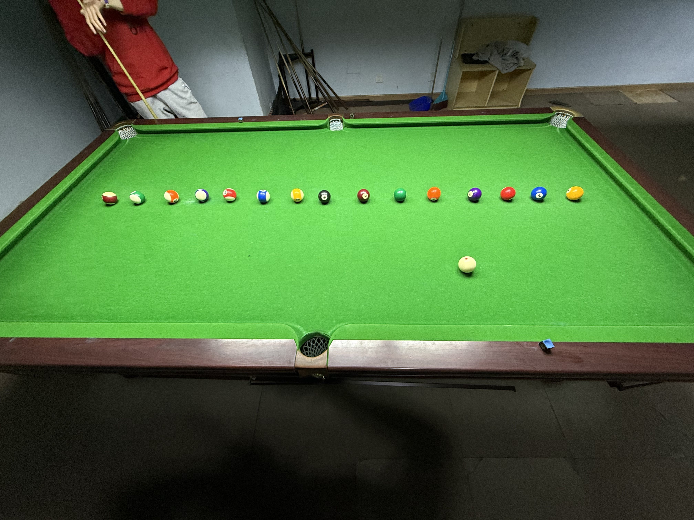

# 速度单项赛/Speed Contest

| 届次 | 日期        | 场地   | 火箭  | 副火箭 | 助理火箭 |
| :--: | :--------: | :----: | :---: | :---: | :-----: |
| 1    | 2025.04.08 | 邱德拔 | 姜星宇 | 王翰墨 | 无      |
| 2    | 2025.04.09 | 邱德拔 | 王翰墨 | 姜星宇 | 无      |
| 3    | 2025.04.16 | 熊猫   | 王翰墨 | 魏天昊 | 姜星宇  |

速度单项赛是MPRC台球俱乐部成员之间的竞速台球游戏，包含以下比赛项目：

1. 限时击球：在限定时间内击球，进球多者获胜
2. 计时击球：击打一定数量的球，用时少者获胜

在击球过程中，如果出现犯规将会被罚去1颗球。比赛结束后，按照平均每个进球耗费的时间计算出速度，决出“火箭”。

## 历届赛历

### 第一届

| 轮次 | 项目           | 王翰墨  | 姜星宇   |
| :--: | :-----------: | :-----: | :-----: |
| 1    | 限时击球-2分钟 |    4    |    9    |
| 2    | 限时击球-2分钟 |    7    |   10    |
| 3    | 限时击球-2分钟 |    8    |    8    |
| 4    | 计时击球-15球  | 4:28.69 | 5:16.23 |

| 排名 |  姓名  | 总成绩 | 总进球  | 总用时 | 限时赛成绩 | 限时赛进球  | 限时赛用时 | 计时赛成绩 | 计时赛进球  | 计时赛用时 |
| :--: | :---: | :----: | :----: | :----: | :-------: | :--------: | :-------: | :-------: | :--------: | :-------: |
|  1   | 姜星宇 | 16.101 |   42   | 676.23 |  13.333  |     27      |    360    |  21.082   |     15     |  316.23   |
|  2   | 王翰墨 | 18.491 |   34   | 628.69 |  18.947  |     19      |    360    |  17.913   |     15     |  268.69   |

### 第二届

| 轮次 | 项目           | 姜星宇  | 王翰墨   |
| :--: | :-----------: | :-----: | :-----: |
| 1    | 限时击球-2分钟 |    8    |    5    |
| 2    | 限时击球-1分钟 |    3    |    5    |
| 3    | 限时击球-3分钟 |   10    |    6    |
| 4    | 计时击球-15球  | 5:30.84 | 4:40.32 |
| 5    | 计时击球-5球   | 1:37.72 | 2:06.71 |
| 6    | 计时击球-10球  | 5:30.78 | 2:58.78 |

| 排名 |  姓名  | 总成绩 | 总进球  | 总用时  | 限时赛成绩 | 限时赛进球  | 限时赛用时 | 计时赛成绩 | 计时赛进球  | 计时赛用时 |
| :--: | :---: | :----: | :----: | :-----: | :-------: | :--------: | :-------: | :-------: | :--------: | :-------: |
|  1   | 王翰墨 | 20.561 |   46   | 945.81  |  22.500  |     16      |    360    |  19.527   |     30     |  585.81   |
|  2   | 姜星宇 | 21.948 |   51   | 1119.34 |  17.143  |     21      |    360    |  24.311   |     30     |  759.34   |

### 第三届

| 轮次 | 项目           | 王翰墨  | 姜星宇   | 魏天昊  |
| :--: | :-----------: | :-----: | :-----: | :-----: |
| 1    | 限时击球-2分钟 |    3    |    2    |    4    |
| 2    | 限时击球-2分钟 |   12    |    4    |    4    |
| 3    | 计时击球-15球  | 4:54.18 | 5:21.03 | 5:27.94 |
| 4    | 限时击球-1分钟 |    5    |    4    |    3    |
| 5    | 计时击球-5球   | 2:36.41 | 2:42.06 | 1:26.41 |

| 排名 |  姓名  | 总成绩 | 总进球  | 总用时  | 限时赛成绩 | 限时赛进球  | 限时赛用时 | 计时赛成绩 | 计时赛进球  | 计时赛用时 |
| :--: | :---: | :----: | :----: | :-----: | :-------: | :--------: | :-------: | :-------: | :--------: | :-------: |
|  1   | 王翰墨 | 18.765 |   40   | 750.59  |  15.000  |     20      |    300    |  22.530   |     20     |  450.59   |
|  2   | 魏天昊 | 23.044 |   31   | 714.35  |  27.273  |     11      |    300    |  20.718   |     20     |  414.35   |
|  3   | 姜星宇 | 26.103 |   30   | 783.09  |  30.000  |     10      |    300    |  24.155   |     20     |  483.09   |