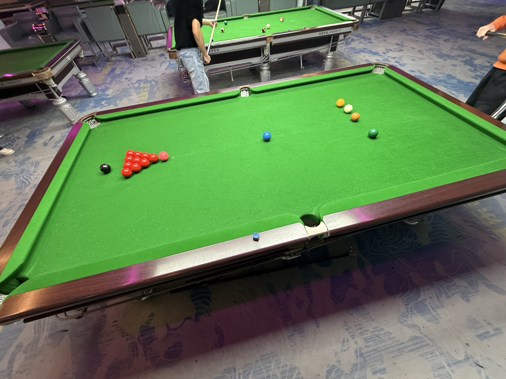

# 斯诺克系列赛/Snooker Series

| 届次 |   日期                 |                     场地                         | 胜者   | 比分  | 负者  |
| :--: | :-------------------: | :----------------------------------------------: | :---: | :---: | :---: |
| 1    | 2025.03.07-2025.06.05 | 至尚/熊猫/邱德拔/鼎升/小铁/碰碰捌/蓝旗星/响袋/谈小娱 | 姜星宇 | 18-15 | 王翰墨 |
| 2    | 2025.06.19-           | 邱德拔                                            |       |       |       |

斯诺克系列赛，采用斯诺克规则，比赛规模为比肩世锦赛决赛的35局18胜制。

## 历届赛历

### 第一届

规则：十红球中式斯诺克

| 14+  | 姜星宇  |  局数  | 王翰墨  | 14+   |
| :--: | :----: | :----: | :----: | :---: |
|      |   11   |   1    | **46** |       |
|      | **43** |   2    |   34   |       |
|      | **55** |   3    |   26   |       |
|      |   9    |   4    | **31** |       |
|      | **54** |   5    |   20   |       |
|      | **44** |   6    |   31   |       |
|      |   23   |   7    | **51** |       |
|      | **73** |   8    |   29   |       |
|      | **57** |   9    |   44   |       |
|      | **66** |   10   |   46   |       |
|      | **70** |   11   |   32   |       |
|      |   33   |   12   | **41** |       |
|      |   32   |   13   | **34** |       |
|      | **56** |   14   |   14   |       |
|      | **47** |   15   |   40   |       |
|      |   30   |   16   | **66** |       |
|      |   17   |   17   | **40** |       |
|      | **43** |   18   |   41   |       |
|      | **59** |   19   |   20   |       |
|      |   38   |   20   | **66** |       |
|      | **55** |   21   |   24   |       |
|      |   17   |   22   | **48** |       |
|      | **38** |   23   |   25   |       |
|      |   12   |   24   | **47** |       |
|      |   29   |   25   | **46** |       |
|      |   33   |   26   | **48** |       |
|      |   20   |   27   | **54** |       |
|      | **40** |   28   |   9    |       |
|      | **44** |   29   |   42   |       |
|      |   46   |   30   | **53** |       |
|      | **48** |   31   |   38   |       |
|      |   13   |   32   | **51** |       |
|      | **37** |   33   |   30   |       |

- 第一阶段：2025年3月7日于至尚台球，进行了第1-6局，比分为姜星宇4-2王翰墨。
- 第二阶段：2025年3月9日于熊猫球社，进行了第7-9局，比分为姜星宇6-3王翰墨。
- 第三阶段：2025年3月19日于邱德拔体育馆，进行了第10-11局，比分为姜星宇8-3王翰墨。
- 第四阶段：2025年3月25日于鼎升台球，进行了第12-15局，比分为姜星宇10-5王翰墨。
- 第五阶段：2025年5月8日于小铁自助台球，进行了第16-18局，比分为姜星宇11-7王翰墨。
- 第六阶段：2025年5月12日于碰碰捌独牙自助台球，进行了第19-21局，比分为姜星宇13-8王翰墨。
- 第七阶段：2025年5月14日于蓝旗星台球俱乐部，进行了第22-25局，比分为姜星宇14-11王翰墨。
- 第八阶段：2025年5月19日于响袋自助台球，进行了第26-29局，比分为姜星宇16-13王翰墨。
- 第九阶段：2025年6月5日于谈小娱自主台球，进行了第30-33局，比分为姜星宇18-15王翰墨。

*Break 14+ was not recorded.*
### 第二届

规则：十红球中式斯诺克

| 14+  | 姜星宇  |  局数  | 王翰墨  | 14+   |
| :--: | :----: | :----: | :----: | :---: |
|      |   30   |   1    | **33** |       |
|  17  | **46** |   2    |   24   |       |
|      |        |   3    |        |       |
|      |        |   4    |        |       |
|      |        |   5    |        |       |
|      |        |   6    |        |       |
|      |        |   7    |        |       |
|      |        |   8    |        |       |
|      |        |   9    |        |       |
|      |        |   10   |        |       |
|      |        |   11   |        |       |
|      |        |   12   |        |       |
|      |        |   13   |        |       |
|      |        |   14   |        |       |
|      |        |   15   |        |       |
|      |        |   16   |        |       |
|      |        |   17   |        |       |
|      |        |   18   |        |       |
|      |        |   19   |        |       |
|      |        |   20   |        |       |
|      |        |   21   |        |       |
|      |        |   22   |        |       |
|      |        |   23   |        |       |
|      |        |   24   |        |       |
|      |        |   25   |        |       |
|      |        |   26   |        |       |
|      |        |   27   |        |       |
|      |        |   28   |        |       |
|      |        |   29   |        |       |
|      |        |   30   |        |       |
|      |        |   31   |        |       |
|      |        |   32   |        |       |
|      |        |   33   |        |       |
|      |        |   34   |        |       |
|      |        |   35   |        |       |

- 第一阶段：2025年6月19日于邱德拔体育馆，进行了第1-2局，比分为姜星宇1-1王翰墨。