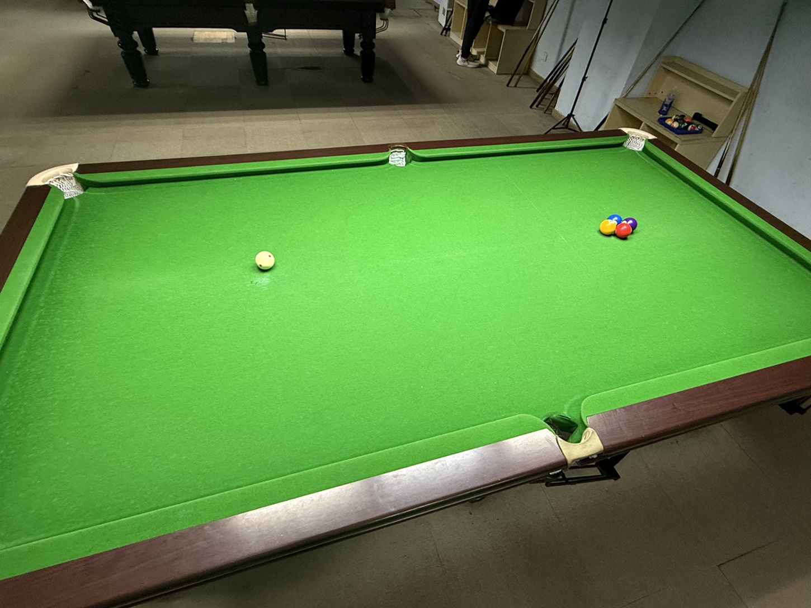

# 保龄台球单项赛/Bowlliards Contest

| 届次 | 日期        | 场地   | 冠军  | 亚军   | 季军   |  局数 | 子球数 |
| :--: | :--------: | :----: | :---: | :---: | :----: | :---: | :---: |
| 1    | 2025.08.28 | 熊猫   | 王翰墨 | 姜星宇 | 无     |   5  |   7   |
| 2    | 2025.08.28 | 熊猫   | 王翰墨 | 姜星宇 | 无     |   5  |   4   |
| 3    | 2025.09.27 | MK     | 王翰墨 | 姜星宇 | 魏天昊 |   5  |   4   |

保龄台球单项赛采用保龄台球规则，局数和子球数可以自定义。

## 历届赛历

### 第一届

- **子球数：**7

- **局数：**5

**选手A：**王翰墨

|          | 第1局 | 第2局  | 第3局 | 第4局 | 第5局  | Final |
| :------: | :---: | :---: | :---: | :---: | :---: | :---: |
| **击球** |  - 1  |  2 1  |  2 -  |  3 -  |  5 -  |       |
| **得分** |   1   |   3   |   2   |   3   |   5   |  14   |

**选手B：**姜星宇

|          | 第1局 | 第2局  | 第3局 | 第4局 | 第5局  | Final |
| :------: | :---: | :---: | :---: | :---: | :---: | :---: |
| **击球** |  - 1  |  1 2  |  2 -  |  1 -  |  1 1  |       |
| **得分** |   1   |   3   |   2   |   1   |   2   |   9   |

### 第二届

- **子球数：**4

- **局数：**5

**选手A：**王翰墨

|          | 第1局 | 第2局  | 第3局 | 第4局 | 第5局  | Final |
| :------: | :---: | :---: | :---: | :---: | :---: | :---: |
| **击球** |  1 2  |  2 /  |  3 /  |  1 1  |  1 -  |       |
| **得分** |   3   |   7   |   5   |   2   |   1   |  18   |

**选手B：**姜星宇

|          | 第1局 | 第2局  | 第3局 | 第4局 | 第5局  | Final |
| :------: | :---: | :---: | :---: | :---: | :---: | :---: |
| **击球** |  - -  |  3 /  |  2 -  |  2 1  |  1 1  |       |
| **得分** |   0   |   6   |   2   |   3   |   2   |  13   |

### 第三届

- **子球数：**4

- **局数：**7

**选手A：**王翰墨

|          | 第1局 | 第2局  | 第3局 | 第4局 | 第5局  | 第6局 | 第7局 | Final |
| :------: | :---: | :---: | :---: | :---: | :---: | :---: | :---: | :---: |
| **击球** |  2 -  |  1 -  |  2 -  |  2 1  |  - 2  |  X    |  2 -  |       |
| **得分** |   2   |   1   |   2   |   3   |   2   |   6   |   2   |  18   |

**选手B：**魏天昊

|          | 第1局 | 第2局  | 第3局 | 第4局 | 第5局  | 第6局 | 第7局 | Final |
| :------: | :---: | :---: | :---: | :---: | :---: | :---: | :---: | :---: |
| **击球** |  1 1  |  1 -  |  2 -  |  1 1  |  1 -  |  2 -  |  1 -  |       |
| **得分** |   2   |   1   |   2   |   2   |   1   |   2   |   1   |  11   |

**选手C：**姜星宇

|          | 第1局 | 第2局  | 第3局 | 第4局 | 第5局  | 第6局 | 第7局 | Final |
| :------: | :---: | :---: | :---: | :---: | :---: | :---: | :---: | :---: |
| **击球** |  1 -  |  1 -  |  3 /  |  2 1  |  1 1  |  1 -  |  2 -  |       |
| **得分** |   1   |   1   |   6   |   3   |   2   |   1   |   2   |  16   |