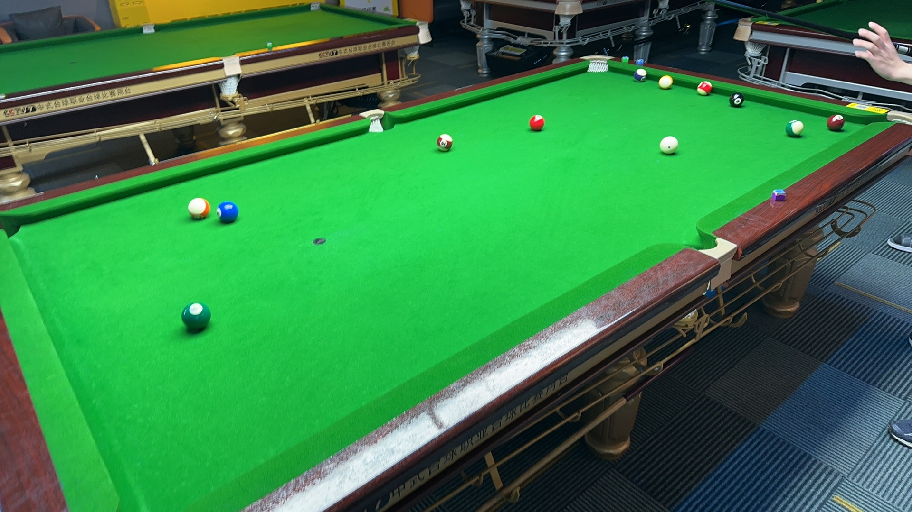

# 中式八球公开赛/Chinese 8-Ball Open

| 届次 | 日期                   | 场地        | 冠军   | 亚军   | 季军   | 决赛比分 |
| ---- | --------------------- | ----------- | ------ | ------ | ------ | ------- |
| 1    | 2024.10.18-2024.10.20 | 邱德拔体育馆 | 王翰墨 | 姜星宇 | 魏天昊 | 3-1      |
| 2    | 2024.10.23-2024.10.24 | 邱德拔体育馆 | 姜星宇 | 魏天昊 | 王翰墨 | 3-1      |
| 3    | 2024.11.01-2024.11.04 | 蓝旗星俱乐部&邱德拔体育馆 | 王翰墨 | 魏天昊 | 姜星宇 | 3-2      |

中式八球公开赛是MPRC台球俱乐部历史最悠久的八球赛事。比赛采用淘汰赛制，抽签决定对阵，直至决出冠军。半决赛采用三局两胜制，决赛采用五局三胜制，季军赛采用单局制。此外，比赛要求至少4名选手参赛。

## 历届赛历

### 第一届

| 场序 | 阶段   | 选手A  | 比分 | 选手B  | 备注 |
| ---- | ------ | ----- | ---- | ----- | ---- |
| 1    | 半决赛 | 王翰墨 | 2-0  | 魏天昊 | Final |
| 2    | 半决赛 | 姜星宇 | 2-0  | 郝明洋 | Walkover |
| 3    | 季军赛 | 魏天昊 | 1-0  | 郝明洋 | Walkover  |
| 4    | 决赛   | 王翰墨 | 3-1  | 姜星宇 | Final |

### 第二届

| 场序 | 阶段   | 选手A  | 比分 | 选手B  | 备注  |
| ---- | ----- | ------ | ---- | ----- | ----- |
| 1    | 半决赛 | 姜星宇 | 2-1  | 王翰墨 | Final |
| 2    | 半决赛 | 郝明洋 | 0-2  | 魏天昊 | Final |
| 3    | 季军赛 | 王翰墨 | 1-0  | 郝明洋 | Simplified |
| 4    | 决赛   | 姜星宇 | 3-1 | 魏天昊 | Final |

### 第三届

| 场序 | 阶段   | 选手A  | 比分 | 选手B  | 备注  |
| ---- | ----- | ------ | ---- | ----- | ----- |
| 1    | 半决赛 | 魏天昊 | 2-0  | 姜星宇 | Final |
| 2    | 半决赛 | 郝明洋 | 1-2  | 王翰墨 | Final |
| 3    | 季军赛 | 姜星宇 | 1-0  | 郝明洋 | Final |
| 4    | 决赛   | 魏天昊 | 2-3 | 王翰墨  | Final |

