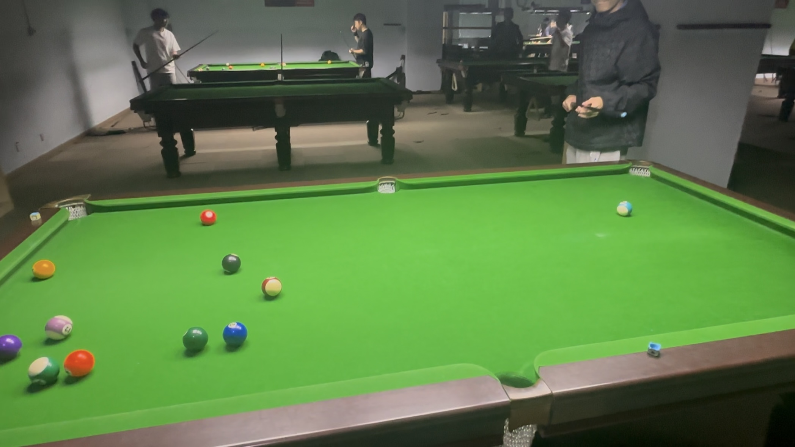

# 中式八球友谊赛/Chinese 8-Ball Friendly

| 届次 | 日期        | 场地        | 胜者   | 负者    | 比分 |
| ---- | ---------- | ----------- | ------ | ------ | ---- |
| 1    | 2024.10.31 | 邱德拔体育馆 | 王翰墨 | 姜星宇 | 3-2 |

中式八球友谊赛为友谊赛，不计入积分，部分比赛记录可能丢失。

## 历届赛历

### 第一届

| 场序 | 选手A  | 比分 | 选手B  | 用时 | 备注 |
| ---- | ------ | ---- | ------ | ---- | ---- |
| 1    | 王翰墨 | 6-8 | 姜星宇 | 10min | Final |
| 2    | 姜星宇 | 8-7 | 王翰墨 | 12min | Final |
| 3    | 王翰墨 | 8-4 | 姜星宇 | 12min | Final |
| 4    | 姜星宇 | 0-5 | 王翰墨 | 2.5min | Foul |
| 5    | 王翰墨 | 8-5 | 姜星宇 | 7.5min | Final |
