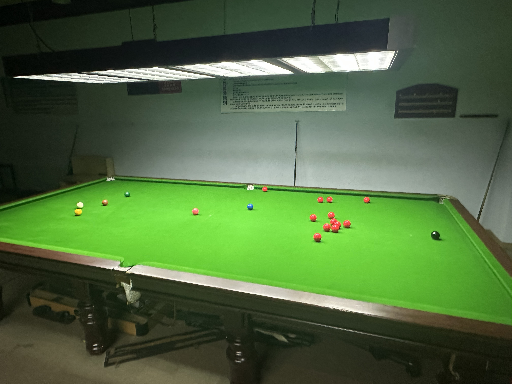

# 英式斯诺克例行赛/Snooker 147 Regular

| 届次 | 日期       | 地点         | 冠军   | 亚军   | 季军   | 殿军 | 比分     |
| ---- | ---------- | ----------- | ------ | ------ | ------ | --- | -------- |
| 1    | 2024.10.15 | 邱德拔体育馆 | 姜星宇 | 魏天昊 | 王翰墨 | None | 30-30-33 |
| 2    | 2024.10.16 | 邱德拔体育馆 | 魏天昊 | 姜星宇 | 王翰墨 | None | 64-51-73 |

英式斯诺克例行赛，是MPRC台球俱乐部例行的英式斯诺克赛事。比赛采用单局制多人对战赛，参赛人数至少为3人，循环轮流击球，按得分排定名次。

