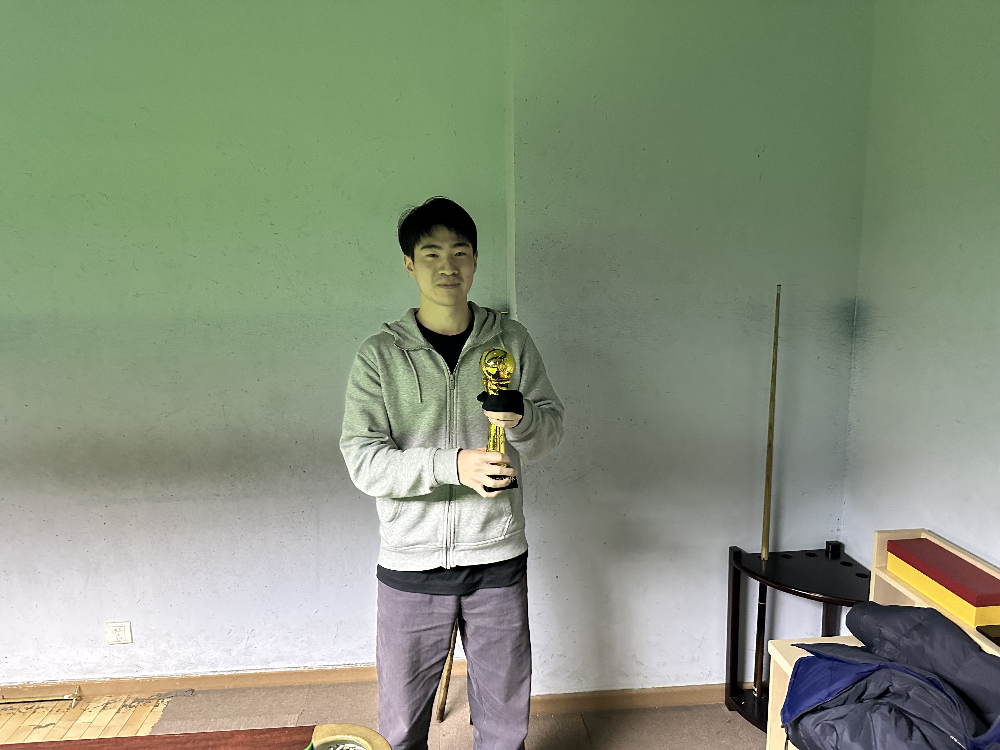

# 精彩画面

### 2024.10.24

魏天昊在第二届中式八球公开赛决赛第三局最后关键时刻，面对姜星宇唾手可得的袋口8号球，连续做出两杆精彩的斯诺克。

### 2024.11.08

王翰墨在第四届中式八球公开赛决赛第四局巧妙利用袋口做成一杆斯诺克。

### 2024.12.01

在美式八球挑战赛中，井文淳/魏天昊队由于进球太多而受困于斯诺克——白球和唯一的3号球被其他球团团围住。

## 2024.12.03

在第六届中式八球公开赛决赛中，魏天昊3-1击败王翰墨成功卫冕，赛后由裁判姜星宇颁发冠军奖杯。

