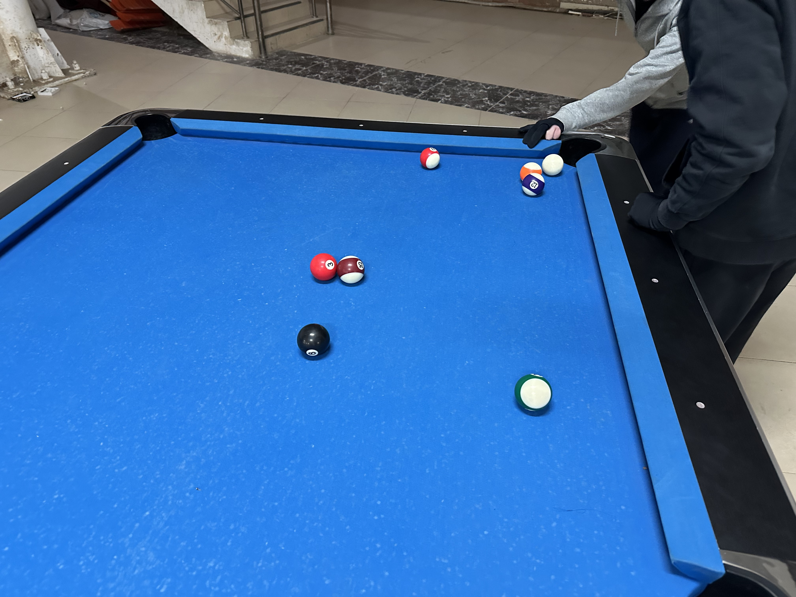
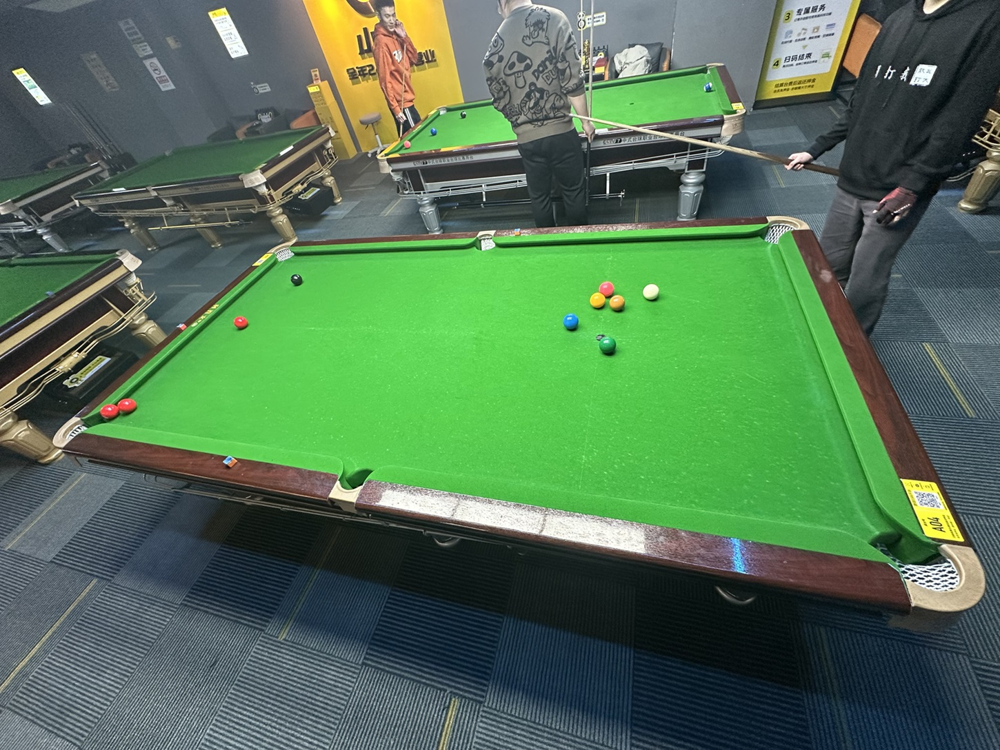
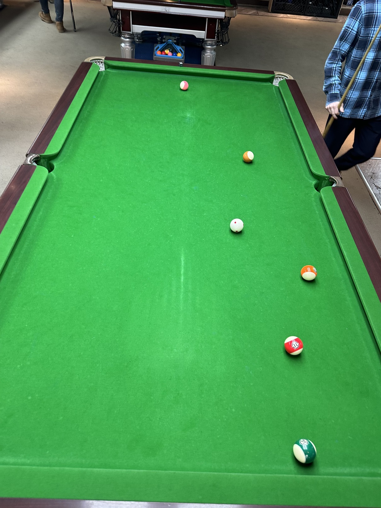
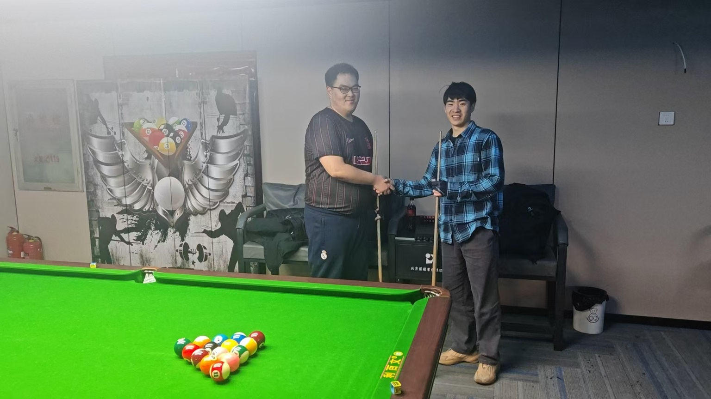
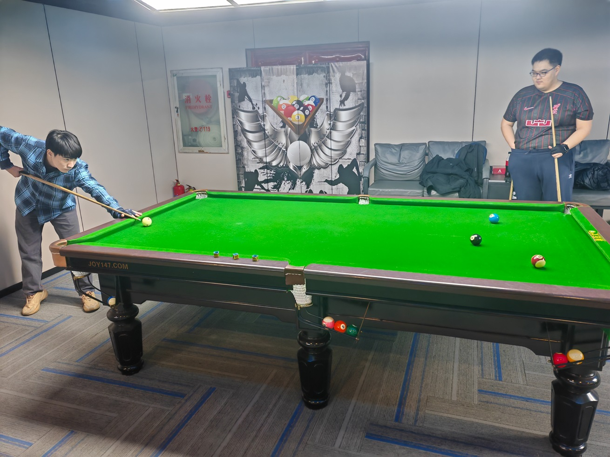
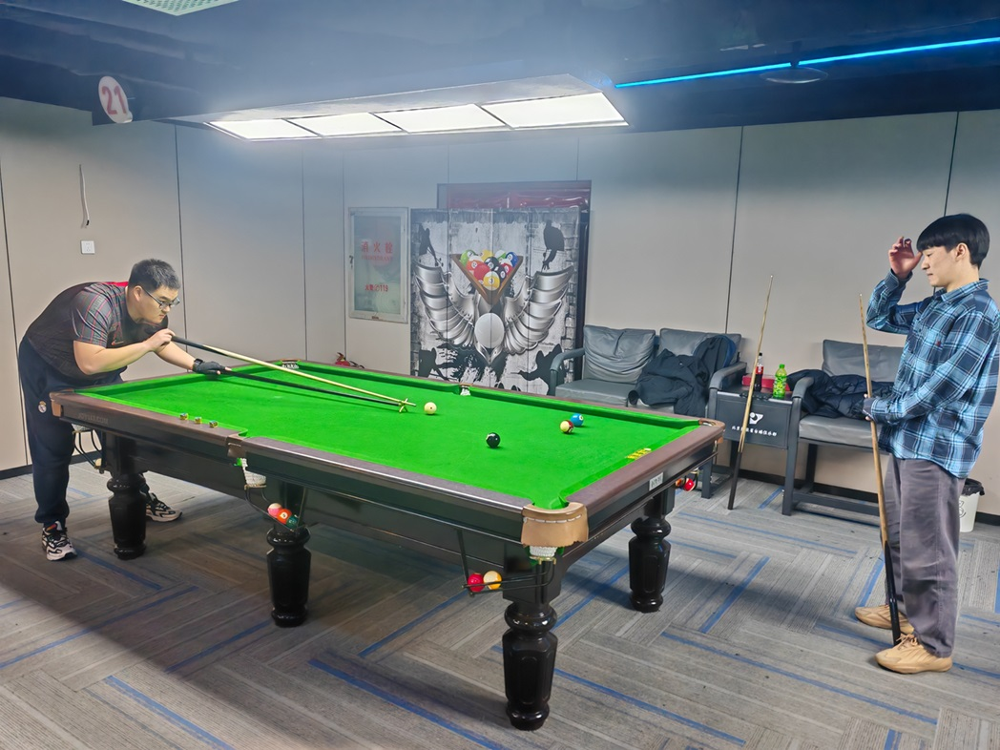
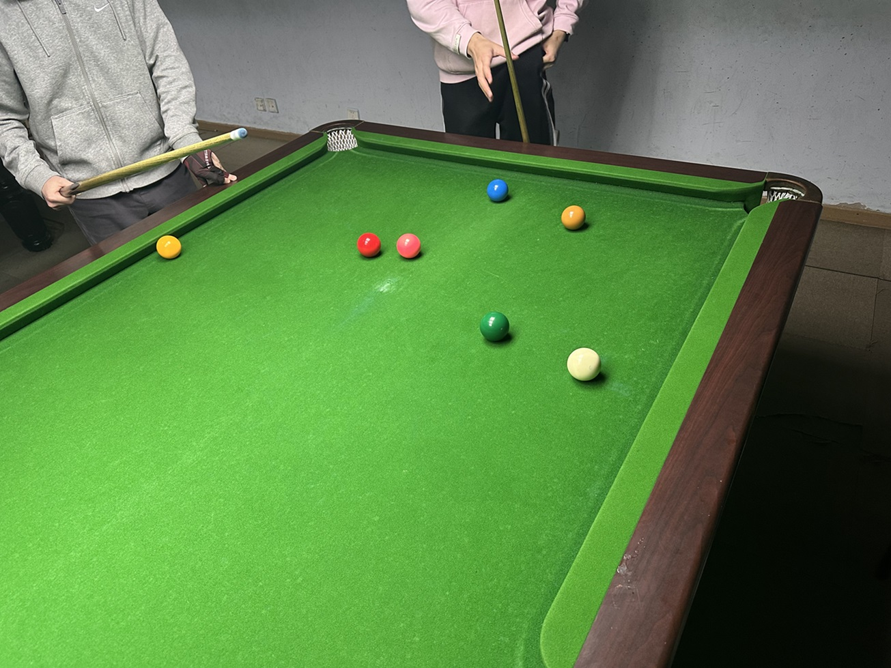
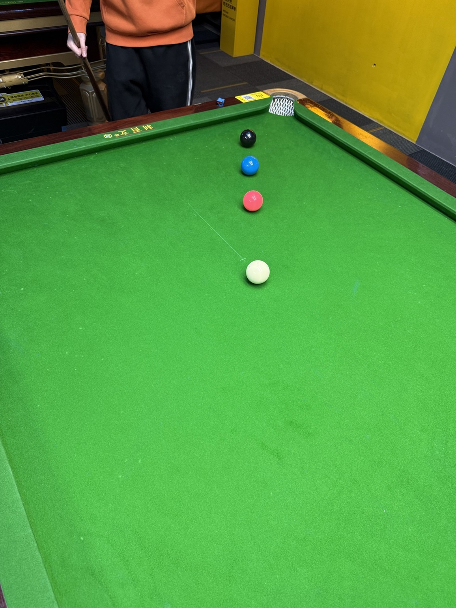
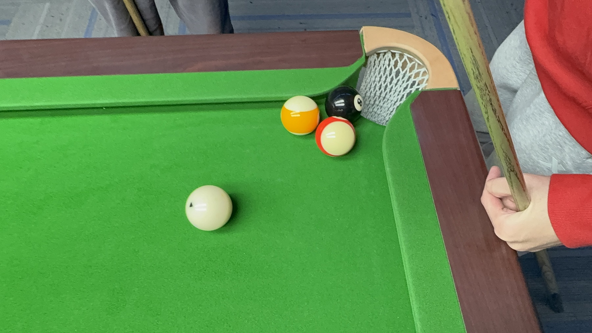

# 精彩画面

### 2024.10.24

魏天昊在第二届中式八球公开赛决赛第三局最后关键时刻，面对姜星宇唾手可得的袋口8号球，连续做出两杆精彩的斯诺克。

### 2024.11.08

王翰墨在第四届中式八球公开赛决赛第四局巧妙利用袋口做成一杆斯诺克。

### 2024.12.01

在美式八球挑战赛中，井文淳/魏天昊队由于进球太多而受困于斯诺克——白球和唯一的3号球被其他球团团围住。

### 2024.12.17

在中式斯诺克友谊赛中，彩球聚集在一起形成一道墙，王翰墨击球后白球躲到了彩球后面，做成了斯诺克。

### 2024.12.31

在残酷台球挑战赛中，王翰墨连续打进多球并快速地解决了比赛，最终以自己的5个球全部在台面结束比赛。

### 2025.01.14

第一届MPRC台球锦标赛总决赛在蓝旗星俱乐部正式开打，对阵双方是王翰墨和魏天昊，由姜星宇担任裁判。

### 2025.02.21

在第九届中式斯诺克例行赛中，郝明洋做出一杆细腻且非常难解的斯诺克，获得30分的罚分并借此获得了生涯第一个积分赛冠军。

### 2025.02.27

在巴西斯诺克友谊赛中，王翰墨做出一杆“四星连珠”的局面。

### 2025.03.17

在第十二届中式八球公开赛决赛第二局中，姜星宇将黑八和魏天昊的花色球都打至袋口，在将纯色球全部打完后形成了僵局：姜星宇无法击打黑八，只能故意犯规击打魏天昊的其他花色球；魏天昊不想击打和黑八相贴的花色球，因此也不主动打进自己的其他花色球。

